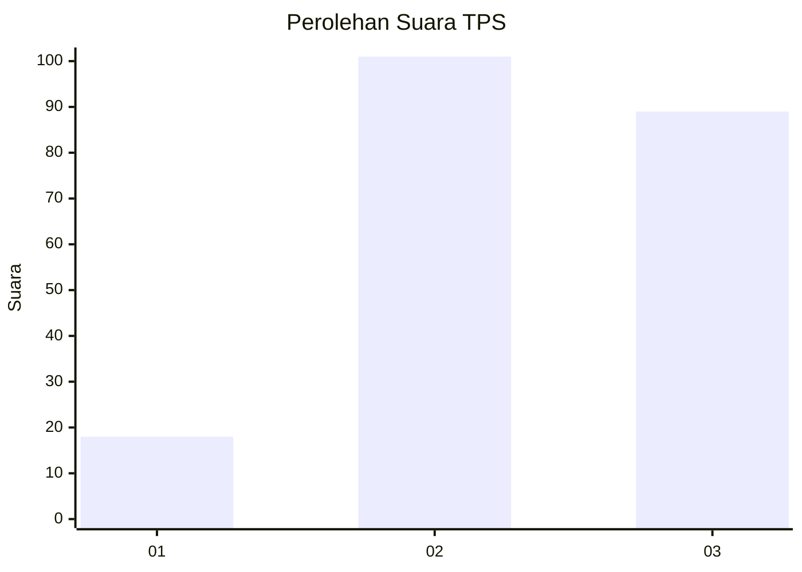
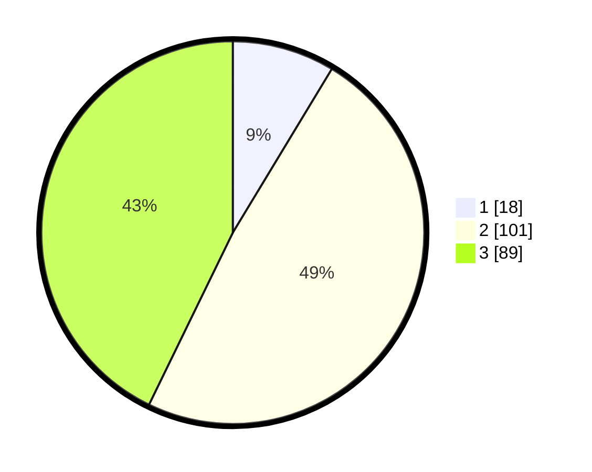

# Hasil

## Grafik

## Tabel

| No. | Nama Paslon    | Suara | Suara (raw) | Persentase |
|:--- |:-------------- | -----:| -----------:| ----------:|
| 1   | ANIES MUHAIMIN | 18    | [18][p-1]   | 8,65       |
| 2   | PRABOWO GIBRAN | 101   | [101][p-2]  | 48,56      |
| 3   | GANJAR MAHFUD  | 89    | [89][p-3]   | 42,79      |

[p-1]: https://github.com/gigit-pemilu/pemilu-2024-35-jawa-timur/blob/main/pilpres/hitung-suara/sub/35-jawa-timur/sub/05-blitar/sub/06-ponggok/sub/2012-sidorejo/sub/010-tps/sub/paslon-1.txt
[p-2]: https://github.com/gigit-pemilu/pemilu-2024-35-jawa-timur/blob/main/pilpres/hitung-suara/sub/35-jawa-timur/sub/05-blitar/sub/06-ponggok/sub/2012-sidorejo/sub/010-tps/sub/paslon-2.txt
[p-3]: https://github.com/gigit-pemilu/pemilu-2024-35-jawa-timur/blob/main/pilpres/hitung-suara/sub/35-jawa-timur/sub/05-blitar/sub/06-ponggok/sub/2012-sidorejo/sub/010-tps/sub/paslon-3.txt

## Foto C Plano

https://sirekap-obj-formc.kpu.go.id/e34e/pemilu/ppwp/35/05/06/20/12/3505062012010-20240215-092940--e87282d2-edcf-43d3-9a6f-8d10b11b4815.jpg

https://sirekap-obj-formc.kpu.go.id/e34e/pemilu/ppwp/35/05/06/20/12/3505062012010-20240215-093202--5ef6194f-3c20-445d-ac48-e30d744d017d.jpg

https://sirekap-obj-formc.kpu.go.id/e34e/pemilu/ppwp/35/05/06/20/12/3505062012010-20240215-093320--70ad1f24-06f8-4374-97ac-58e9e91dab42.jpg

## Metadata

| Key        | Value               |
| ---------- | ------------------- |
| Time Stamp | 2024-02-16 11:00:29 |

