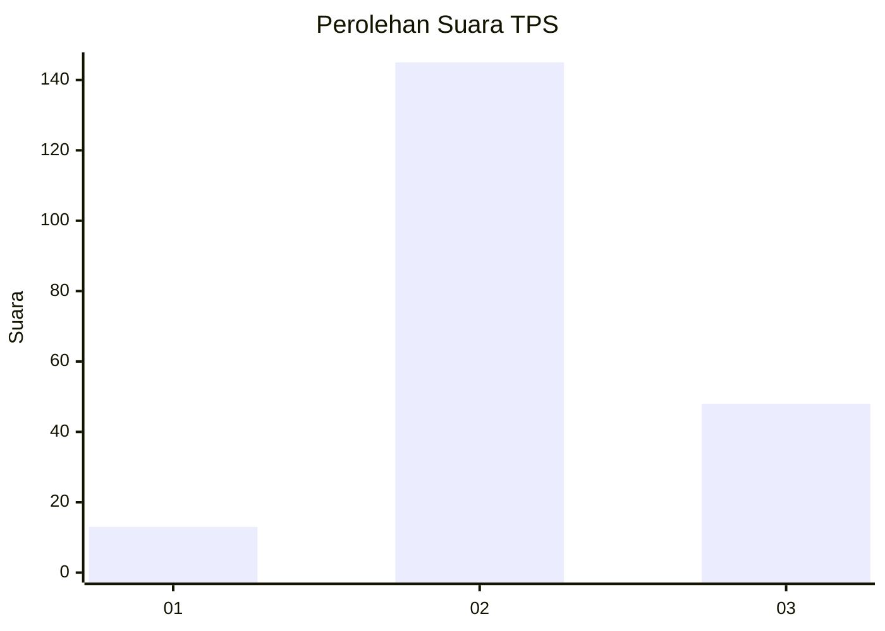
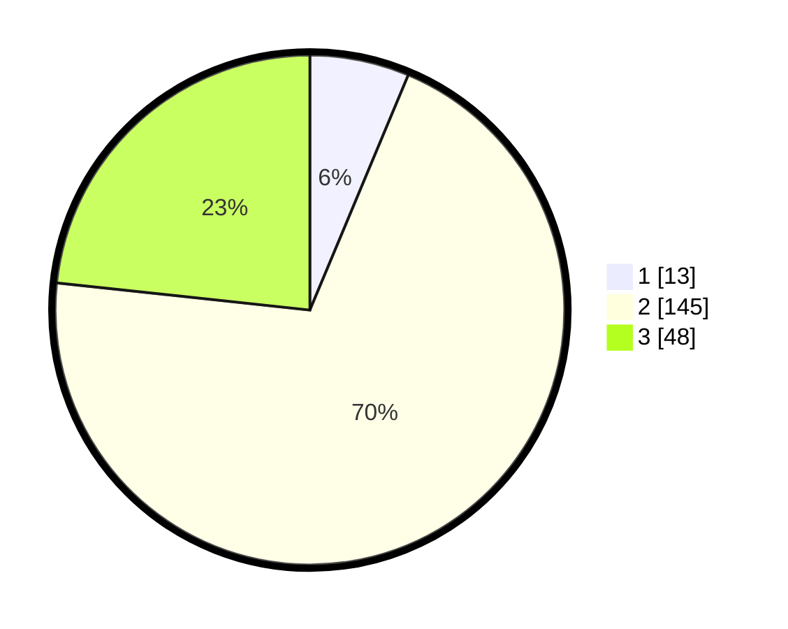

# Hasil

## Grafik

## Tabel

| No. | Nama Paslon    | Suara | Suara (raw) | Persentase |
|:--- |:-------------- | -----:| -----------:| ----------:|
| 1   | ANIES MUHAIMIN | 13    | [13][p-1]   | 6,31       |
| 2   | PRABOWO GIBRAN | 145   | [145][p-2]  | 70,39      |
| 3   | GANJAR MAHFUD  | 48    | [48][p-3]   | 23,30      |

[p-1]: https://github.com/gigit-pemilu/pemilu-2024/blob/main/pilpres/hitung-suara/sub/35-jawa-timur/sub/05-blitar/sub/06-ponggok/sub/2012-sidorejo/sub/017-tps/sub/paslon-1.txt
[p-2]: https://github.com/gigit-pemilu/pemilu-2024/blob/main/pilpres/hitung-suara/sub/35-jawa-timur/sub/05-blitar/sub/06-ponggok/sub/2012-sidorejo/sub/017-tps/sub/paslon-2.txt
[p-3]: https://github.com/gigit-pemilu/pemilu-2024/blob/main/pilpres/hitung-suara/sub/35-jawa-timur/sub/05-blitar/sub/06-ponggok/sub/2012-sidorejo/sub/017-tps/sub/paslon-3.txt

## Foto C Plano

https://sirekap-obj-formc.kpu.go.id/3d3f/pemilu/ppwp/35/05/06/20/12/3505062012017-20240214-224947--e8f2a8aa-333c-4c7c-b9c7-f7afc438223e.jpg

https://sirekap-obj-formc.kpu.go.id/3d3f/pemilu/ppwp/35/05/06/20/12/3505062012017-20240214-225047--a9743f00-82ce-43c0-b240-c5158d21b690.jpg

https://sirekap-obj-formc.kpu.go.id/3d3f/pemilu/ppwp/35/05/06/20/12/3505062012017-20240214-225141--b4de5c50-80d4-448f-8a3f-14df46ee2538.jpg

## Metadata

| Key        | Value               |
| ---------- | ------------------- |
| Time Stamp | 2024-02-15 09:00:24 |

