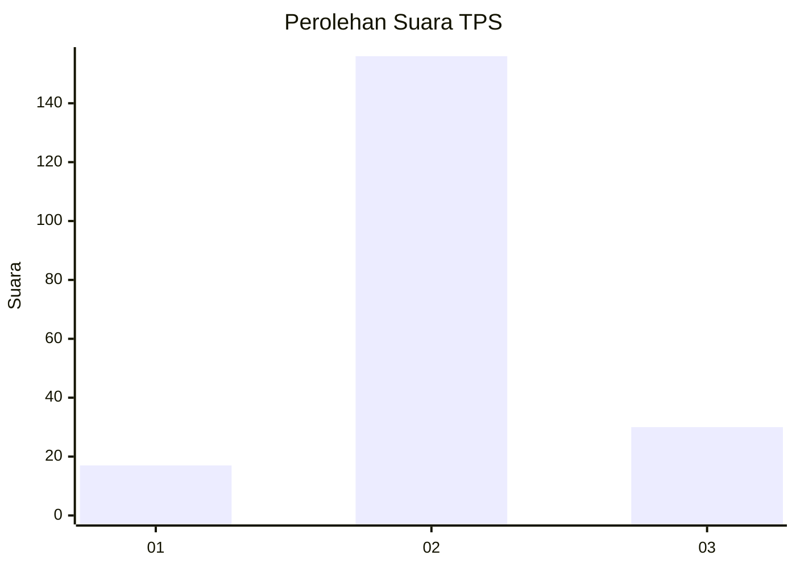

# Hasil

## Grafik

## Tabel

| No. | Nama Paslon    | Suara | Suara (raw) | Persentase |
|:--- |:-------------- | -----:| -----------:| ----------:|
| 1   | ANIES MUHAIMIN | 17    | [17][p-1]   | 8,37       |
| 2   | PRABOWO GIBRAN | 156   | [156][p-2]  | 76,85      |
| 3   | GANJAR MAHFUD  | 30    | [30][p-3]   | 14,78      |

[p-1]: https://github.com/gigit-pemilu/pemilu-2024/blob/main/pilpres/hitung-suara/sub/35-jawa-timur/sub/05-blitar/sub/06-ponggok/sub/2012-sidorejo/sub/037-tps/sub/paslon-1.txt
[p-2]: https://github.com/gigit-pemilu/pemilu-2024/blob/main/pilpres/hitung-suara/sub/35-jawa-timur/sub/05-blitar/sub/06-ponggok/sub/2012-sidorejo/sub/037-tps/sub/paslon-2.txt
[p-3]: https://github.com/gigit-pemilu/pemilu-2024/blob/main/pilpres/hitung-suara/sub/35-jawa-timur/sub/05-blitar/sub/06-ponggok/sub/2012-sidorejo/sub/037-tps/sub/paslon-3.txt

## Foto C Plano

https://sirekap-obj-formc.kpu.go.id/f97c/pemilu/ppwp/35/05/06/20/12/3505062012037-20240214-222337--4683bff6-b25c-4b47-bcff-7cce28e7404f.jpg

https://sirekap-obj-formc.kpu.go.id/f97c/pemilu/ppwp/35/05/06/20/12/3505062012037-20240214-222405--55d034b2-aedb-4639-8787-8e742b745a28.jpg

https://sirekap-obj-formc.kpu.go.id/f97c/pemilu/ppwp/35/05/06/20/12/3505062012037-20240214-223056--62175744-3098-4b3f-9325-2c5d2adb5fdd.jpg

## Metadata

| Key        | Value               |
| ---------- | ------------------- |
| Time Stamp | 2024-02-15 03:06:03 |

