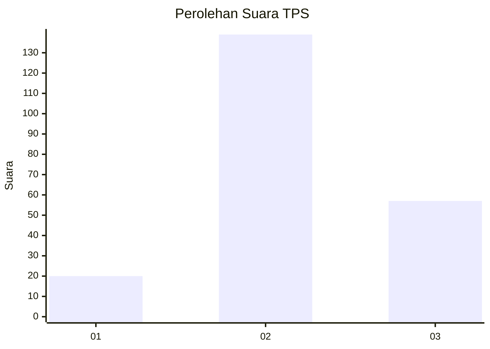
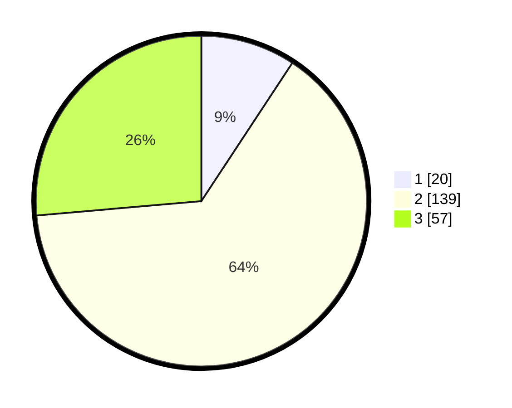

# Hasil

## Grafik

## Tabel

| No. | Nama Paslon    | Suara | Suara (raw) | Persentase |
|:--- |:-------------- | -----:| -----------:| ----------:|
| 1   | ANIES MUHAIMIN | 20    | [20][p-1]   | 9,26       |
| 2   | PRABOWO GIBRAN | 139   | [139][p-2]  | 64,35      |
| 3   | GANJAR MAHFUD  | 57    | [57][p-3]   | 26,39      |

[p-1]: https://github.com/gigit-pemilu/pemilu-2024/blob/main/pilpres/hitung-suara/sub/35-jawa-timur/sub/05-blitar/sub/06-ponggok/sub/2013-maliran/sub/003-tps/sub/paslon-1.txt
[p-2]: https://github.com/gigit-pemilu/pemilu-2024/blob/main/pilpres/hitung-suara/sub/35-jawa-timur/sub/05-blitar/sub/06-ponggok/sub/2013-maliran/sub/003-tps/sub/paslon-2.txt
[p-3]: https://github.com/gigit-pemilu/pemilu-2024/blob/main/pilpres/hitung-suara/sub/35-jawa-timur/sub/05-blitar/sub/06-ponggok/sub/2013-maliran/sub/003-tps/sub/paslon-3.txt

## Foto C Plano

https://sirekap-obj-formc.kpu.go.id/a219/pemilu/ppwp/35/05/06/20/13/3505062013003-20240214-160100--e25e6ef1-23d9-43f2-998a-33b5021ad99b.jpg

https://sirekap-obj-formc.kpu.go.id/a219/pemilu/ppwp/35/05/06/20/13/3505062013003-20240214-155818--56c412c3-ee3b-439c-b3f6-c7cf9ff24c04.jpg

https://sirekap-obj-formc.kpu.go.id/a219/pemilu/ppwp/35/05/06/20/13/3505062013003-20240214-160057--14b4c6ea-be74-4bc9-930d-bd9f4cb04825.jpg

## Metadata

| Key        | Value               |
| ---------- | ------------------- |
| Time Stamp | 2024-02-17 13:37:34 |

