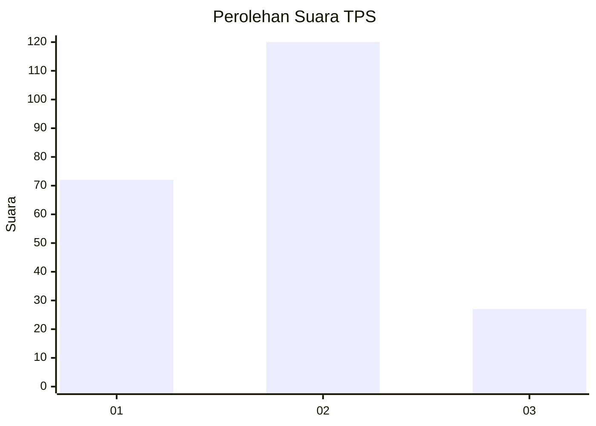
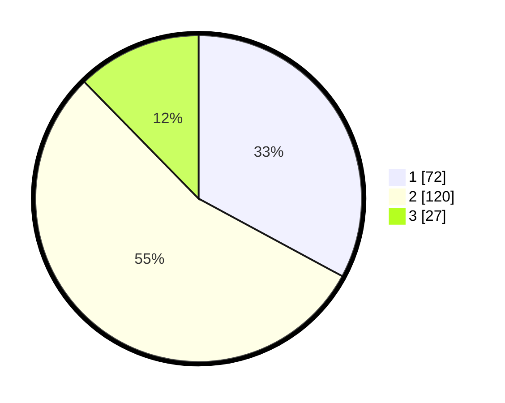

# Hasil

## Grafik

## Tabel

| No. | Nama Paslon    | Suara | Suara (raw) | Persentase |
|:--- |:-------------- | -----:| -----------:| ----------:|
| 1   | ANIES MUHAIMIN | 72    | [72][p-1]   | 32,88      |
| 2   | PRABOWO GIBRAN | 120   | [120][p-2]  | 54,79      |
| 3   | GANJAR MAHFUD  | 27    | [27][p-3]   | 12,33      |

[p-1]: https://github.com/gigit-pemilu/pemilu-2024/blob/main/pilpres/hitung-suara/sub/35-jawa-timur/sub/05-blitar/sub/07-sanankulon/sub/2002-bendosari/sub/005-tps/sub/paslon-1.txt
[p-2]: https://github.com/gigit-pemilu/pemilu-2024/blob/main/pilpres/hitung-suara/sub/35-jawa-timur/sub/05-blitar/sub/07-sanankulon/sub/2002-bendosari/sub/005-tps/sub/paslon-2.txt
[p-3]: https://github.com/gigit-pemilu/pemilu-2024/blob/main/pilpres/hitung-suara/sub/35-jawa-timur/sub/05-blitar/sub/07-sanankulon/sub/2002-bendosari/sub/005-tps/sub/paslon-3.txt

## Foto C Plano

https://sirekap-obj-formc.kpu.go.id/ea9a/pemilu/ppwp/35/05/07/20/02/3505072002005-20240219-180949--a663674a-d861-4363-ba67-1506e1daad2e.jpg

https://sirekap-obj-formc.kpu.go.id/ea9a/pemilu/ppwp/35/05/07/20/02/3505072002005-20240219-181315--553327f2-863c-4c5b-bc1e-47ca55f4e68d.jpg

https://sirekap-obj-formc.kpu.go.id/ea9a/pemilu/ppwp/35/05/07/20/02/3505072002005-20240219-181141--818fcd1d-1c6e-4fa1-bc87-87e131076408.jpg

## Metadata

| Key        | Value               |
| ---------- | ------------------- |
| Time Stamp | 2024-02-19 19:00:00 |

## DATA PEMILIH TETAP

Jumlah pemilih dalam DPT: **911**.
 * L: **154**.
 * P: **116**.

## DATA PENGGUNA HAK PILIH

Jumlah pengguna hak pilih dalam DPT: **625**.
 * L: **777**.
 * P: **587**.

Jumlah pengguna hak pilih dalam DPTb: **127**.
 * L: **556**.
 * P: **617**.

Jumlah pengguna hak pilih dalam DPK: **111**.
 * L: **556**.
 * P: **501**.

Jumlah pengguna hak pilih: **221**.
 * L: **2**.
 * P: **222**.

## JUMLAH SUARA SAH DAN TIDAK SAH

JUMLAH SELURUH SUARA SAH: **208**.

JUMLAH SUARA TIDAK SAH: **723**.

JUMLAH SELURUH SUARA SAH DAN SUARA TIDAK SAH: **211**.

