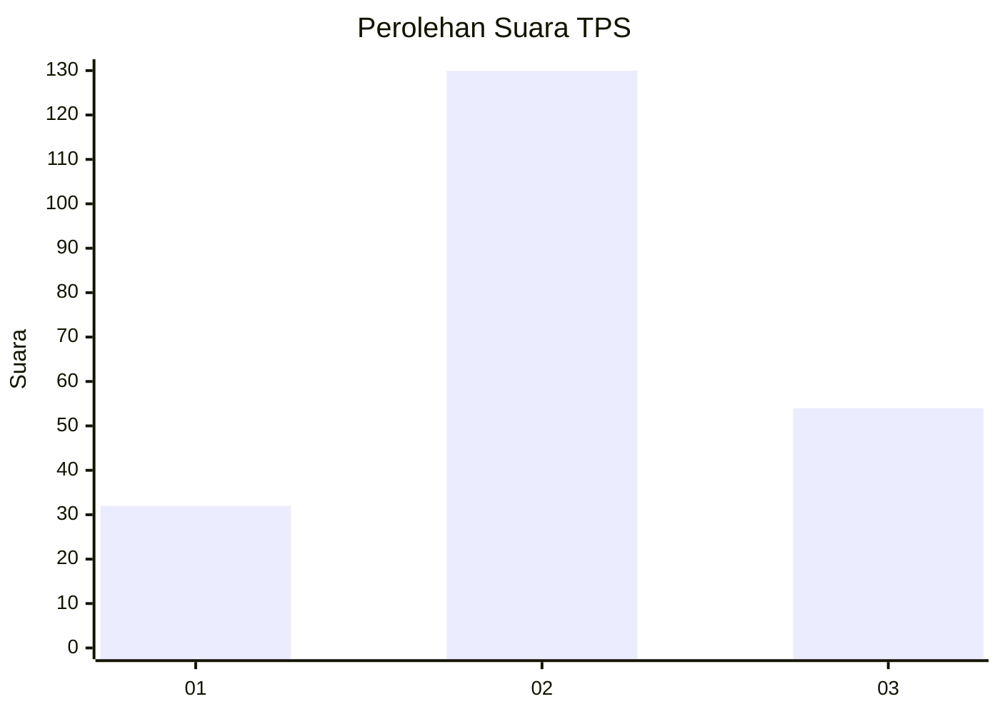
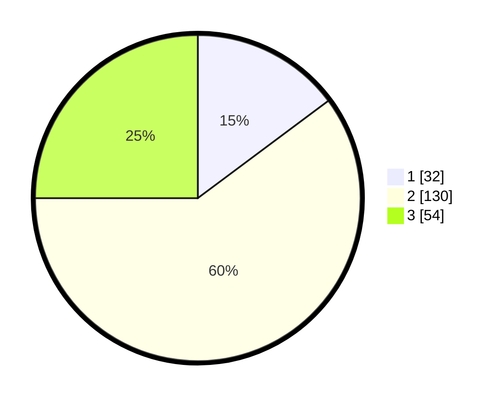

# Hasil

## Grafik

## Tabel

| No. | Nama Paslon    | Suara | Suara (raw) | Persentase |
|:--- |:-------------- | -----:| -----------:| ----------:|
| 1   | ANIES MUHAIMIN | 32    | [32][p-1]   | 14,81      |
| 2   | PRABOWO GIBRAN | 130   | [130][p-2]  | 60,19      |
| 3   | GANJAR MAHFUD  | 54    | [54][p-3]   | 25,00      |

[p-1]: https://github.com/gigit-pemilu/pemilu-2024/blob/main/pilpres/hitung-suara/sub/35-jawa-timur/sub/05-blitar/sub/07-sanankulon/sub/2004-sanankulon/sub/002-tps/sub/paslon-1.txt
[p-2]: https://github.com/gigit-pemilu/pemilu-2024/blob/main/pilpres/hitung-suara/sub/35-jawa-timur/sub/05-blitar/sub/07-sanankulon/sub/2004-sanankulon/sub/002-tps/sub/paslon-2.txt
[p-3]: https://github.com/gigit-pemilu/pemilu-2024/blob/main/pilpres/hitung-suara/sub/35-jawa-timur/sub/05-blitar/sub/07-sanankulon/sub/2004-sanankulon/sub/002-tps/sub/paslon-3.txt

## Foto C Plano

https://sirekap-obj-formc.kpu.go.id/387e/pemilu/ppwp/35/05/07/20/04/3505072004002-20240215-045518--c849c4eb-2a38-466c-b813-d657f6a1ee1f.jpg

https://sirekap-obj-formc.kpu.go.id/387e/pemilu/ppwp/35/05/07/20/04/3505072004002-20240215-045642--699f00f7-1d37-453b-b589-87ec49efff4e.jpg

https://sirekap-obj-formc.kpu.go.id/387e/pemilu/ppwp/35/05/07/20/04/3505072004002-20240215-045739--7757a837-4bef-4ee4-a02d-7f3f953e66cd.jpg

## Metadata

| Key        | Value               |
| ---------- | ------------------- |
| Time Stamp | 2024-02-16 21:01:00 |

