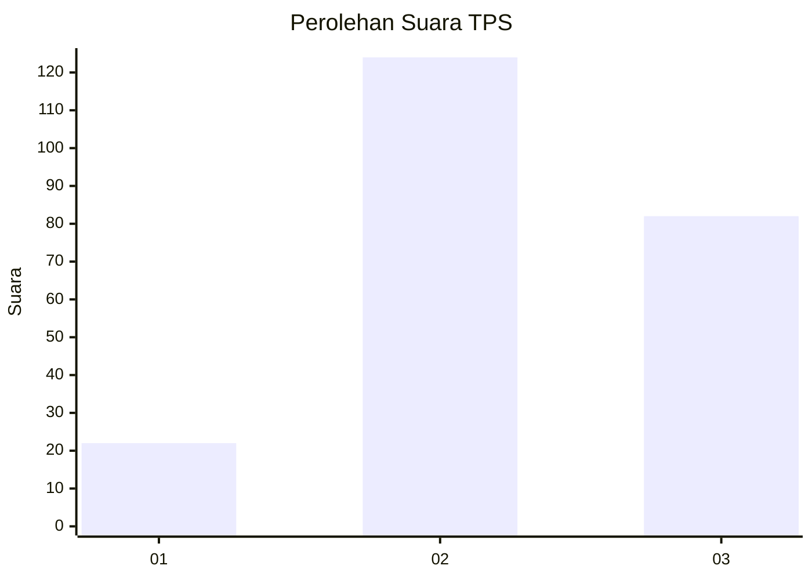
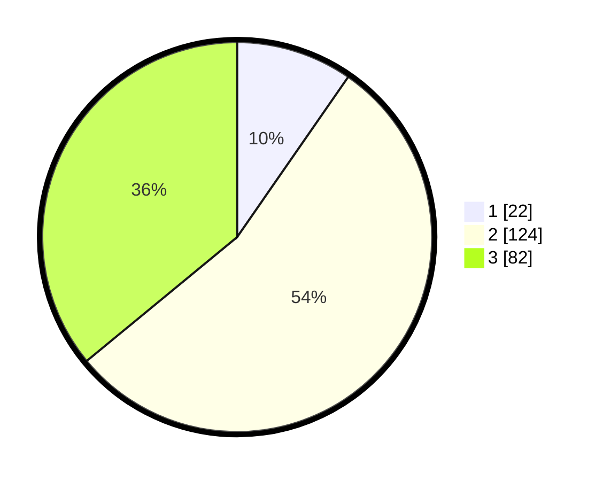

# Hasil

## Grafik

## Tabel

| No. | Nama Paslon    | Suara | Suara (raw) | Persentase |
|:--- |:-------------- | -----:| -----------:| ----------:|
| 1   | ANIES MUHAIMIN | 22    | [22][p-1]   | 9,65       |
| 2   | PRABOWO GIBRAN | 124   | [124][p-2]  | 54,39      |
| 3   | GANJAR MAHFUD  | 82    | [82][p-3]   | 35,96      |

[p-1]: https://github.com/gigit-pemilu/pemilu-2024/blob/main/pilpres/hitung-suara/sub/35-jawa-timur/sub/05-blitar/sub/07-sanankulon/sub/2010-gledug/sub/001-tps/sub/paslon-1.txt
[p-2]: https://github.com/gigit-pemilu/pemilu-2024/blob/main/pilpres/hitung-suara/sub/35-jawa-timur/sub/05-blitar/sub/07-sanankulon/sub/2010-gledug/sub/001-tps/sub/paslon-2.txt
[p-3]: https://github.com/gigit-pemilu/pemilu-2024/blob/main/pilpres/hitung-suara/sub/35-jawa-timur/sub/05-blitar/sub/07-sanankulon/sub/2010-gledug/sub/001-tps/sub/paslon-3.txt

## Foto C Plano

https://sirekap-obj-formc.kpu.go.id/cf53/pemilu/ppwp/35/05/07/20/10/3505072010001-20240215-005925--b101aba8-50db-4076-8af2-6acc7b2860a6.jpg

https://sirekap-obj-formc.kpu.go.id/cf53/pemilu/ppwp/35/05/07/20/10/3505072010001-20240215-010042--1d6d07f3-d810-46fa-a112-58e5c0dfab8a.jpg

https://sirekap-obj-formc.kpu.go.id/cf53/pemilu/ppwp/35/05/07/20/10/3505072010001-20240215-010121--c7065d7e-df29-4f86-a8bf-97035b1eed83.jpg

## Metadata

| Key        | Value               |
| ---------- | ------------------- |
| Time Stamp | 2024-02-16 16:25:10 |

