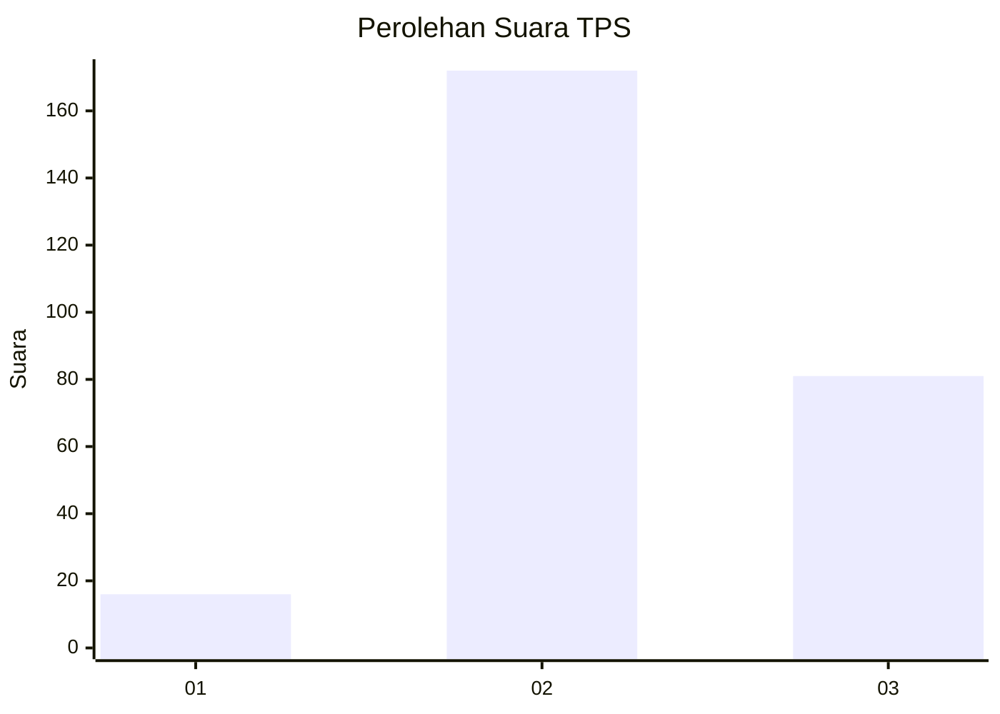
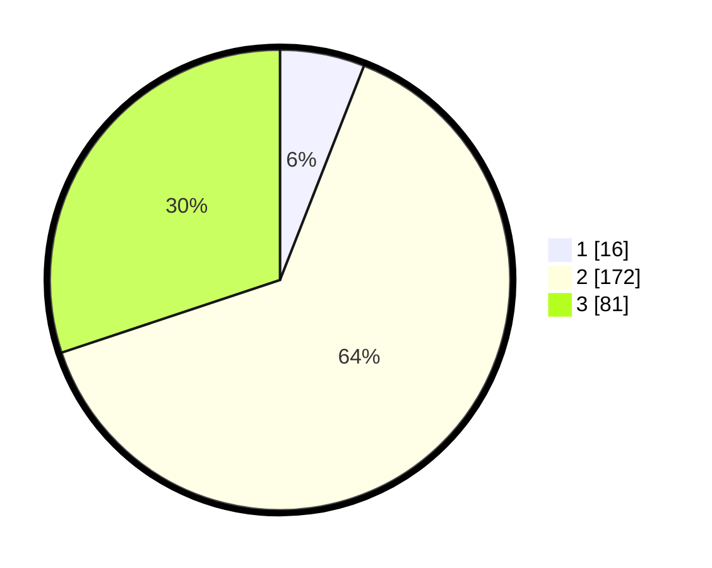

# Hasil

## Grafik

## Tabel

| No. | Nama Paslon    | Suara | Suara (raw) | Persentase |
|:--- |:-------------- | -----:| -----------:| ----------:|
| 1   | ANIES MUHAIMIN | 16    | [16][p-1]   | 5,95       |
| 2   | PRABOWO GIBRAN | 172   | [172][p-2]  | 63,94      |
| 3   | GANJAR MAHFUD  | 81    | [81][p-3]   | 30,11      |

[p-1]: https://github.com/gigit-pemilu/pemilu-2024/blob/main/pilpres/hitung-suara/sub/35-jawa-timur/sub/05-blitar/sub/07-sanankulon/sub/2010-gledug/sub/003-tps/sub/paslon-1.txt
[p-2]: https://github.com/gigit-pemilu/pemilu-2024/blob/main/pilpres/hitung-suara/sub/35-jawa-timur/sub/05-blitar/sub/07-sanankulon/sub/2010-gledug/sub/003-tps/sub/paslon-2.txt
[p-3]: https://github.com/gigit-pemilu/pemilu-2024/blob/main/pilpres/hitung-suara/sub/35-jawa-timur/sub/05-blitar/sub/07-sanankulon/sub/2010-gledug/sub/003-tps/sub/paslon-3.txt

## Foto C Plano

https://sirekap-obj-formc.kpu.go.id/ad95/pemilu/ppwp/35/05/07/20/10/3505072010003-20240220-161127--1f0904da-e656-4a75-aed2-76fc21db7c49.jpg

https://sirekap-obj-formc.kpu.go.id/ad95/pemilu/ppwp/35/05/07/20/10/3505072010003-20240220-160904--f28bf977-bbb3-4ebe-afd9-f10b0fbd3188.jpg

https://sirekap-obj-formc.kpu.go.id/ad95/pemilu/ppwp/35/05/07/20/10/3505072010003-20240220-161237--335f589e-99fe-45b3-ae69-08870cd6fe47.jpg

## Metadata

| Key        | Value               |
| ---------- | ------------------- |
| Time Stamp | 2024-02-20 17:00:00 |

## DATA PEMILIH TETAP

Jumlah pemilih dalam DPT: **850**.
 * L: **0**.
 * P: **226**.

## DATA PENGGUNA HAK PILIH

Jumlah pengguna hak pilih dalam DPT: **0**.
 * L: **0**.
 * P: **74**.

Jumlah pengguna hak pilih dalam DPTb: **40**.
 * L: **1**.
 * P: **74**.

Jumlah pengguna hak pilih dalam DPK: **491**.
 * L: **128**.
 * P: **127**.

Jumlah pengguna hak pilih: **10**.
 * L: **0**.
 * P: **0**.

## JUMLAH SUARA SAH DAN TIDAK SAH

JUMLAH SELURUH SUARA SAH: **229**.

JUMLAH SUARA TIDAK SAH: **20**.

JUMLAH SELURUH SUARA SAH DAN SUARA TIDAK SAH: **249**.

