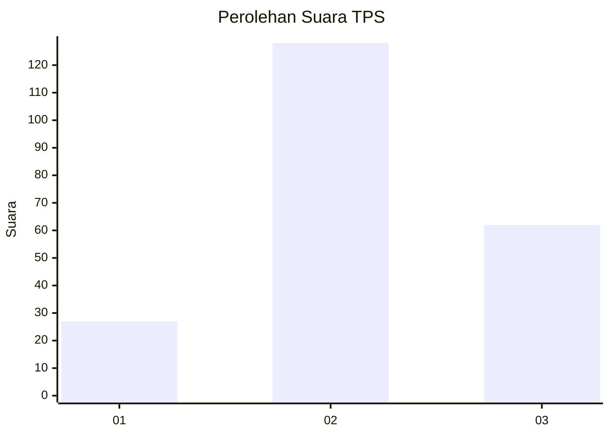
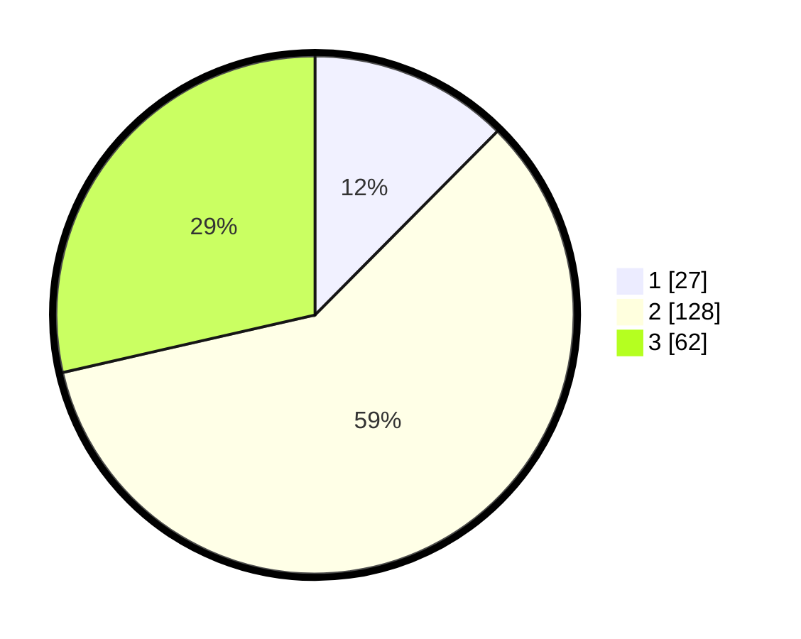

# Hasil

## Grafik

## Tabel

| No. | Nama Paslon    | Suara | Suara (raw) | Persentase |
|:--- |:-------------- | -----:| -----------:| ----------:|
| 1   | ANIES MUHAIMIN | 27    | [27][p-1]   | 12,44      |
| 2   | PRABOWO GIBRAN | 128   | [128][p-2]  | 58,99      |
| 3   | GANJAR MAHFUD  | 62    | [62][p-3]   | 28,57      |

[p-1]: https://github.com/gigit-pemilu/pemilu-2024-35-jawa-timur/blob/main/pilpres/hitung-suara/sub/35-jawa-timur/sub/05-blitar/sub/07-sanankulon/sub/2012-plosoarang/sub/004-tps/sub/paslon-1.txt
[p-2]: https://github.com/gigit-pemilu/pemilu-2024-35-jawa-timur/blob/main/pilpres/hitung-suara/sub/35-jawa-timur/sub/05-blitar/sub/07-sanankulon/sub/2012-plosoarang/sub/004-tps/sub/paslon-2.txt
[p-3]: https://github.com/gigit-pemilu/pemilu-2024-35-jawa-timur/blob/main/pilpres/hitung-suara/sub/35-jawa-timur/sub/05-blitar/sub/07-sanankulon/sub/2012-plosoarang/sub/004-tps/sub/paslon-3.txt

## Foto C Plano

https://sirekap-obj-formc.kpu.go.id/1dca/pemilu/ppwp/35/05/07/20/12/3505072012004-20240219-204744--c50503b4-d6d6-4412-8248-18f2ec074883.jpg

https://sirekap-obj-formc.kpu.go.id/1dca/pemilu/ppwp/35/05/07/20/12/3505072012004-20240214-185440--009ac124-e0ad-46ca-bed3-3ac6bd17a34b.jpg

https://sirekap-obj-formc.kpu.go.id/1dca/pemilu/ppwp/35/05/07/20/12/3505072012004-20240219-205805--606d0d2d-6ef1-46bd-a3d9-45bb75beb833.jpg

## Metadata

| Key        | Value               |
| ---------- | ------------------- |
| Time Stamp | 2024-02-22 18:00:00 |

