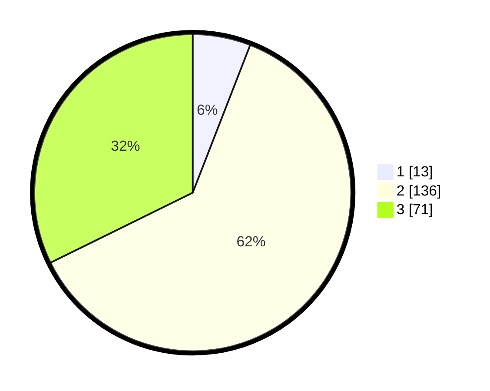

# Hasil

## Grafik

## Tabel

| No. | Nama Paslon    | Suara | Suara (raw) | Persentase |
|:--- |:-------------- | -----:| -----------:| ----------:|
| 1   | ANIES MUHAIMIN | 13    | [13][p-1]   | 5,91       |
| 2   | PRABOWO GIBRAN | 136   | [136][p-2]  | 61,82      |
| 3   | GANJAR MAHFUD  | 71    | [71][p-3]   | 32,27      |

[p-1]: https://github.com/gigit-pemilu/pemilu-2024-35-jawa-timur/blob/main/pilpres/hitung-suara/sub/35-jawa-timur/sub/05-blitar/sub/07-sanankulon/sub/2012-plosoarang/sub/005-tps/sub/paslon-1.txt
[p-2]: https://github.com/gigit-pemilu/pemilu-2024-35-jawa-timur/blob/main/pilpres/hitung-suara/sub/35-jawa-timur/sub/05-blitar/sub/07-sanankulon/sub/2012-plosoarang/sub/005-tps/sub/paslon-2.txt
[p-3]: https://github.com/gigit-pemilu/pemilu-2024-35-jawa-timur/blob/main/pilpres/hitung-suara/sub/35-jawa-timur/sub/05-blitar/sub/07-sanankulon/sub/2012-plosoarang/sub/005-tps/sub/paslon-3.txt

## Foto C Plano

https://sirekap-obj-formc.kpu.go.id/ee5b/pemilu/ppwp/35/05/07/20/12/3505072012005-20240220-195047--8b7d3b2a-e7e6-47b0-a927-901df28f5be8.jpg

https://sirekap-obj-formc.kpu.go.id/ee5b/pemilu/ppwp/35/05/07/20/12/3505072012005-20240220-195116--7730cd01-b220-4a77-b7ca-8b0f7ef4bf19.jpg

https://sirekap-obj-formc.kpu.go.id/ee5b/pemilu/ppwp/35/05/07/20/12/3505072012005-20240220-195333--a7ec0799-8fe2-4b02-b31d-e6c37ad742bb.jpg

## Metadata

| Key        | Value               |
| ---------- | ------------------- |
| Time Stamp | 2024-02-20 20:00:00 |

## DATA PEMILIH TETAP

Jumlah pemilih dalam DPT: **373**.
 * L: **439**.
 * P: **443**.

## DATA PENGGUNA HAK PILIH

Jumlah pengguna hak pilih dalam DPT: **334**.
 * L: **893**.
 * P: **277**.

Jumlah pengguna hak pilih dalam DPTb: **883**.
 * L: **384**.
 * P: **483**.

Jumlah pengguna hak pilih dalam DPK: **84**.
 * L: **880**.
 * P: **84**.

Jumlah pengguna hak pilih: **333**.
 * L: **189**.
 * P: **430**.

## JUMLAH SUARA SAH DAN TIDAK SAH

JUMLAH SELURUH SUARA SAH: **220**.

JUMLAH SUARA TIDAK SAH: **9**.

JUMLAH SELURUH SUARA SAH DAN SUARA TIDAK SAH: **225**.

