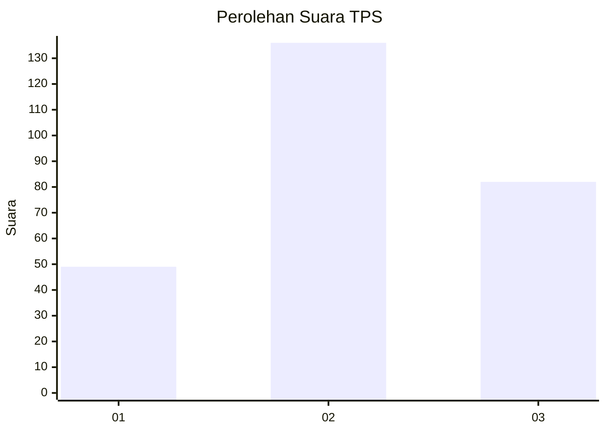
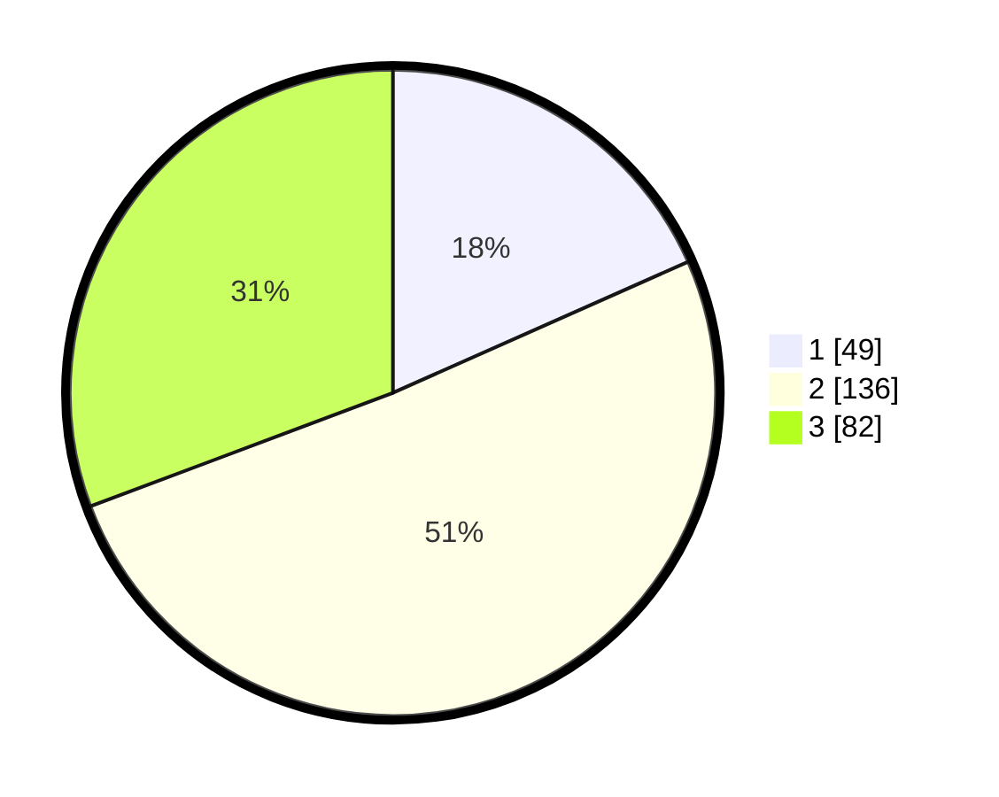

# Hasil

## Grafik

## Tabel

| No. | Nama Paslon    | Suara | Suara (raw) | Persentase |
|:--- |:-------------- | -----:| -----------:| ----------:|
| 1   | ANIES MUHAIMIN | 49    | [49][p-1]   | 18,35      |
| 2   | PRABOWO GIBRAN | 136   | [136][p-2]  | 50,94      |
| 3   | GANJAR MAHFUD  | 82    | [82][p-3]   | 30,71      |

[p-1]: https://github.com/gigit-pemilu/pemilu-2024-35-jawa-timur/blob/main/pilpres/hitung-suara/sub/35-jawa-timur/sub/05-blitar/sub/07-sanankulon/sub/2012-plosoarang/sub/008-tps/sub/paslon-1.txt
[p-2]: https://github.com/gigit-pemilu/pemilu-2024-35-jawa-timur/blob/main/pilpres/hitung-suara/sub/35-jawa-timur/sub/05-blitar/sub/07-sanankulon/sub/2012-plosoarang/sub/008-tps/sub/paslon-2.txt
[p-3]: https://github.com/gigit-pemilu/pemilu-2024-35-jawa-timur/blob/main/pilpres/hitung-suara/sub/35-jawa-timur/sub/05-blitar/sub/07-sanankulon/sub/2012-plosoarang/sub/008-tps/sub/paslon-3.txt

## Foto C Plano

https://sirekap-obj-formc.kpu.go.id/4c6c/pemilu/ppwp/35/05/07/20/12/3505072012008-20240220-194701--dd9e2d42-bd99-44cd-a166-ace96ad0ae76.jpg

https://sirekap-obj-formc.kpu.go.id/4c6c/pemilu/ppwp/35/05/07/20/12/3505072012008-20240220-194730--cc099f40-f0f9-4cfd-8e14-253b274cb23b.jpg

https://sirekap-obj-formc.kpu.go.id/4c6c/pemilu/ppwp/35/05/07/20/12/3505072012008-20240220-194757--86e6d475-2ccf-44f9-b91e-6c5971dc0881.jpg

## Metadata

| Key        | Value               |
| ---------- | ------------------- |
| Time Stamp | 2024-02-20 20:00:00 |

## DATA PEMILIH TETAP

Jumlah pemilih dalam DPT: **241**.
 * L: **149**.
 * P: **175**.

## DATA PENGGUNA HAK PILIH

Jumlah pengguna hak pilih dalam DPT: **335**.
 * L: **5**.
 * P: **555**.

Jumlah pengguna hak pilih dalam DPTb: **4**.
 * L: **1**.
 * P: **2**.

Jumlah pengguna hak pilih dalam DPK: **1**.
 * L: **0**.
 * P: **1**.

Jumlah pengguna hak pilih: **244**.
 * L: **115**.
 * P: **126**.

## JUMLAH SUARA SAH DAN TIDAK SAH

JUMLAH SELURUH SUARA SAH: **277**.

JUMLAH SUARA TIDAK SAH: **3**.

JUMLAH SELURUH SUARA SAH DAN SUARA TIDAK SAH: **244**.

