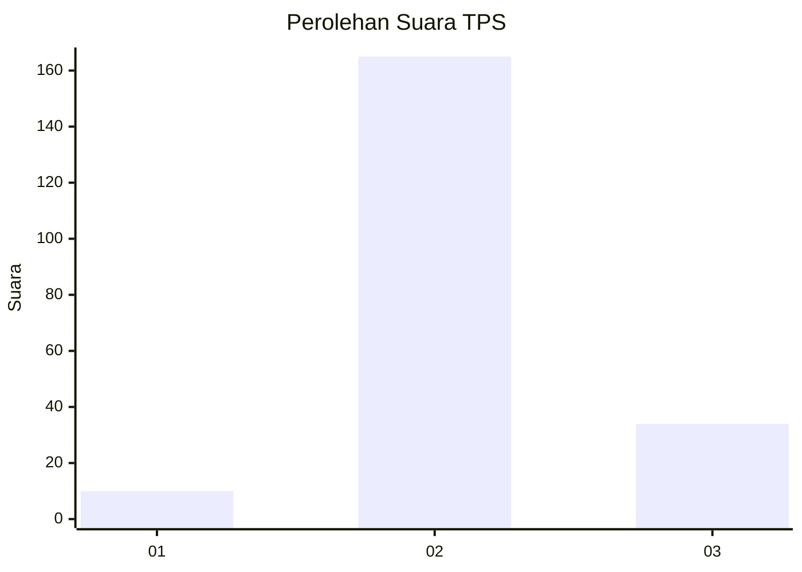
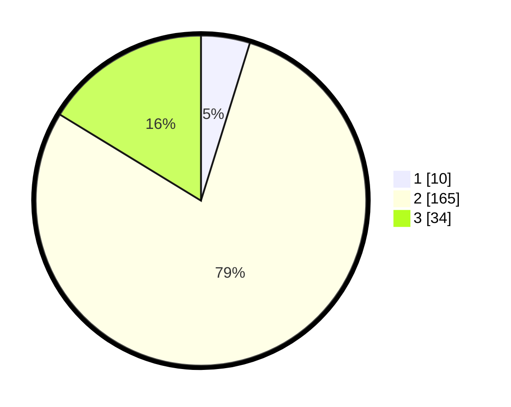

# Hasil

## Grafik

## Tabel

| No. | Nama Paslon    | Suara | Suara (raw) | Persentase |
|:--- |:-------------- | -----:| -----------:| ----------:|
| 1   | ANIES MUHAIMIN | 10    | [10][p-1]   | 4,78       |
| 2   | PRABOWO GIBRAN | 165   | [165][p-2]  | 78,95      |
| 3   | GANJAR MAHFUD  | 34    | [34][p-3]   | 16,27      |

[p-1]: https://github.com/gigit-pemilu/pemilu-2024/blob/main/pilpres/hitung-suara/sub/35-jawa-timur/sub/05-blitar/sub/08-wonotirto/sub/2004-sumberboto/sub/008-tps/sub/paslon-1.txt
[p-2]: https://github.com/gigit-pemilu/pemilu-2024/blob/main/pilpres/hitung-suara/sub/35-jawa-timur/sub/05-blitar/sub/08-wonotirto/sub/2004-sumberboto/sub/008-tps/sub/paslon-2.txt
[p-3]: https://github.com/gigit-pemilu/pemilu-2024/blob/main/pilpres/hitung-suara/sub/35-jawa-timur/sub/05-blitar/sub/08-wonotirto/sub/2004-sumberboto/sub/008-tps/sub/paslon-3.txt

## Foto C Plano

https://sirekap-obj-formc.kpu.go.id/c693/pemilu/ppwp/35/05/08/20/04/3505082004008-20240219-114411--71cbbe55-41ec-42b0-a7c4-72206bbb1a69.jpg

https://sirekap-obj-formc.kpu.go.id/c693/pemilu/ppwp/35/05/08/20/04/3505082004008-20240219-114509--3183f3f6-dcd6-4e75-82ec-0b001c499c89.jpg

https://sirekap-obj-formc.kpu.go.id/c693/pemilu/ppwp/35/05/08/20/04/3505082004008-20240219-114834--367f40dd-b088-41d0-9ee7-902b5d4d890d.jpg

## Metadata

| Key        | Value               |
| ---------- | ------------------- |
| Time Stamp | 2024-02-19 13:00:00 |

