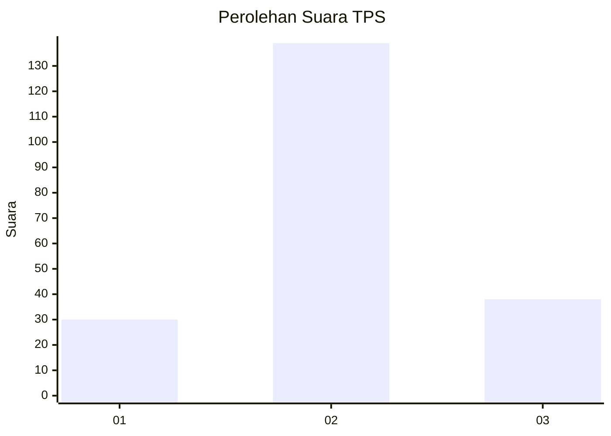
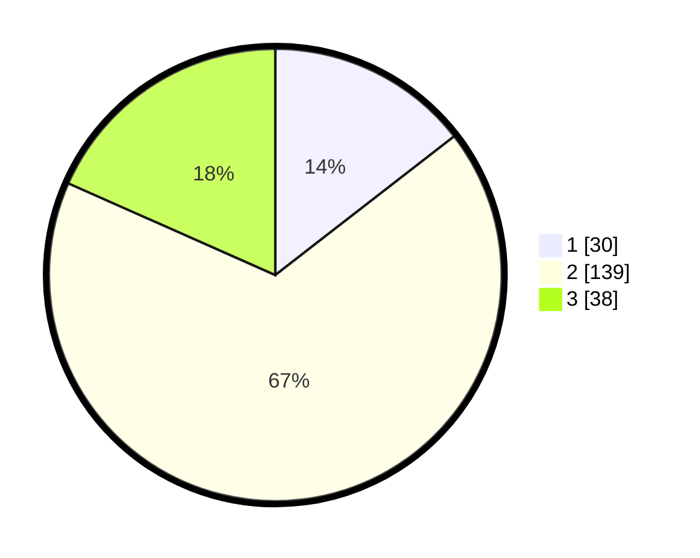

# Hasil

## Grafik

## Tabel

| No. | Nama Paslon    | Suara | Suara (raw) | Persentase |
|:--- |:-------------- | -----:| -----------:| ----------:|
| 1   | ANIES MUHAIMIN | 30    | [30][p-1]   | 14,49      |
| 2   | PRABOWO GIBRAN | 139   | [139][p-2]  | 67,15      |
| 3   | GANJAR MAHFUD  | 38    | [38][p-3]   | 18,36      |

[p-1]: https://github.com/gigit-pemilu/pemilu-2024-35-jawa-timur/blob/main/pilpres/hitung-suara/sub/35-jawa-timur/sub/05-blitar/sub/09-nglegok/sub/1009-nglegok/sub/002-tps/sub/paslon-1.txt
[p-2]: https://github.com/gigit-pemilu/pemilu-2024-35-jawa-timur/blob/main/pilpres/hitung-suara/sub/35-jawa-timur/sub/05-blitar/sub/09-nglegok/sub/1009-nglegok/sub/002-tps/sub/paslon-2.txt
[p-3]: https://github.com/gigit-pemilu/pemilu-2024-35-jawa-timur/blob/main/pilpres/hitung-suara/sub/35-jawa-timur/sub/05-blitar/sub/09-nglegok/sub/1009-nglegok/sub/002-tps/sub/paslon-3.txt

## Foto C Plano

https://sirekap-obj-formc.kpu.go.id/5b5f/pemilu/ppwp/35/05/09/10/09/3505091009002-20240214-212541--e27df1bc-9334-433e-8da1-09c573579ec1.jpg

https://sirekap-obj-formc.kpu.go.id/5b5f/pemilu/ppwp/35/05/09/10/09/3505091009002-20240214-162234--ef28b533-2530-455e-bfad-4ded943b3fa4.jpg

https://sirekap-obj-formc.kpu.go.id/5b5f/pemilu/ppwp/35/05/09/10/09/3505091009002-20240214-212628--7fe4f4b3-5946-4b32-b693-0531548fefe8.jpg

## Metadata

| Key        | Value               |
| ---------- | ------------------- |
| Time Stamp | 2024-02-15 09:00:24 |

