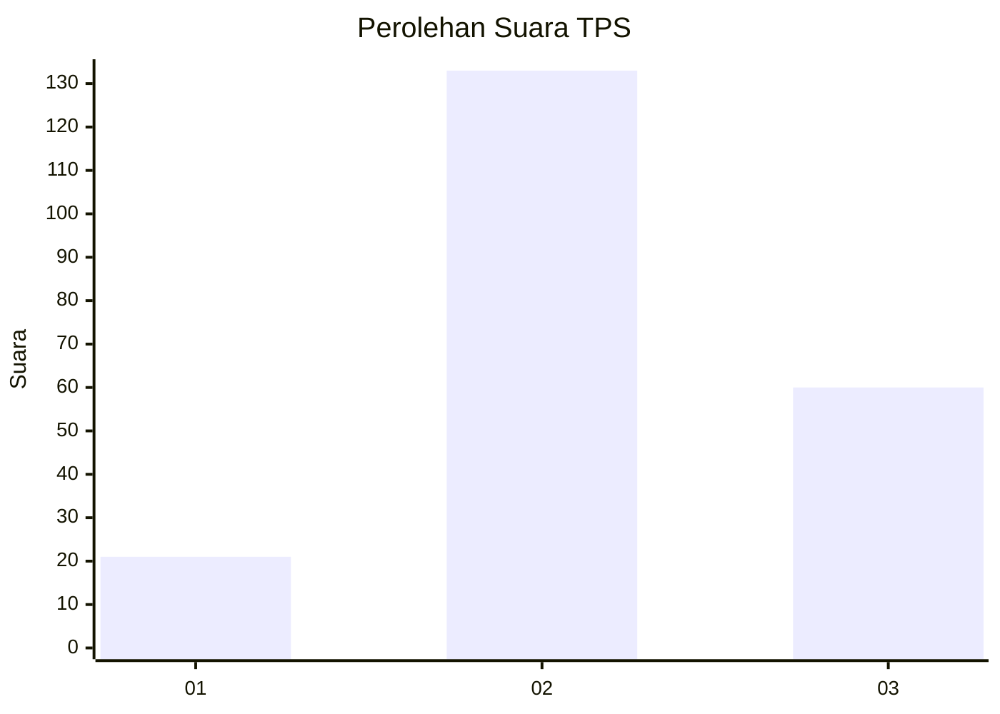
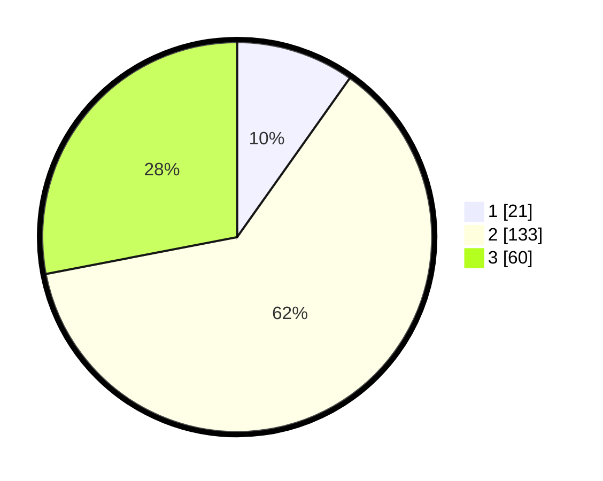

# Hasil

## Grafik

## Tabel

| No. | Nama Paslon    | Suara | Suara (raw) | Persentase |
|:--- |:-------------- | -----:| -----------:| ----------:|
| 1   | ANIES MUHAIMIN | 21    | [21][p-1]   | 9,81       |
| 2   | PRABOWO GIBRAN | 133   | [133][p-2]  | 62,15      |
| 3   | GANJAR MAHFUD  | 60    | [60][p-3]   | 28,04      |

[p-1]: https://github.com/gigit-pemilu/pemilu-2024-35-jawa-timur/blob/main/pilpres/hitung-suara/sub/35-jawa-timur/sub/05-blitar/sub/09-nglegok/sub/1009-nglegok/sub/005-tps/sub/paslon-1.txt
[p-2]: https://github.com/gigit-pemilu/pemilu-2024-35-jawa-timur/blob/main/pilpres/hitung-suara/sub/35-jawa-timur/sub/05-blitar/sub/09-nglegok/sub/1009-nglegok/sub/005-tps/sub/paslon-2.txt
[p-3]: https://github.com/gigit-pemilu/pemilu-2024-35-jawa-timur/blob/main/pilpres/hitung-suara/sub/35-jawa-timur/sub/05-blitar/sub/09-nglegok/sub/1009-nglegok/sub/005-tps/sub/paslon-3.txt

## Foto C Plano

https://sirekap-obj-formc.kpu.go.id/8600/pemilu/ppwp/35/05/09/10/09/3505091009005-20240215-033142--0f325c3b-67d6-4009-be88-9717decca865.jpg

https://sirekap-obj-formc.kpu.go.id/8600/pemilu/ppwp/35/05/09/10/09/3505091009005-20240215-033318--bb91fd5a-8334-47ff-97fd-cc49ba771289.jpg

https://sirekap-obj-formc.kpu.go.id/8600/pemilu/ppwp/35/05/09/10/09/3505091009005-20240215-033433--b5b576a5-2a6f-4636-aa24-5eb9d7a2df05.jpg

## Metadata

| Key        | Value               |
| ---------- | ------------------- |
| Time Stamp | 2024-02-16 22:01:00 |

