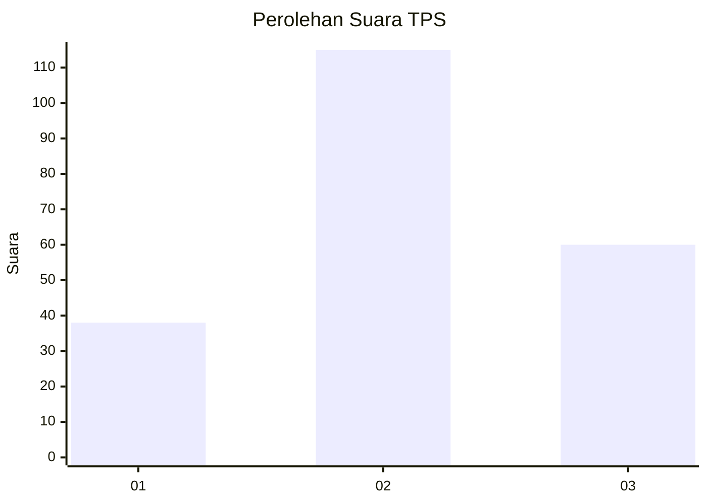
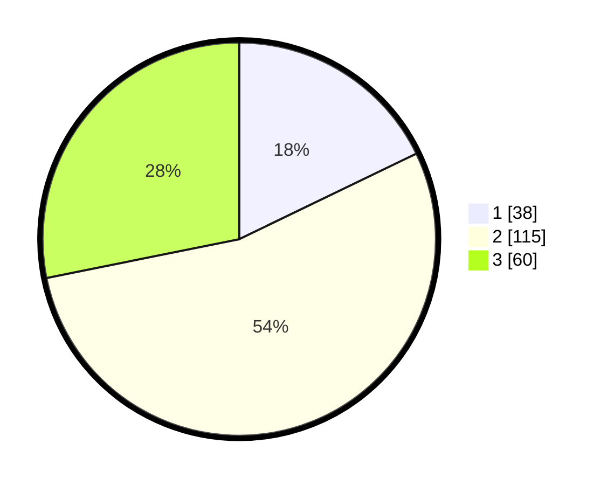

# Hasil

## Grafik

## Tabel

| No. | Nama Paslon    | Suara | Suara (raw) | Persentase |
|:--- |:-------------- | -----:| -----------:| ----------:|
| 1   | ANIES MUHAIMIN | 38    | [38][p-1]   | 17,84      |
| 2   | PRABOWO GIBRAN | 115   | [115][p-2]  | 53,99      |
| 3   | GANJAR MAHFUD  | 60    | [60][p-3]   | 28,17      |

[p-1]: https://github.com/gigit-pemilu/pemilu-2024/blob/main/pilpres/hitung-suara/sub/35-jawa-timur/sub/05-blitar/sub/09-nglegok/sub/1009-nglegok/sub/021-tps/sub/paslon-1.txt
[p-2]: https://github.com/gigit-pemilu/pemilu-2024/blob/main/pilpres/hitung-suara/sub/35-jawa-timur/sub/05-blitar/sub/09-nglegok/sub/1009-nglegok/sub/021-tps/sub/paslon-2.txt
[p-3]: https://github.com/gigit-pemilu/pemilu-2024/blob/main/pilpres/hitung-suara/sub/35-jawa-timur/sub/05-blitar/sub/09-nglegok/sub/1009-nglegok/sub/021-tps/sub/paslon-3.txt

## Foto C Plano

https://sirekap-obj-formc.kpu.go.id/5c63/pemilu/ppwp/35/05/09/10/09/3505091009021-20240215-041955--e34355dd-e5a2-47f3-a255-ec9ed868be57.jpg

https://sirekap-obj-formc.kpu.go.id/5c63/pemilu/ppwp/35/05/09/10/09/3505091009021-20240215-032423--c0bc5015-37b1-4389-816e-3a3782528680.jpg

https://sirekap-obj-formc.kpu.go.id/5c63/pemilu/ppwp/35/05/09/10/09/3505091009021-20240215-042143--1beabcac-37ed-4c41-b5fe-f1ff9a3aff11.jpg

## Metadata

| Key        | Value               |
| ---------- | ------------------- |
| Time Stamp | 2024-02-15 15:00:29 |

