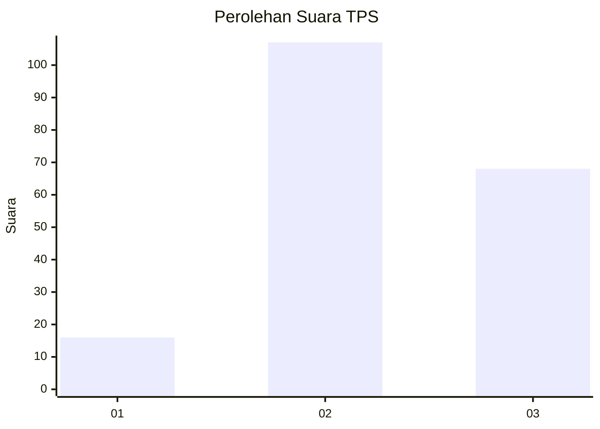
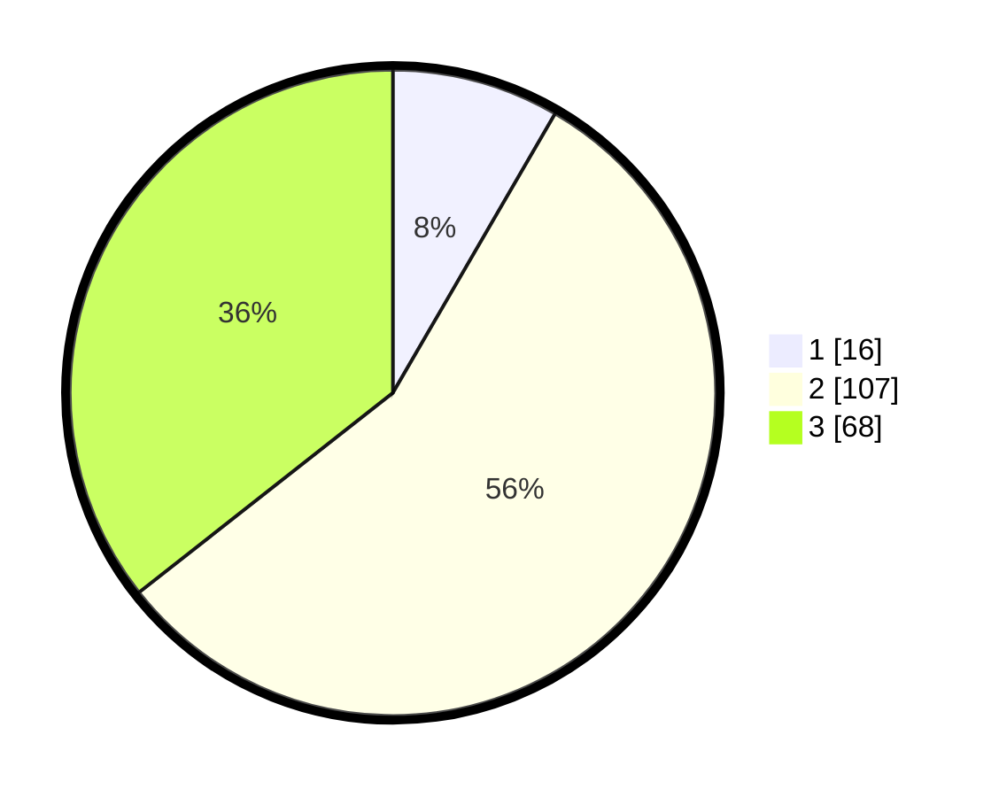

# Hasil

## Grafik

## Tabel

| No. | Nama Paslon    | Suara | Suara (raw) | Persentase |
|:--- |:-------------- | -----:| -----------:| ----------:|
| 1   | ANIES MUHAIMIN | 16    | [16][p-1]   | 8,38       |
| 2   | PRABOWO GIBRAN | 107   | [107][p-2]  | 56,02      |
| 3   | GANJAR MAHFUD  | 68    | [68][p-3]   | 35,60      |

[p-1]: https://github.com/gigit-pemilu/pemilu-2024-35-jawa-timur/blob/main/pilpres/hitung-suara/sub/35-jawa-timur/sub/05-blitar/sub/09-nglegok/sub/1009-nglegok/sub/023-tps/sub/paslon-1.txt
[p-2]: https://github.com/gigit-pemilu/pemilu-2024-35-jawa-timur/blob/main/pilpres/hitung-suara/sub/35-jawa-timur/sub/05-blitar/sub/09-nglegok/sub/1009-nglegok/sub/023-tps/sub/paslon-2.txt
[p-3]: https://github.com/gigit-pemilu/pemilu-2024-35-jawa-timur/blob/main/pilpres/hitung-suara/sub/35-jawa-timur/sub/05-blitar/sub/09-nglegok/sub/1009-nglegok/sub/023-tps/sub/paslon-3.txt

## Foto C Plano

https://sirekap-obj-formc.kpu.go.id/9003/pemilu/ppwp/35/05/09/10/09/3505091009023-20240214-205955--ee4f4b26-5eb2-4d06-a2c0-29cf7450974c.jpg

https://sirekap-obj-formc.kpu.go.id/9003/pemilu/ppwp/35/05/09/10/09/3505091009023-20240214-210233--46f7735a-46a2-4dab-959d-8c2180532aa2.jpg

https://sirekap-obj-formc.kpu.go.id/9003/pemilu/ppwp/35/05/09/10/09/3505091009023-20240214-210413--6675fe2d-666c-4d91-9264-7d16860f24fd.jpg

## Metadata

| Key        | Value               |
| ---------- | ------------------- |
| Time Stamp | 2024-02-22 18:00:00 |

