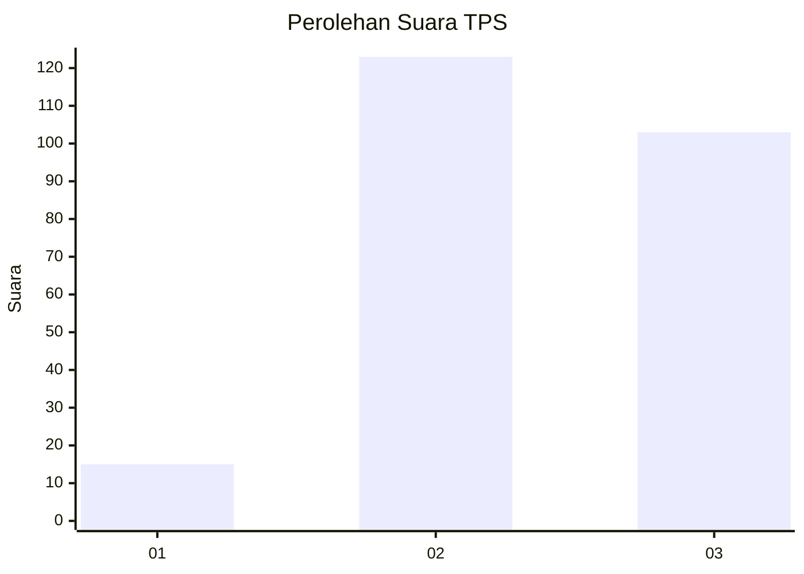
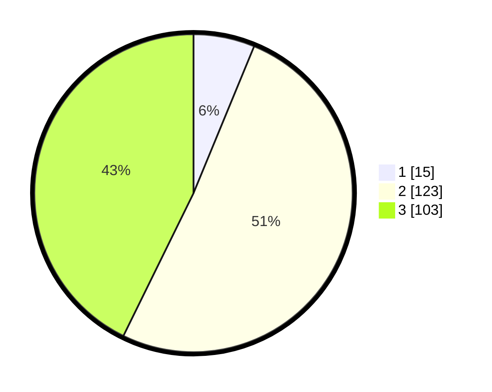

# Hasil

## Grafik

## Tabel

| No. | Nama Paslon    | Suara | Suara (raw) | Persentase |
|:--- |:-------------- | -----:| -----------:| ----------:|
| 1   | ANIES MUHAIMIN | 15    | [15][p-1]   | 6,22       |
| 2   | PRABOWO GIBRAN | 123   | [123][p-2]  | 51,04      |
| 3   | GANJAR MAHFUD  | 103   | [103][p-3]  | 42,74      |

[p-1]: https://github.com/gigit-pemilu/pemilu-2024/blob/main/pilpres/hitung-suara/sub/35-jawa-timur/sub/05-blitar/sub/09-nglegok/sub/2001-sumberasri/sub/001-tps/sub/paslon-1.txt
[p-2]: https://github.com/gigit-pemilu/pemilu-2024/blob/main/pilpres/hitung-suara/sub/35-jawa-timur/sub/05-blitar/sub/09-nglegok/sub/2001-sumberasri/sub/001-tps/sub/paslon-2.txt
[p-3]: https://github.com/gigit-pemilu/pemilu-2024/blob/main/pilpres/hitung-suara/sub/35-jawa-timur/sub/05-blitar/sub/09-nglegok/sub/2001-sumberasri/sub/001-tps/sub/paslon-3.txt

## Foto C Plano

https://sirekap-obj-formc.kpu.go.id/bd83/pemilu/ppwp/35/05/09/20/01/3505092001001-20240214-141404--697a18b0-4efd-476b-8df7-6ddf7b2e5d43.jpg

https://sirekap-obj-formc.kpu.go.id/bd83/pemilu/ppwp/35/05/09/20/01/3505092001001-20240216-100306--ca37895b-964b-4d7d-8293-0cb400e3e15a.jpg

https://sirekap-obj-formc.kpu.go.id/bd83/pemilu/ppwp/35/05/09/20/01/3505092001001-20240214-141222--906f74ca-5fea-45ba-86ce-a2830d948622.jpg

## Metadata

| Key        | Value               |
| ---------- | ------------------- |
| Time Stamp | 2024-02-22 18:00:00 |

