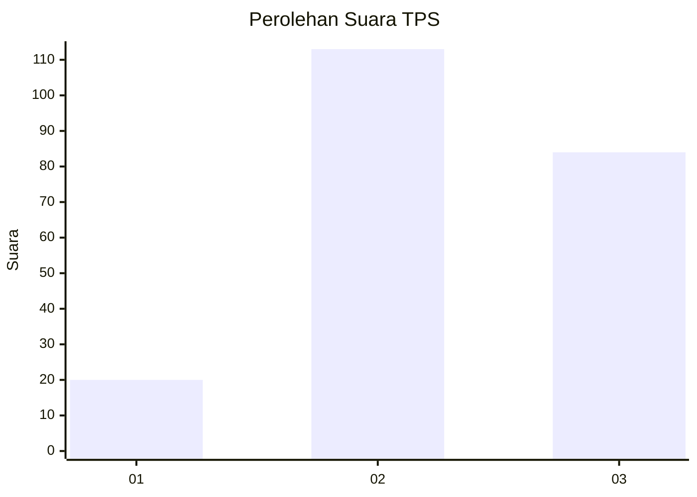
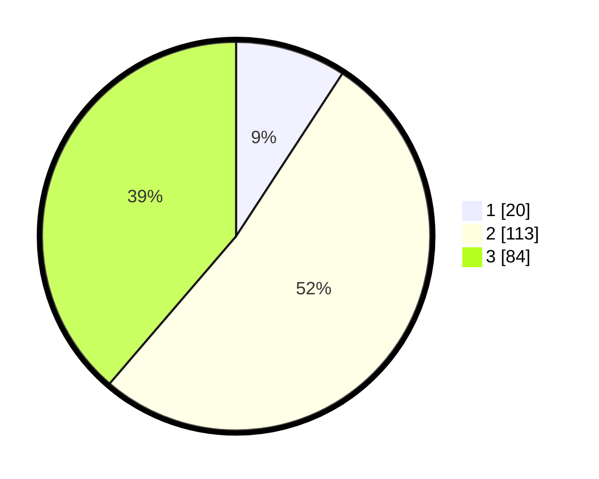

# Hasil

## Grafik

## Tabel

| No. | Nama Paslon    | Suara | Suara (raw) | Persentase |
|:--- |:-------------- | -----:| -----------:| ----------:|
| 1   | ANIES MUHAIMIN | 20    | [20][p-1]   | 9,22       |
| 2   | PRABOWO GIBRAN | 113   | [113][p-2]  | 52,07      |
| 3   | GANJAR MAHFUD  | 84    | [84][p-3]   | 38,71      |

[p-1]: https://github.com/gigit-pemilu/pemilu-2024/blob/main/pilpres/hitung-suara/sub/35-jawa-timur/sub/05-blitar/sub/09-nglegok/sub/2001-sumberasri/sub/002-tps/sub/paslon-1.txt
[p-2]: https://github.com/gigit-pemilu/pemilu-2024/blob/main/pilpres/hitung-suara/sub/35-jawa-timur/sub/05-blitar/sub/09-nglegok/sub/2001-sumberasri/sub/002-tps/sub/paslon-2.txt
[p-3]: https://github.com/gigit-pemilu/pemilu-2024/blob/main/pilpres/hitung-suara/sub/35-jawa-timur/sub/05-blitar/sub/09-nglegok/sub/2001-sumberasri/sub/002-tps/sub/paslon-3.txt

## Foto C Plano

https://sirekap-obj-formc.kpu.go.id/be9d/pemilu/ppwp/35/05/09/20/01/3505092001002-20240214-224850--f19f815c-a6a4-429c-9982-09442b5c37cb.jpg

https://sirekap-obj-formc.kpu.go.id/be9d/pemilu/ppwp/35/05/09/20/01/3505092001002-20240214-224950--9d2631f7-75b9-4eb2-8aca-179f0d6a842b.jpg

https://sirekap-obj-formc.kpu.go.id/be9d/pemilu/ppwp/35/05/09/20/01/3505092001002-20240214-225103--3d318532-0edd-4080-b632-1742d3dc2330.jpg

## Metadata

| Key        | Value               |
| ---------- | ------------------- |
| Time Stamp | 2024-02-15 12:00:28 |

