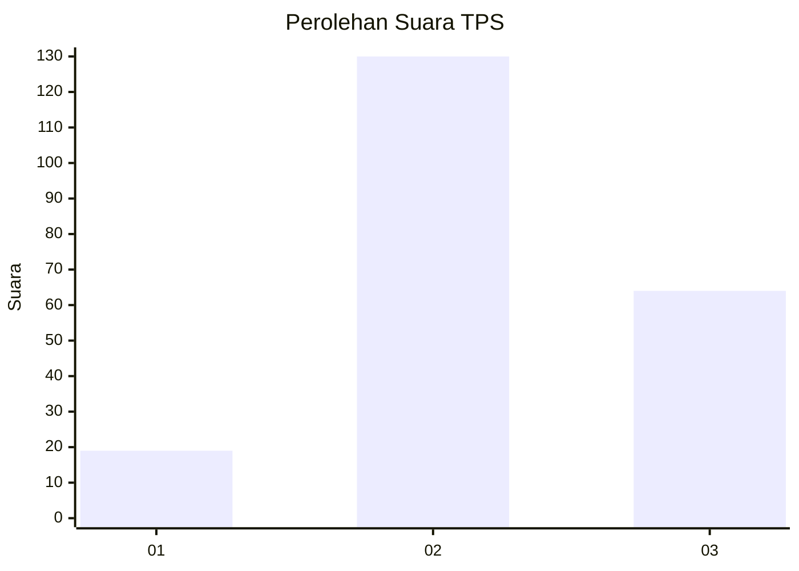
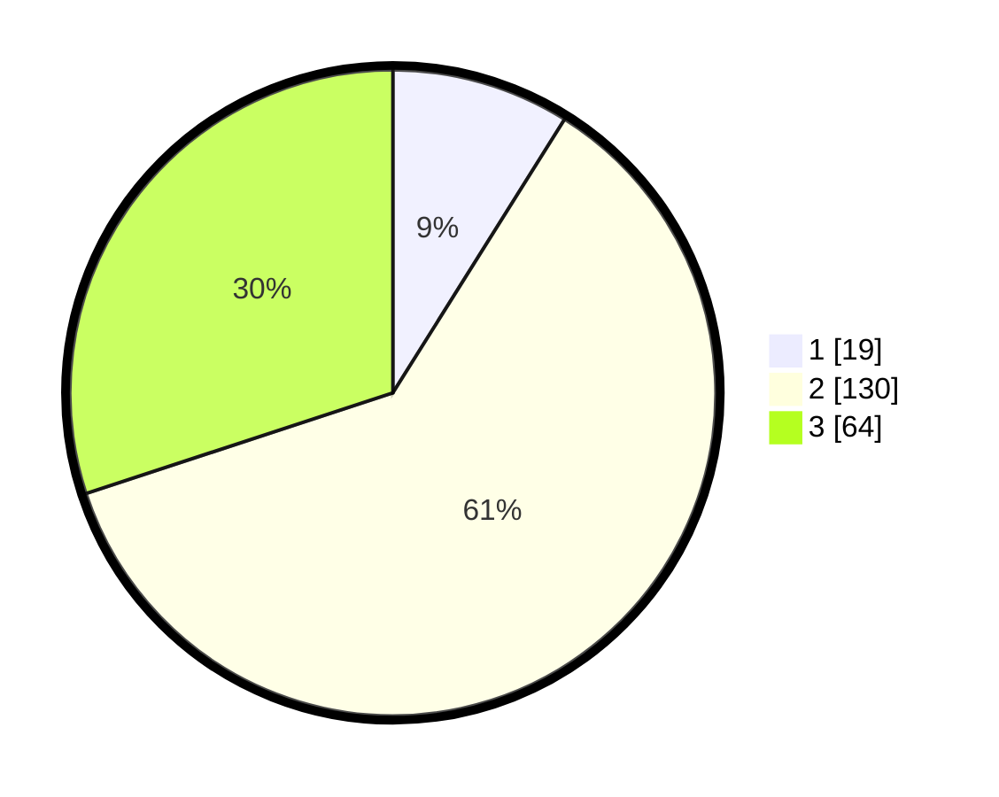

# Hasil

## Grafik

## Tabel

| No. | Nama Paslon    | Suara | Suara (raw) | Persentase |
|:--- |:-------------- | -----:| -----------:| ----------:|
| 1   | ANIES MUHAIMIN | 19    | [19][p-1]   | 8,92       |
| 2   | PRABOWO GIBRAN | 130   | [130][p-2]  | 61,03      |
| 3   | GANJAR MAHFUD  | 64    | [64][p-3]   | 30,05      |

[p-1]: https://github.com/gigit-pemilu/pemilu-2024-35-jawa-timur/blob/main/pilpres/hitung-suara/sub/35-jawa-timur/sub/05-blitar/sub/09-nglegok/sub/2001-sumberasri/sub/010-tps/sub/paslon-1.txt
[p-2]: https://github.com/gigit-pemilu/pemilu-2024-35-jawa-timur/blob/main/pilpres/hitung-suara/sub/35-jawa-timur/sub/05-blitar/sub/09-nglegok/sub/2001-sumberasri/sub/010-tps/sub/paslon-2.txt
[p-3]: https://github.com/gigit-pemilu/pemilu-2024-35-jawa-timur/blob/main/pilpres/hitung-suara/sub/35-jawa-timur/sub/05-blitar/sub/09-nglegok/sub/2001-sumberasri/sub/010-tps/sub/paslon-3.txt

## Foto C Plano

https://sirekap-obj-formc.kpu.go.id/e848/pemilu/ppwp/35/05/09/20/01/3505092001010-20240214-195004--fbc7b2fc-18c4-4a01-b9c2-c541feac9fc7.jpg

https://sirekap-obj-formc.kpu.go.id/e848/pemilu/ppwp/35/05/09/20/01/3505092001010-20240214-194656--e5caf323-d6a2-4068-9482-4f48b3114e1b.jpg

https://sirekap-obj-formc.kpu.go.id/e848/pemilu/ppwp/35/05/09/20/01/3505092001010-20240214-195302--f3a74a60-9fe2-4566-9fce-ecdd0b851062.jpg

## Metadata

| Key        | Value               |
| ---------- | ------------------- |
| Time Stamp | 2024-02-15 09:00:24 |

