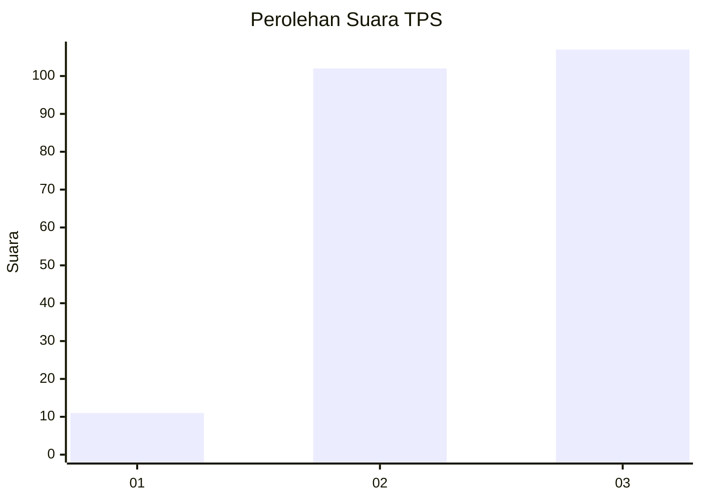
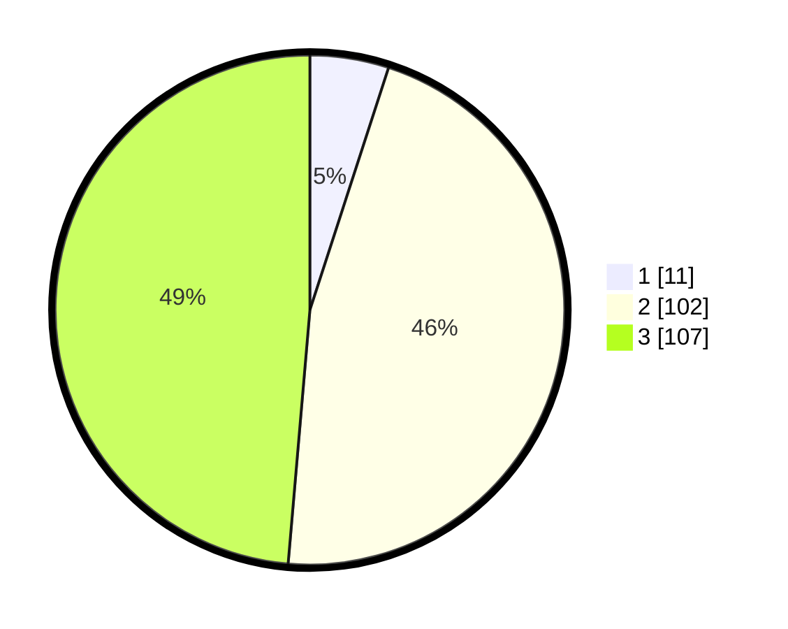

# Hasil

## Grafik

## Tabel

| No. | Nama Paslon    | Suara | Suara (raw) | Persentase |
|:--- |:-------------- | -----:| -----------:| ----------:|
| 1   | ANIES MUHAIMIN | 11    | [11][p-1]   | 5,00       |
| 2   | PRABOWO GIBRAN | 102   | [102][p-2]  | 46,36      |
| 3   | GANJAR MAHFUD  | 107   | [107][p-3]  | 48,64      |

[p-1]: https://github.com/gigit-pemilu/pemilu-2024/blob/main/pilpres/hitung-suara/sub/35-jawa-timur/sub/05-blitar/sub/09-nglegok/sub/2001-sumberasri/sub/014-tps/sub/paslon-1.txt
[p-2]: https://github.com/gigit-pemilu/pemilu-2024/blob/main/pilpres/hitung-suara/sub/35-jawa-timur/sub/05-blitar/sub/09-nglegok/sub/2001-sumberasri/sub/014-tps/sub/paslon-2.txt
[p-3]: https://github.com/gigit-pemilu/pemilu-2024/blob/main/pilpres/hitung-suara/sub/35-jawa-timur/sub/05-blitar/sub/09-nglegok/sub/2001-sumberasri/sub/014-tps/sub/paslon-3.txt

## Foto C Plano

https://sirekap-obj-formc.kpu.go.id/a94f/pemilu/ppwp/35/05/09/20/01/3505092001014-20240214-232447--14f917c8-e47b-48b6-bd01-c078a47b9b2d.jpg

https://sirekap-obj-formc.kpu.go.id/a94f/pemilu/ppwp/35/05/09/20/01/3505092001014-20240214-232534--00aef37f-6c7c-41b1-b179-2711c1fb6b0b.jpg

https://sirekap-obj-formc.kpu.go.id/a94f/pemilu/ppwp/35/05/09/20/01/3505092001014-20240214-232624--9c89cdbd-54c5-4ae6-acd5-77d0a9aa2c5b.jpg

## Metadata

| Key        | Value               |
| ---------- | ------------------- |
| Time Stamp | 2024-02-15 09:00:24 |

