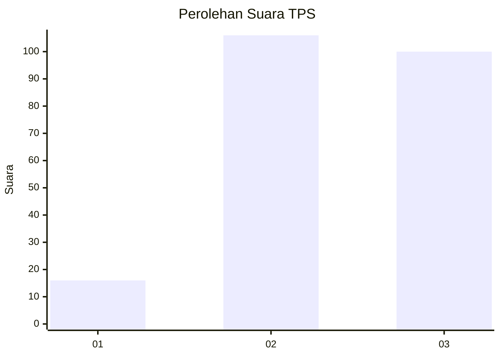
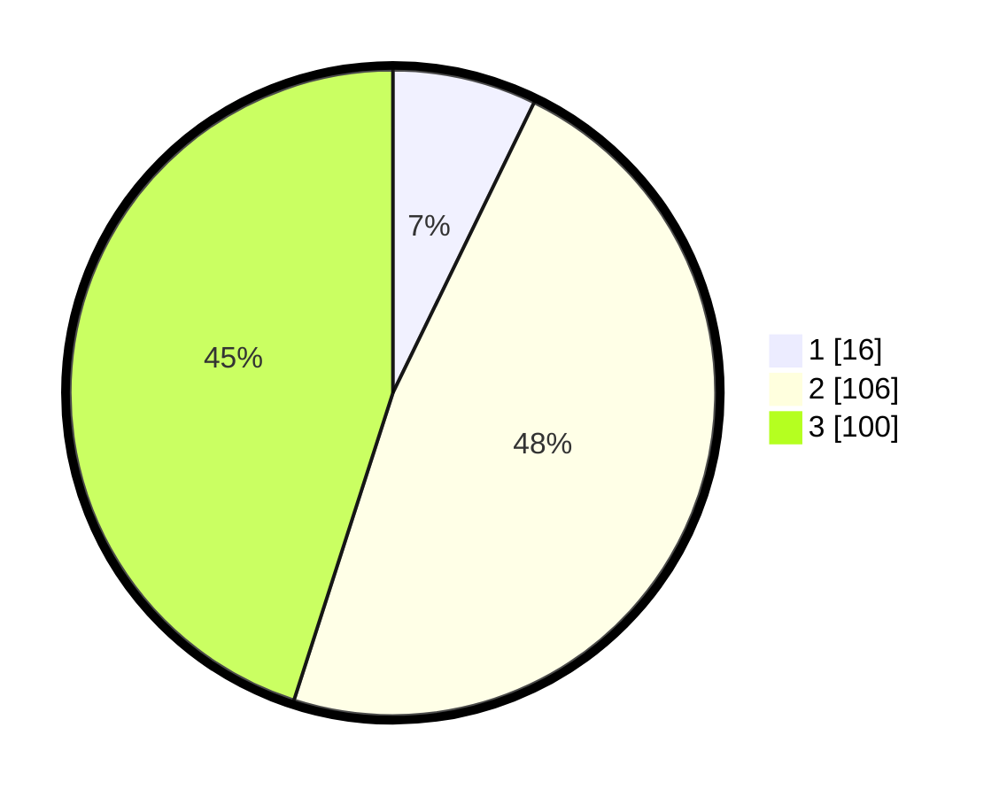

# Hasil

## Grafik

## Tabel

| No. | Nama Paslon    | Suara | Suara (raw) | Persentase |
|:--- |:-------------- | -----:| -----------:| ----------:|
| 1   | ANIES MUHAIMIN | 16    | [16][p-1]   | 7,21       |
| 2   | PRABOWO GIBRAN | 106   | [106][p-2]  | 47,75      |
| 3   | GANJAR MAHFUD  | 100   | [100][p-3]  | 45,05      |

[p-1]: https://github.com/gigit-pemilu/pemilu-2024-35-jawa-timur/blob/main/pilpres/hitung-suara/sub/35-jawa-timur/sub/05-blitar/sub/09-nglegok/sub/2001-sumberasri/sub/023-tps/sub/paslon-1.txt
[p-2]: https://github.com/gigit-pemilu/pemilu-2024-35-jawa-timur/blob/main/pilpres/hitung-suara/sub/35-jawa-timur/sub/05-blitar/sub/09-nglegok/sub/2001-sumberasri/sub/023-tps/sub/paslon-2.txt
[p-3]: https://github.com/gigit-pemilu/pemilu-2024-35-jawa-timur/blob/main/pilpres/hitung-suara/sub/35-jawa-timur/sub/05-blitar/sub/09-nglegok/sub/2001-sumberasri/sub/023-tps/sub/paslon-3.txt

## Foto C Plano

https://sirekap-obj-formc.kpu.go.id/b87e/pemilu/ppwp/35/05/09/20/01/3505092001023-20240214-215012--c405f465-1a46-4c35-b514-8a6bc83c82b3.jpg

https://sirekap-obj-formc.kpu.go.id/b87e/pemilu/ppwp/35/05/09/20/01/3505092001023-20240214-215205--e5618ebf-af9c-4723-aee0-9a251918deff.jpg

https://sirekap-obj-formc.kpu.go.id/b87e/pemilu/ppwp/35/05/09/20/01/3505092001023-20240214-215321--26ba0e68-ba08-4402-a497-627cde6a071b.jpg

## Metadata

| Key        | Value               |
| ---------- | ------------------- |
| Time Stamp | 2024-02-15 15:00:29 |

