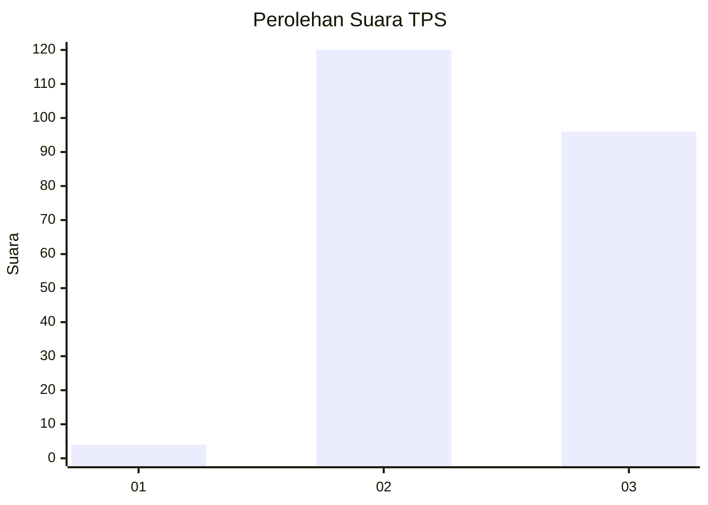
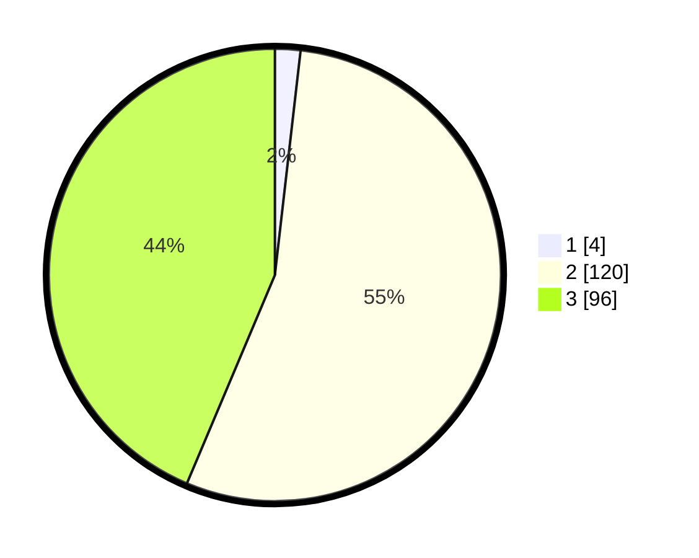

# Hasil

## Grafik

## Tabel

| No. | Nama Paslon    | Suara | Suara (raw) | Persentase |
|:--- |:-------------- | -----:| -----------:| ----------:|
| 1   | ANIES MUHAIMIN | 4     | [4][p-1]    | 1,82       |
| 2   | PRABOWO GIBRAN | 120   | [120][p-2]  | 54,55      |
| 3   | GANJAR MAHFUD  | 96    | [96][p-3]   | 43,64      |

[p-1]: https://github.com/gigit-pemilu/pemilu-2024/blob/main/pilpres/hitung-suara/sub/35-jawa-timur/sub/05-blitar/sub/09-nglegok/sub/2001-sumberasri/sub/026-tps/sub/paslon-1.txt
[p-2]: https://github.com/gigit-pemilu/pemilu-2024/blob/main/pilpres/hitung-suara/sub/35-jawa-timur/sub/05-blitar/sub/09-nglegok/sub/2001-sumberasri/sub/026-tps/sub/paslon-2.txt
[p-3]: https://github.com/gigit-pemilu/pemilu-2024/blob/main/pilpres/hitung-suara/sub/35-jawa-timur/sub/05-blitar/sub/09-nglegok/sub/2001-sumberasri/sub/026-tps/sub/paslon-3.txt

## Foto C Plano

https://sirekap-obj-formc.kpu.go.id/1d23/pemilu/ppwp/35/05/09/20/01/3505092001026-20240214-234636--ed1ac69a-3e58-4f58-bcd2-d078deb3451e.jpg

https://sirekap-obj-formc.kpu.go.id/1d23/pemilu/ppwp/35/05/09/20/01/3505092001026-20240214-234712--e1803f1b-5b81-484b-8cef-b21a5733ddfc.jpg

https://sirekap-obj-formc.kpu.go.id/1d23/pemilu/ppwp/35/05/09/20/01/3505092001026-20240214-234852--33e76356-4817-418d-a148-601a030fbe7b.jpg

## Metadata

| Key        | Value               |
| ---------- | ------------------- |
| Time Stamp | 2024-02-25 12:00:00 |

