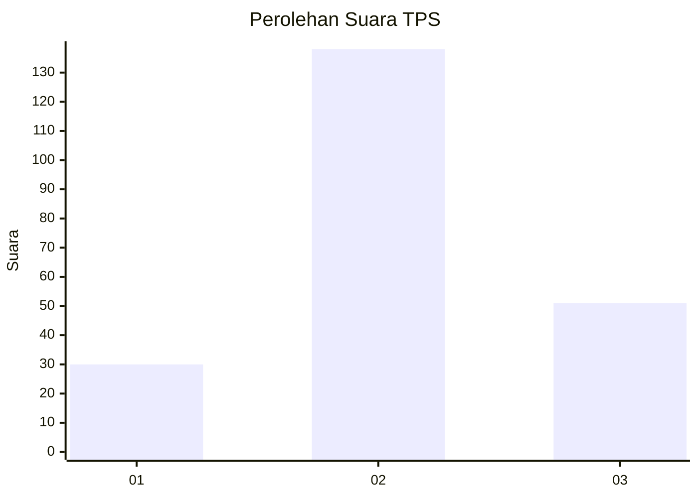
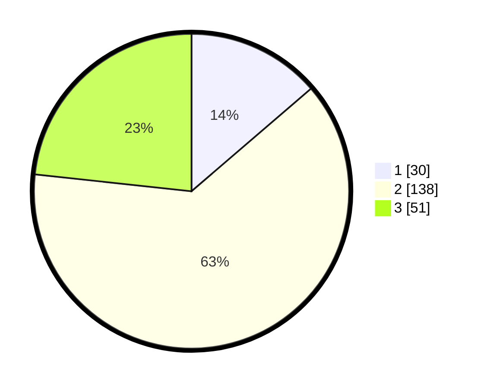

# Hasil

## Grafik

## Tabel

| No. | Nama Paslon    | Suara | Suara (raw) | Persentase |
|:--- |:-------------- | -----:| -----------:| ----------:|
| 1   | ANIES MUHAIMIN | 30    | [30][p-1]   | 13,70      |
| 2   | PRABOWO GIBRAN | 138   | [138][p-2]  | 63,01      |
| 3   | GANJAR MAHFUD  | 51    | [51][p-3]   | 23,29      |

[p-1]: https://github.com/gigit-pemilu/pemilu-2024-35-jawa-timur/blob/main/pilpres/hitung-suara/sub/35-jawa-timur/sub/05-blitar/sub/09-nglegok/sub/2002-kedawung/sub/002-tps/sub/paslon-1.txt
[p-2]: https://github.com/gigit-pemilu/pemilu-2024-35-jawa-timur/blob/main/pilpres/hitung-suara/sub/35-jawa-timur/sub/05-blitar/sub/09-nglegok/sub/2002-kedawung/sub/002-tps/sub/paslon-2.txt
[p-3]: https://github.com/gigit-pemilu/pemilu-2024-35-jawa-timur/blob/main/pilpres/hitung-suara/sub/35-jawa-timur/sub/05-blitar/sub/09-nglegok/sub/2002-kedawung/sub/002-tps/sub/paslon-3.txt

## Foto C Plano

https://sirekap-obj-formc.kpu.go.id/9690/pemilu/ppwp/35/05/09/20/02/3505092002002-20240219-102927--322a5f65-4ac9-40e4-b67f-efe592be26b3.jpg

https://sirekap-obj-formc.kpu.go.id/9690/pemilu/ppwp/35/05/09/20/02/3505092002002-20240219-103038--bb39599b-c690-490e-a107-e9543f0e2980.jpg

https://sirekap-obj-formc.kpu.go.id/9690/pemilu/ppwp/35/05/09/20/02/3505092002002-20240219-103141--229471c8-c23d-4bf7-a8a6-e59a384fcdf0.jpg

## Metadata

| Key        | Value               |
| ---------- | ------------------- |
| Time Stamp | 2024-02-24 22:31:28 |

