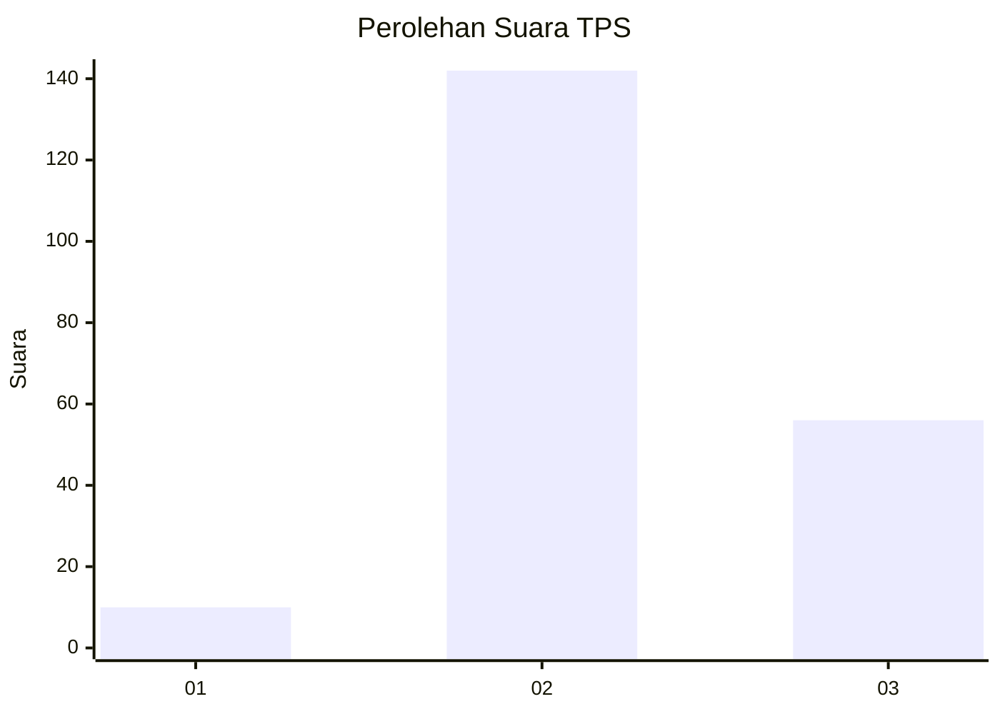

# Hasil

## Grafik

## Tabel

| No. | Nama Paslon    | Suara | Suara (raw) | Persentase |
|:--- |:-------------- | -----:| -----------:| ----------:|
| 1   | ANIES MUHAIMIN | 10    | [10][p-1]   | 4,81       |
| 2   | PRABOWO GIBRAN | 142   | [142][p-2]  | 68,27      |
| 3   | GANJAR MAHFUD  | 56    | [56][p-3]   | 26,92      |

[p-1]: https://github.com/gigit-pemilu/pemilu-2024/blob/main/pilpres/hitung-suara/sub/35-jawa-timur/sub/05-blitar/sub/09-nglegok/sub/2002-kedawung/sub/005-tps/sub/paslon-1.txt
[p-2]: https://github.com/gigit-pemilu/pemilu-2024/blob/main/pilpres/hitung-suara/sub/35-jawa-timur/sub/05-blitar/sub/09-nglegok/sub/2002-kedawung/sub/005-tps/sub/paslon-2.txt
[p-3]: https://github.com/gigit-pemilu/pemilu-2024/blob/main/pilpres/hitung-suara/sub/35-jawa-timur/sub/05-blitar/sub/09-nglegok/sub/2002-kedawung/sub/005-tps/sub/paslon-3.txt

## Foto C Plano

https://sirekap-obj-formc.kpu.go.id/5de4/pemilu/ppwp/35/05/09/20/02/3505092002005-20240214-205008--6bf253b3-c08b-4209-91e7-fd18d09b15b7.jpg

https://sirekap-obj-formc.kpu.go.id/5de4/pemilu/ppwp/35/05/09/20/02/3505092002005-20240214-205623--188adc38-a065-44d5-bc34-56aa65540d36.jpg

https://sirekap-obj-formc.kpu.go.id/5de4/pemilu/ppwp/35/05/09/20/02/3505092002005-20240214-205808--22c71516-fd65-4446-a732-be3025ded2a0.jpg

## Metadata

| Key        | Value               |
| ---------- | ------------------- |
| Time Stamp | 2024-02-22 18:00:00 |

