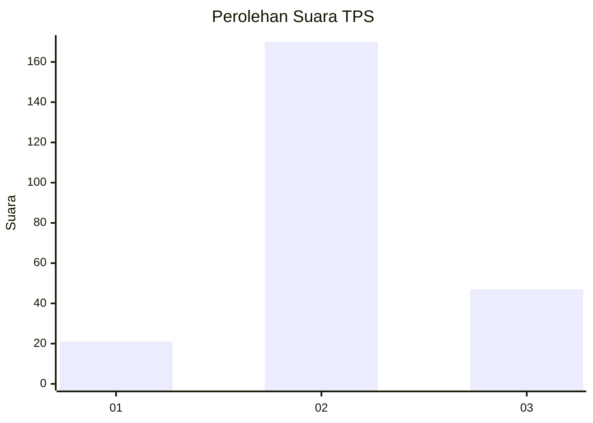
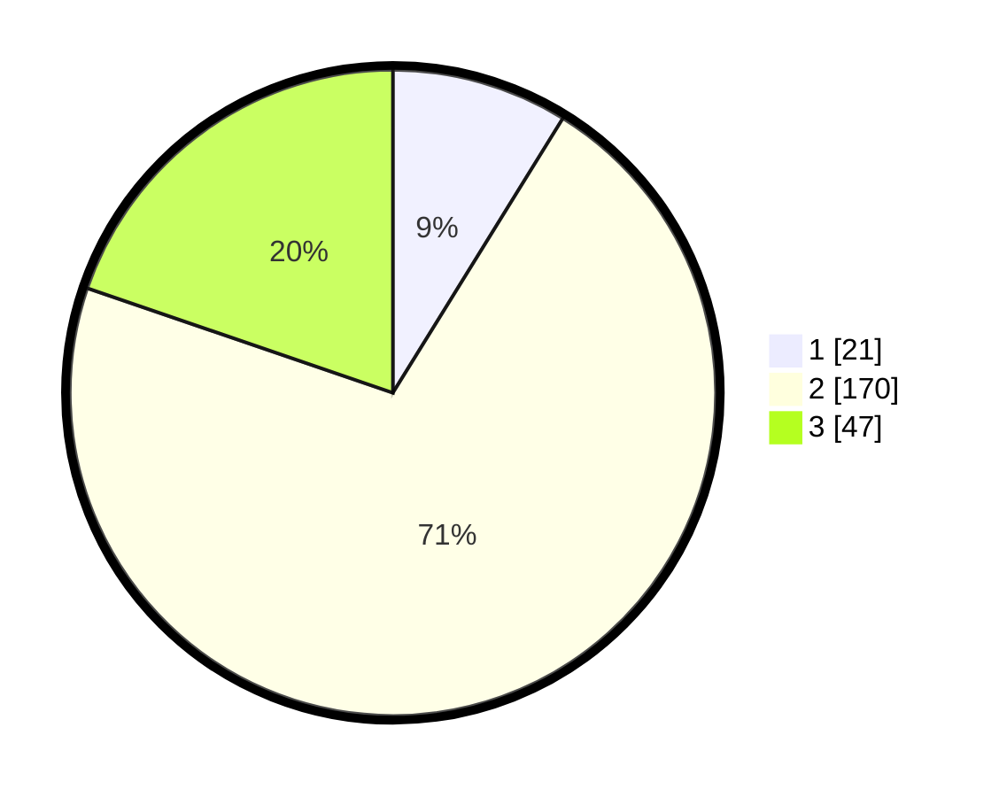

# Hasil

## Grafik

## Tabel

| No. | Nama Paslon    | Suara | Suara (raw) | Persentase |
|:--- |:-------------- | -----:| -----------:| ----------:|
| 1   | ANIES MUHAIMIN | 21    | [21][p-1]   | 8,82       |
| 2   | PRABOWO GIBRAN | 170   | [170][p-2]  | 71,43      |
| 3   | GANJAR MAHFUD  | 47    | [47][p-3]   | 19,75      |

[p-1]: https://github.com/gigit-pemilu/pemilu-2024-35-jawa-timur/blob/main/pilpres/hitung-suara/sub/35-jawa-timur/sub/05-blitar/sub/09-nglegok/sub/2002-kedawung/sub/006-tps/sub/paslon-1.txt
[p-2]: https://github.com/gigit-pemilu/pemilu-2024-35-jawa-timur/blob/main/pilpres/hitung-suara/sub/35-jawa-timur/sub/05-blitar/sub/09-nglegok/sub/2002-kedawung/sub/006-tps/sub/paslon-2.txt
[p-3]: https://github.com/gigit-pemilu/pemilu-2024-35-jawa-timur/blob/main/pilpres/hitung-suara/sub/35-jawa-timur/sub/05-blitar/sub/09-nglegok/sub/2002-kedawung/sub/006-tps/sub/paslon-3.txt

## Foto C Plano

https://sirekap-obj-formc.kpu.go.id/c524/pemilu/ppwp/35/05/09/20/02/3505092002006-20240214-203733--67523aa3-870c-405a-b1fe-97ba7609d9f7.jpg

https://sirekap-obj-formc.kpu.go.id/c524/pemilu/ppwp/35/05/09/20/02/3505092002006-20240214-203746--d0f18c53-ba4d-4278-9008-c614d83cd582.jpg

https://sirekap-obj-formc.kpu.go.id/c524/pemilu/ppwp/35/05/09/20/02/3505092002006-20240214-222610--9ef62ed4-9457-4172-addf-b53b4eb68e33.jpg

## Metadata

| Key        | Value               |
| ---------- | ------------------- |
| Time Stamp | 2024-02-15 00:41:44 |

