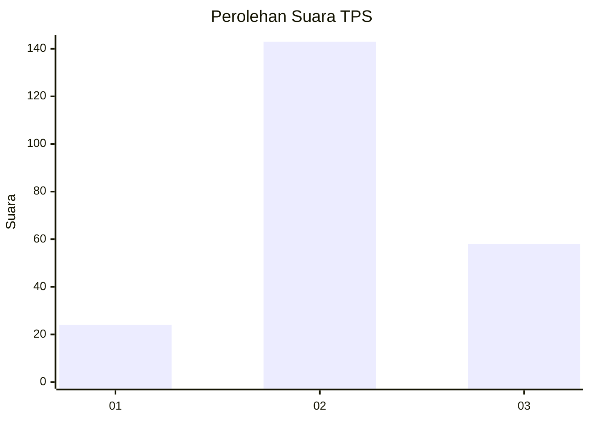
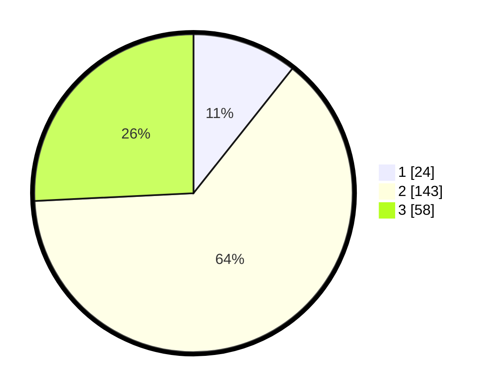

# Hasil

## Grafik

## Tabel

| No. | Nama Paslon    | Suara | Suara (raw) | Persentase |
|:--- |:-------------- | -----:| -----------:| ----------:|
| 1   | ANIES MUHAIMIN | 24    | [24][p-1]   | 10,67      |
| 2   | PRABOWO GIBRAN | 143   | [143][p-2]  | 63,56      |
| 3   | GANJAR MAHFUD  | 58    | [58][p-3]   | 25,78      |

[p-1]: https://github.com/gigit-pemilu/pemilu-2024-35-jawa-timur/blob/main/pilpres/hitung-suara/sub/35-jawa-timur/sub/05-blitar/sub/09-nglegok/sub/2002-kedawung/sub/013-tps/sub/paslon-1.txt
[p-2]: https://github.com/gigit-pemilu/pemilu-2024-35-jawa-timur/blob/main/pilpres/hitung-suara/sub/35-jawa-timur/sub/05-blitar/sub/09-nglegok/sub/2002-kedawung/sub/013-tps/sub/paslon-2.txt
[p-3]: https://github.com/gigit-pemilu/pemilu-2024-35-jawa-timur/blob/main/pilpres/hitung-suara/sub/35-jawa-timur/sub/05-blitar/sub/09-nglegok/sub/2002-kedawung/sub/013-tps/sub/paslon-3.txt

## Foto C Plano

https://sirekap-obj-formc.kpu.go.id/5f2f/pemilu/ppwp/35/05/09/20/02/3505092002013-20240216-144143--32060b9a-103f-47f2-af7f-be6ff5f90959.jpg

https://sirekap-obj-formc.kpu.go.id/5f2f/pemilu/ppwp/35/05/09/20/02/3505092002013-20240216-144238--c356549a-1bb2-4abc-ac8f-e547ee65077a.jpg

https://sirekap-obj-formc.kpu.go.id/5f2f/pemilu/ppwp/35/05/09/20/02/3505092002013-20240216-144408--b2300efa-00a7-4ea3-8731-18660f34593b.jpg

## Metadata

| Key        | Value               |
| ---------- | ------------------- |
| Time Stamp | 2024-02-24 22:31:28 |

