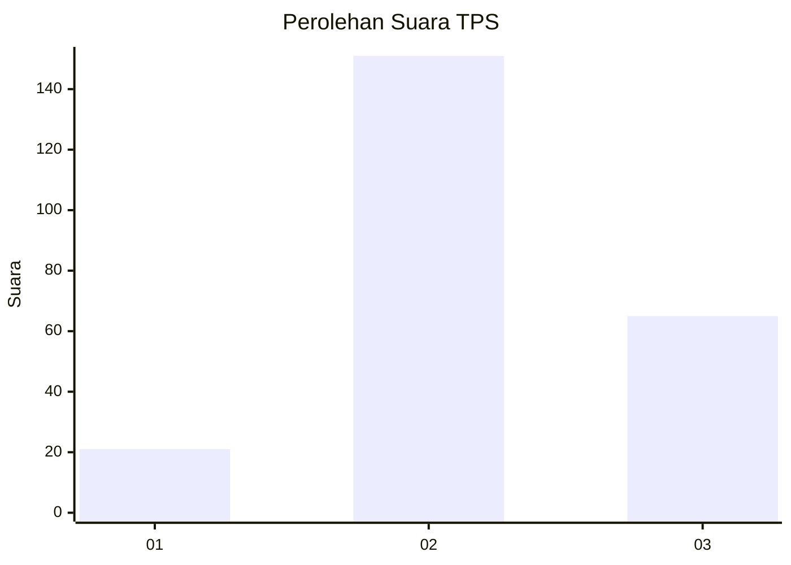
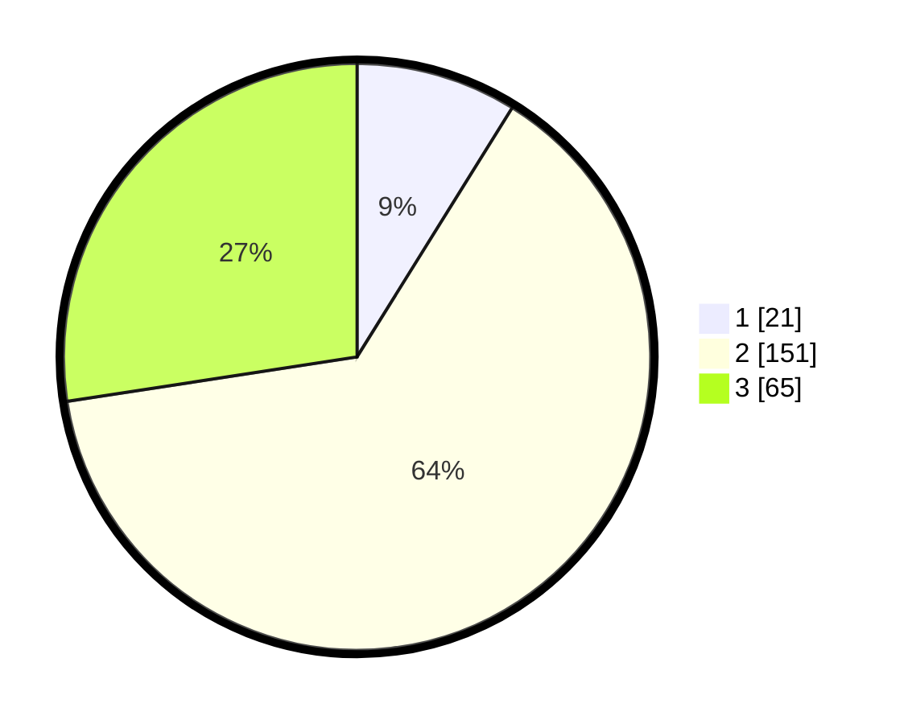

# Hasil

## Grafik

## Tabel

| No. | Nama Paslon    | Suara | Suara (raw) | Persentase |
|:--- |:-------------- | -----:| -----------:| ----------:|
| 1   | ANIES MUHAIMIN | 21    | [21][p-1]   | 8,86       |
| 2   | PRABOWO GIBRAN | 151   | [151][p-2]  | 63,71      |
| 3   | GANJAR MAHFUD  | 65    | [65][p-3]   | 27,43      |

[p-1]: https://github.com/gigit-pemilu/pemilu-2024-35-jawa-timur/blob/main/pilpres/hitung-suara/sub/35-jawa-timur/sub/05-blitar/sub/09-nglegok/sub/2002-kedawung/sub/018-tps/sub/paslon-1.txt
[p-2]: https://github.com/gigit-pemilu/pemilu-2024-35-jawa-timur/blob/main/pilpres/hitung-suara/sub/35-jawa-timur/sub/05-blitar/sub/09-nglegok/sub/2002-kedawung/sub/018-tps/sub/paslon-2.txt
[p-3]: https://github.com/gigit-pemilu/pemilu-2024-35-jawa-timur/blob/main/pilpres/hitung-suara/sub/35-jawa-timur/sub/05-blitar/sub/09-nglegok/sub/2002-kedawung/sub/018-tps/sub/paslon-3.txt

## Foto C Plano

https://sirekap-obj-formc.kpu.go.id/50be/pemilu/ppwp/35/05/09/20/02/3505092002018-20240214-200107--3bc0d81e-f555-41db-8a94-4eb6e141d9f1.jpg

https://sirekap-obj-formc.kpu.go.id/50be/pemilu/ppwp/35/05/09/20/02/3505092002018-20240214-200251--7dec8389-371a-4d53-a10c-d6ff3893c79c.jpg

https://sirekap-obj-formc.kpu.go.id/50be/pemilu/ppwp/35/05/09/20/02/3505092002018-20240214-200355--d9b9f0c0-109d-44b1-8315-05db9a566c76.jpg

## Metadata

| Key        | Value               |
| ---------- | ------------------- |
| Time Stamp | 2024-02-15 09:00:24 |

