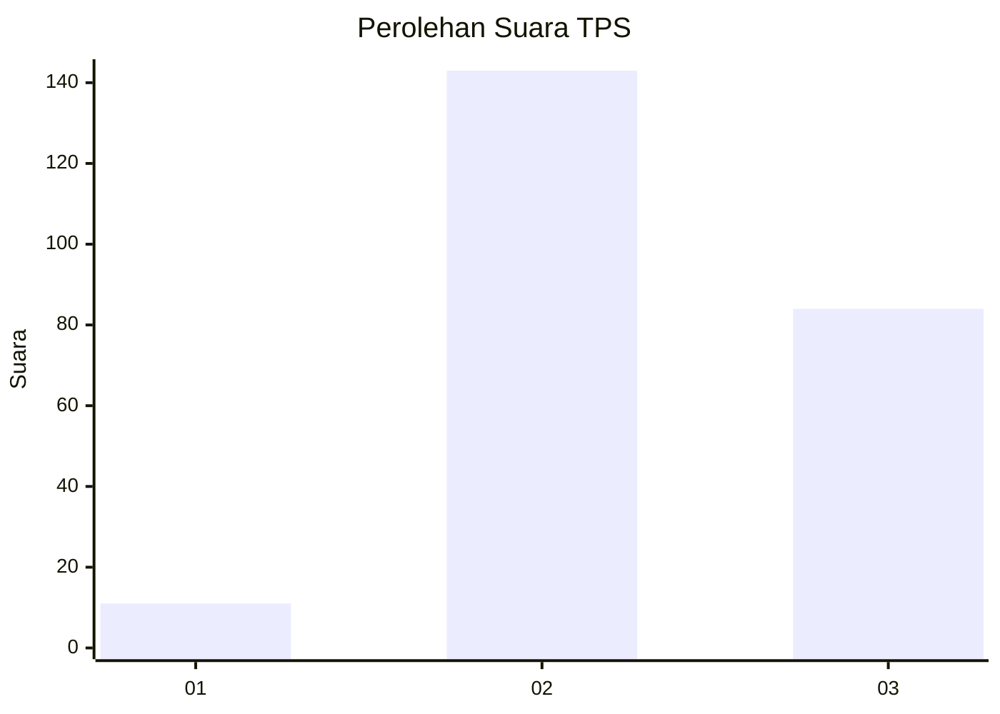
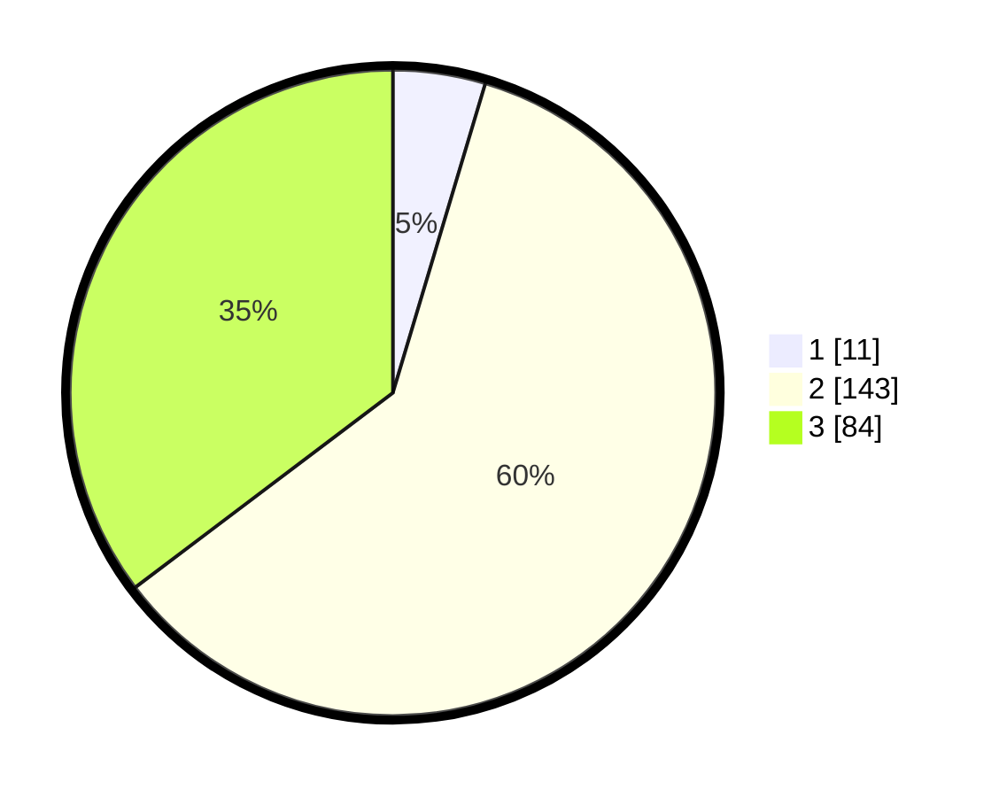

# Hasil

## Grafik

## Tabel

| No. | Nama Paslon    | Suara | Suara (raw) | Persentase |
|:--- |:-------------- | -----:| -----------:| ----------:|
| 1   | ANIES MUHAIMIN | 11    | [11][p-1]   | 4,62       |
| 2   | PRABOWO GIBRAN | 143   | [143][p-2]  | 60,08      |
| 3   | GANJAR MAHFUD  | 84    | [84][p-3]   | 35,29      |

[p-1]: https://github.com/gigit-pemilu/pemilu-2024/blob/main/pilpres/hitung-suara/sub/35-jawa-timur/sub/05-blitar/sub/09-nglegok/sub/2003-ngoran/sub/008-tps/sub/paslon-1.txt
[p-2]: https://github.com/gigit-pemilu/pemilu-2024/blob/main/pilpres/hitung-suara/sub/35-jawa-timur/sub/05-blitar/sub/09-nglegok/sub/2003-ngoran/sub/008-tps/sub/paslon-2.txt
[p-3]: https://github.com/gigit-pemilu/pemilu-2024/blob/main/pilpres/hitung-suara/sub/35-jawa-timur/sub/05-blitar/sub/09-nglegok/sub/2003-ngoran/sub/008-tps/sub/paslon-3.txt

## Foto C Plano

https://sirekap-obj-formc.kpu.go.id/8f80/pemilu/ppwp/35/05/09/20/03/3505092003008-20240214-190138--5839f6c8-48c8-481c-bb9e-bd1a4cf7de43.jpg

https://sirekap-obj-formc.kpu.go.id/8f80/pemilu/ppwp/35/05/09/20/03/3505092003008-20240214-190427--6cf64606-f671-4992-b87d-780d763fe0d0.jpg

https://sirekap-obj-formc.kpu.go.id/8f80/pemilu/ppwp/35/05/09/20/03/3505092003008-20240214-190338--b511996f-dcd3-44c6-a648-809bb82dd6f4.jpg

## Metadata

| Key        | Value               |
| ---------- | ------------------- |
| Time Stamp | 2024-02-15 12:00:28 |

