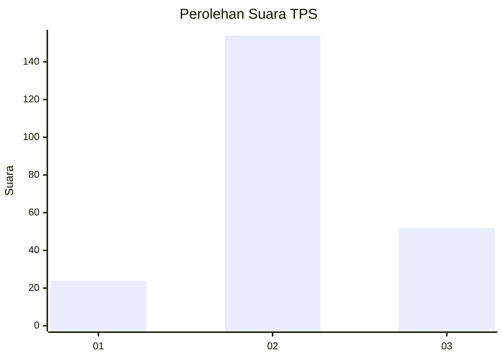
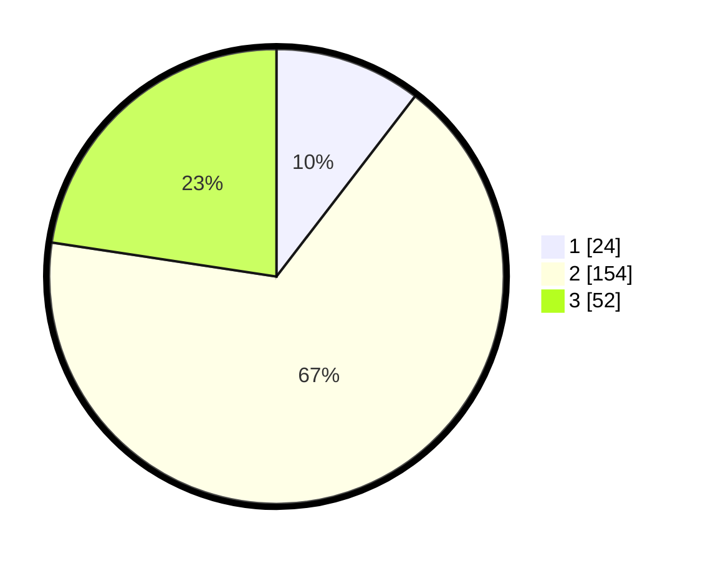

# Hasil

## Grafik

## Tabel

| No. | Nama Paslon    | Suara | Suara (raw) | Persentase |
|:--- |:-------------- | -----:| -----------:| ----------:|
| 1   | ANIES MUHAIMIN | 24    | [24][p-1]   | 10,43      |
| 2   | PRABOWO GIBRAN | 154   | [154][p-2]  | 66,96      |
| 3   | GANJAR MAHFUD  | 52    | [52][p-3]   | 22,61      |

[p-1]: https://github.com/gigit-pemilu/pemilu-2024-35-jawa-timur/blob/main/pilpres/hitung-suara/sub/35-jawa-timur/sub/05-blitar/sub/09-nglegok/sub/2004-dayu/sub/005-tps/sub/paslon-1.txt
[p-2]: https://github.com/gigit-pemilu/pemilu-2024-35-jawa-timur/blob/main/pilpres/hitung-suara/sub/35-jawa-timur/sub/05-blitar/sub/09-nglegok/sub/2004-dayu/sub/005-tps/sub/paslon-2.txt
[p-3]: https://github.com/gigit-pemilu/pemilu-2024-35-jawa-timur/blob/main/pilpres/hitung-suara/sub/35-jawa-timur/sub/05-blitar/sub/09-nglegok/sub/2004-dayu/sub/005-tps/sub/paslon-3.txt

## Foto C Plano

https://sirekap-obj-formc.kpu.go.id/9768/pemilu/ppwp/35/05/09/20/04/3505092004005-20240214-202227--5e97f7ea-73b3-4774-8984-8ef0a285dd67.jpg

https://sirekap-obj-formc.kpu.go.id/9768/pemilu/ppwp/35/05/09/20/04/3505092004005-20240214-202232--88eeebdd-e521-4305-91dc-a7a19fc00612.jpg

https://sirekap-obj-formc.kpu.go.id/9768/pemilu/ppwp/35/05/09/20/04/3505092004005-20240214-202238--d8991f30-7d6c-4032-83cc-38af85e480e4.jpg

## Metadata

| Key        | Value               |
| ---------- | ------------------- |
| Time Stamp | 2024-02-15 12:00:28 |

