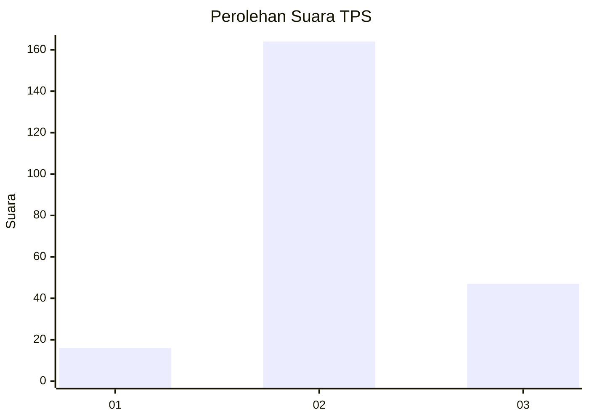

# Hasil

## Grafik

## Tabel

| No. | Nama Paslon    | Suara | Suara (raw) | Persentase |
|:--- |:-------------- | -----:| -----------:| ----------:|
| 1   | ANIES MUHAIMIN | 16    | [16][p-1]   | 7,05       |
| 2   | PRABOWO GIBRAN | 164   | [164][p-2]  | 72,25      |
| 3   | GANJAR MAHFUD  | 47    | [47][p-3]   | 20,70      |

[p-1]: https://github.com/gigit-pemilu/pemilu-2024-35-jawa-timur/blob/main/pilpres/hitung-suara/sub/35-jawa-timur/sub/05-blitar/sub/09-nglegok/sub/2004-dayu/sub/009-tps/sub/paslon-1.txt
[p-2]: https://github.com/gigit-pemilu/pemilu-2024-35-jawa-timur/blob/main/pilpres/hitung-suara/sub/35-jawa-timur/sub/05-blitar/sub/09-nglegok/sub/2004-dayu/sub/009-tps/sub/paslon-2.txt
[p-3]: https://github.com/gigit-pemilu/pemilu-2024-35-jawa-timur/blob/main/pilpres/hitung-suara/sub/35-jawa-timur/sub/05-blitar/sub/09-nglegok/sub/2004-dayu/sub/009-tps/sub/paslon-3.txt

## Foto C Plano

https://sirekap-obj-formc.kpu.go.id/f054/pemilu/ppwp/35/05/09/20/04/3505092004009-20240215-000234--bf45a733-96be-4602-910a-48f794beb022.jpg

https://sirekap-obj-formc.kpu.go.id/f054/pemilu/ppwp/35/05/09/20/04/3505092004009-20240214-235518--f9d36536-efd9-4a0c-9b82-db2a2057879f.jpg

https://sirekap-obj-formc.kpu.go.id/f054/pemilu/ppwp/35/05/09/20/04/3505092004009-20240215-000438--9825861a-b9db-4f3c-b0a9-5f75c111f870.jpg

## Metadata

| Key        | Value               |
| ---------- | ------------------- |
| Time Stamp | 2024-02-15 12:00:28 |

