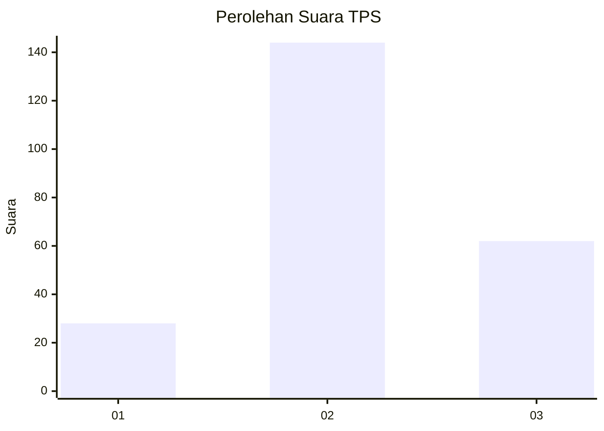
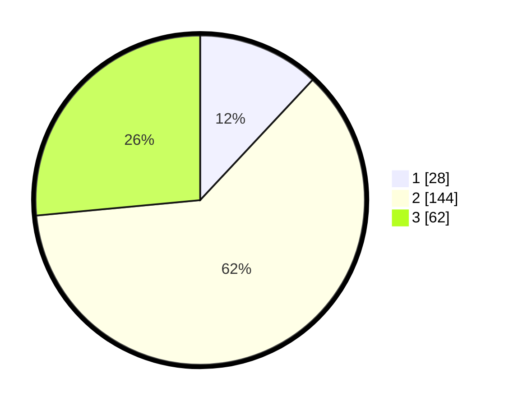

# Hasil

## Grafik

## Tabel

| No. | Nama Paslon    | Suara | Suara (raw) | Persentase |
|:--- |:-------------- | -----:| -----------:| ----------:|
| 1   | ANIES MUHAIMIN | 28    | [28][p-1]   | 11,97      |
| 2   | PRABOWO GIBRAN | 144   | [144][p-2]  | 61,54      |
| 3   | GANJAR MAHFUD  | 62    | [62][p-3]   | 26,50      |

[p-1]: https://github.com/gigit-pemilu/pemilu-2024/blob/main/pilpres/hitung-suara/sub/35-jawa-timur/sub/05-blitar/sub/09-nglegok/sub/2004-dayu/sub/015-tps/sub/paslon-1.txt
[p-2]: https://github.com/gigit-pemilu/pemilu-2024/blob/main/pilpres/hitung-suara/sub/35-jawa-timur/sub/05-blitar/sub/09-nglegok/sub/2004-dayu/sub/015-tps/sub/paslon-2.txt
[p-3]: https://github.com/gigit-pemilu/pemilu-2024/blob/main/pilpres/hitung-suara/sub/35-jawa-timur/sub/05-blitar/sub/09-nglegok/sub/2004-dayu/sub/015-tps/sub/paslon-3.txt

## Foto C Plano

https://sirekap-obj-formc.kpu.go.id/3dca/pemilu/ppwp/35/05/09/20/04/3505092004015-20240214-202726--413f1cf7-efd1-4f40-89f4-a8f9c6864605.jpg

https://sirekap-obj-formc.kpu.go.id/3dca/pemilu/ppwp/35/05/09/20/04/3505092004015-20240214-203245--05ebe9db-401f-431b-a1aa-d0018ea15ee5.jpg

https://sirekap-obj-formc.kpu.go.id/3dca/pemilu/ppwp/35/05/09/20/04/3505092004015-20240214-203642--2c98ea79-2cc9-4bb5-bb01-9863f94e62e0.jpg

## Metadata

| Key        | Value               |
| ---------- | ------------------- |
| Time Stamp | 2024-02-15 12:00:28 |

