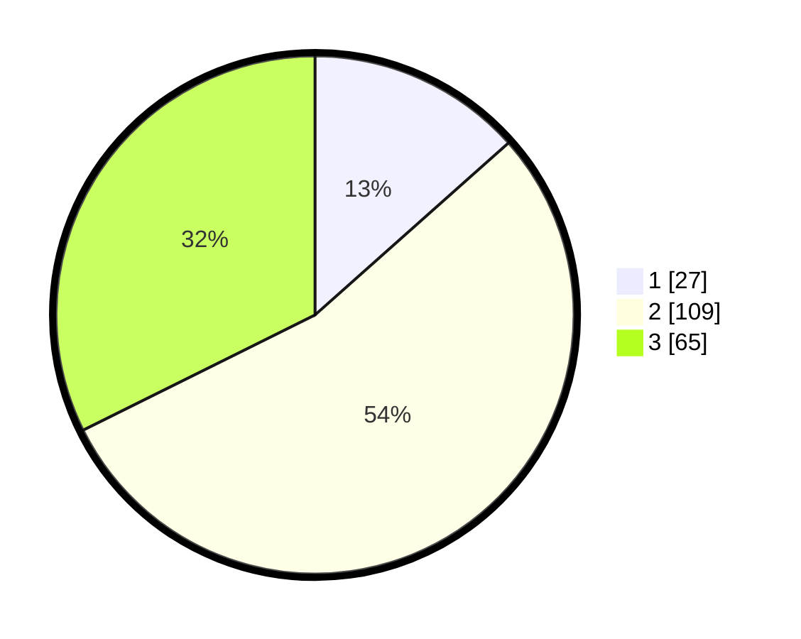

# Hasil

## Grafik

## Tabel

| No. | Nama Paslon    | Suara | Suara (raw) | Persentase |
|:--- |:-------------- | -----:| -----------:| ----------:|
| 1   | ANIES MUHAIMIN | 27    | [27][p-1]   | 13,43      |
| 2   | PRABOWO GIBRAN | 109   | [109][p-2]  | 54,23      |
| 3   | GANJAR MAHFUD  | 65    | [65][p-3]   | 32,34      |

[p-1]: https://github.com/gigit-pemilu/pemilu-2024/blob/main/pilpres/hitung-suara/sub/35-jawa-timur/sub/05-blitar/sub/09-nglegok/sub/2005-bangsri/sub/003-tps/sub/paslon-1.txt
[p-2]: https://github.com/gigit-pemilu/pemilu-2024/blob/main/pilpres/hitung-suara/sub/35-jawa-timur/sub/05-blitar/sub/09-nglegok/sub/2005-bangsri/sub/003-tps/sub/paslon-2.txt
[p-3]: https://github.com/gigit-pemilu/pemilu-2024/blob/main/pilpres/hitung-suara/sub/35-jawa-timur/sub/05-blitar/sub/09-nglegok/sub/2005-bangsri/sub/003-tps/sub/paslon-3.txt

## Foto C Plano

https://sirekap-obj-formc.kpu.go.id/d447/pemilu/ppwp/35/05/09/20/05/3505092005003-20240214-222833--3f54e933-4b44-4950-b304-2334fe4feab9.jpg

https://sirekap-obj-formc.kpu.go.id/d447/pemilu/ppwp/35/05/09/20/05/3505092005003-20240214-223035--2e0b0c9b-eff3-4d75-9980-c662ce52a13d.jpg

https://sirekap-obj-formc.kpu.go.id/d447/pemilu/ppwp/35/05/09/20/05/3505092005003-20240214-223327--f2b46a74-d740-4a56-9255-0db7d5266ddf.jpg

## Metadata

| Key        | Value               |
| ---------- | ------------------- |
| Time Stamp | 2024-02-15 12:00:28 |

