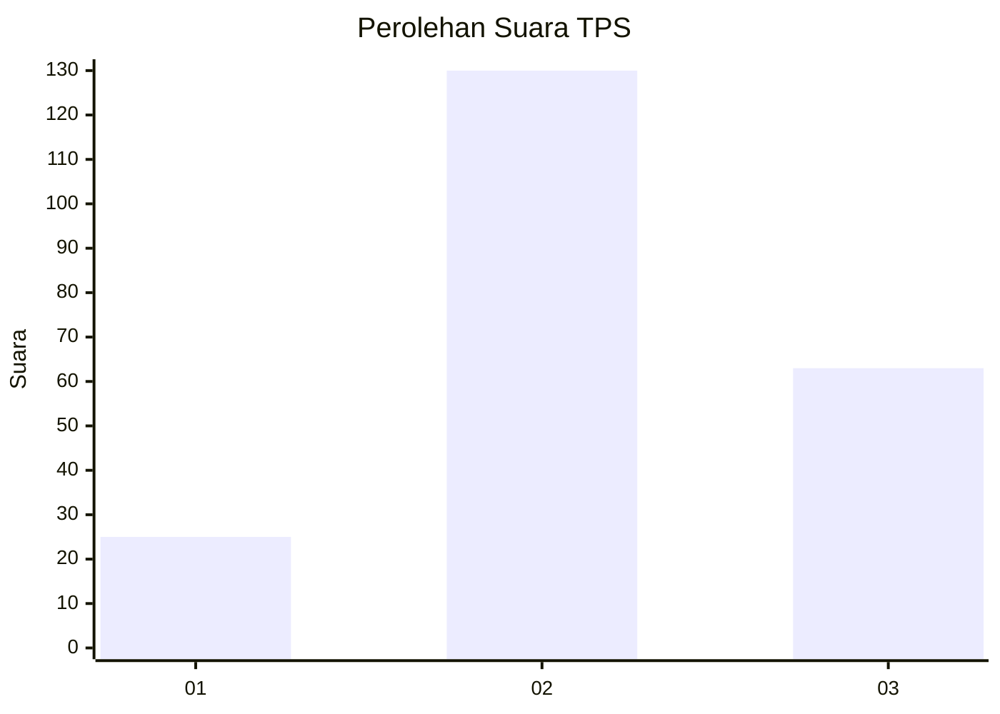
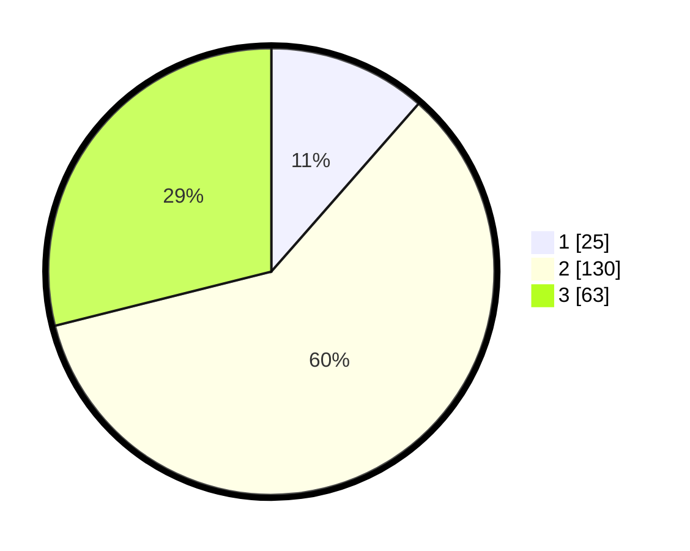

# Hasil

## Grafik

## Tabel

| No. | Nama Paslon    | Suara | Suara (raw) | Persentase |
|:--- |:-------------- | -----:| -----------:| ----------:|
| 1   | ANIES MUHAIMIN | 25    | [25][p-1]   | 11,47      |
| 2   | PRABOWO GIBRAN | 130   | [130][p-2]  | 59,63      |
| 3   | GANJAR MAHFUD  | 63    | [63][p-3]   | 28,90      |

[p-1]: https://github.com/gigit-pemilu/pemilu-2024-35-jawa-timur/blob/main/pilpres/hitung-suara/sub/35-jawa-timur/sub/05-blitar/sub/09-nglegok/sub/2005-bangsri/sub/007-tps/sub/paslon-1.txt
[p-2]: https://github.com/gigit-pemilu/pemilu-2024-35-jawa-timur/blob/main/pilpres/hitung-suara/sub/35-jawa-timur/sub/05-blitar/sub/09-nglegok/sub/2005-bangsri/sub/007-tps/sub/paslon-2.txt
[p-3]: https://github.com/gigit-pemilu/pemilu-2024-35-jawa-timur/blob/main/pilpres/hitung-suara/sub/35-jawa-timur/sub/05-blitar/sub/09-nglegok/sub/2005-bangsri/sub/007-tps/sub/paslon-3.txt

## Foto C Plano

https://sirekap-obj-formc.kpu.go.id/a878/pemilu/ppwp/35/05/09/20/05/3505092005007-20240214-222528--a2aca935-1fb6-4621-86d2-70734af647e6.jpg

https://sirekap-obj-formc.kpu.go.id/a878/pemilu/ppwp/35/05/09/20/05/3505092005007-20240214-222712--a5e427c9-2965-4879-b2cd-caa8cf8417e5.jpg

https://sirekap-obj-formc.kpu.go.id/a878/pemilu/ppwp/35/05/09/20/05/3505092005007-20240214-222823--be3c99f9-7833-4c6e-aa45-14aa2fa8071a.jpg

## Metadata

| Key        | Value               |
| ---------- | ------------------- |
| Time Stamp | 2024-02-15 12:00:28 |

