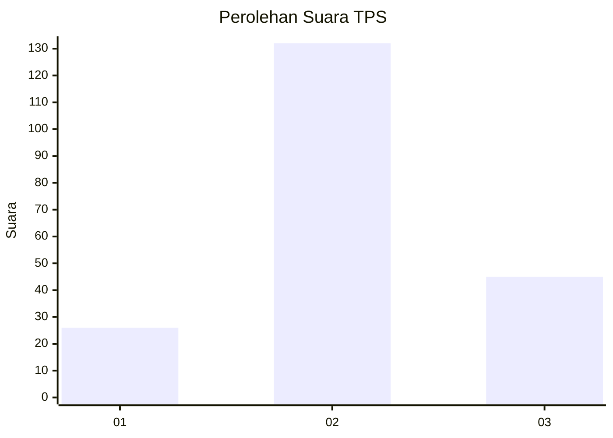
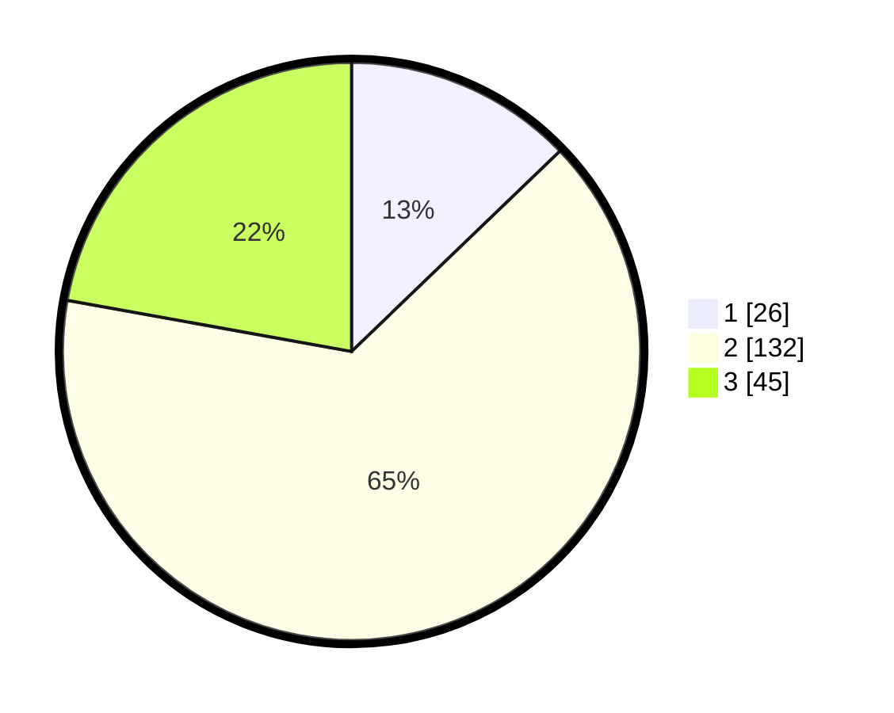

# Hasil

## Grafik

## Tabel

| No. | Nama Paslon    | Suara | Suara (raw) | Persentase |
|:--- |:-------------- | -----:| -----------:| ----------:|
| 1   | ANIES MUHAIMIN | 26    | [26][p-1]   | 12,81      |
| 2   | PRABOWO GIBRAN | 132   | [132][p-2]  | 65,02      |
| 3   | GANJAR MAHFUD  | 45    | [45][p-3]   | 22,17      |

[p-1]: https://github.com/gigit-pemilu/pemilu-2024/blob/main/pilpres/hitung-suara/sub/35-jawa-timur/sub/05-blitar/sub/09-nglegok/sub/2005-bangsri/sub/009-tps/sub/paslon-1.txt
[p-2]: https://github.com/gigit-pemilu/pemilu-2024/blob/main/pilpres/hitung-suara/sub/35-jawa-timur/sub/05-blitar/sub/09-nglegok/sub/2005-bangsri/sub/009-tps/sub/paslon-2.txt
[p-3]: https://github.com/gigit-pemilu/pemilu-2024/blob/main/pilpres/hitung-suara/sub/35-jawa-timur/sub/05-blitar/sub/09-nglegok/sub/2005-bangsri/sub/009-tps/sub/paslon-3.txt

## Foto C Plano

https://sirekap-obj-formc.kpu.go.id/afe3/pemilu/ppwp/35/05/09/20/05/3505092005009-20240214-214158--709c2e0b-0f39-4228-abad-af3d2d722cb2.jpg

https://sirekap-obj-formc.kpu.go.id/afe3/pemilu/ppwp/35/05/09/20/05/3505092005009-20240214-214338--9acafcb0-85e5-4f16-b574-83038efd5d38.jpg

https://sirekap-obj-formc.kpu.go.id/afe3/pemilu/ppwp/35/05/09/20/05/3505092005009-20240214-214618--eb7bdbba-6f5a-46ea-a603-2b2b11b05c5c.jpg

## Metadata

| Key        | Value               |
| ---------- | ------------------- |
| Time Stamp | 2024-02-15 12:00:28 |

