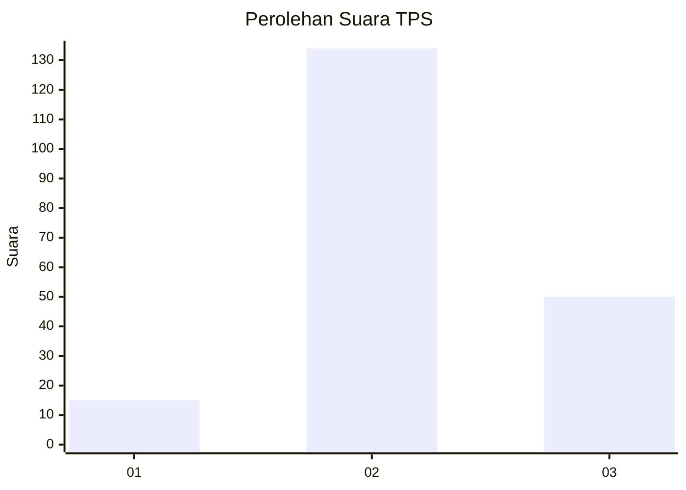
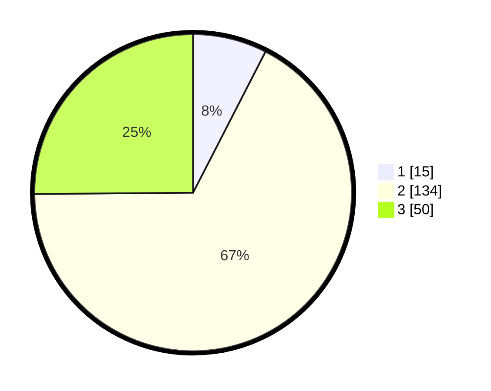

# Hasil

## Grafik

## Tabel

| No. | Nama Paslon    | Suara | Suara (raw) | Persentase |
|:--- |:-------------- | -----:| -----------:| ----------:|
| 1   | ANIES MUHAIMIN | 15    | [15][p-1]   | 7,54       |
| 2   | PRABOWO GIBRAN | 134   | [134][p-2]  | 67,34      |
| 3   | GANJAR MAHFUD  | 50    | [50][p-3]   | 25,13      |

[p-1]: https://github.com/gigit-pemilu/pemilu-2024/blob/main/pilpres/hitung-suara/sub/35-jawa-timur/sub/05-blitar/sub/09-nglegok/sub/2005-bangsri/sub/010-tps/sub/paslon-1.txt
[p-2]: https://github.com/gigit-pemilu/pemilu-2024/blob/main/pilpres/hitung-suara/sub/35-jawa-timur/sub/05-blitar/sub/09-nglegok/sub/2005-bangsri/sub/010-tps/sub/paslon-2.txt
[p-3]: https://github.com/gigit-pemilu/pemilu-2024/blob/main/pilpres/hitung-suara/sub/35-jawa-timur/sub/05-blitar/sub/09-nglegok/sub/2005-bangsri/sub/010-tps/sub/paslon-3.txt

## Foto C Plano

https://sirekap-obj-formc.kpu.go.id/deca/pemilu/ppwp/35/05/09/20/05/3505092005010-20240215-013639--374ad961-a142-453d-818f-a522708af435.jpg

https://sirekap-obj-formc.kpu.go.id/deca/pemilu/ppwp/35/05/09/20/05/3505092005010-20240215-013810--25591c7e-b950-41f7-aa04-871e300d6329.jpg

https://sirekap-obj-formc.kpu.go.id/deca/pemilu/ppwp/35/05/09/20/05/3505092005010-20240215-013946--c3c2ce75-9666-4d64-93ac-e9d79d9d4d6f.jpg

## Metadata

| Key        | Value               |
| ---------- | ------------------- |
| Time Stamp | 2024-02-15 12:00:28 |

