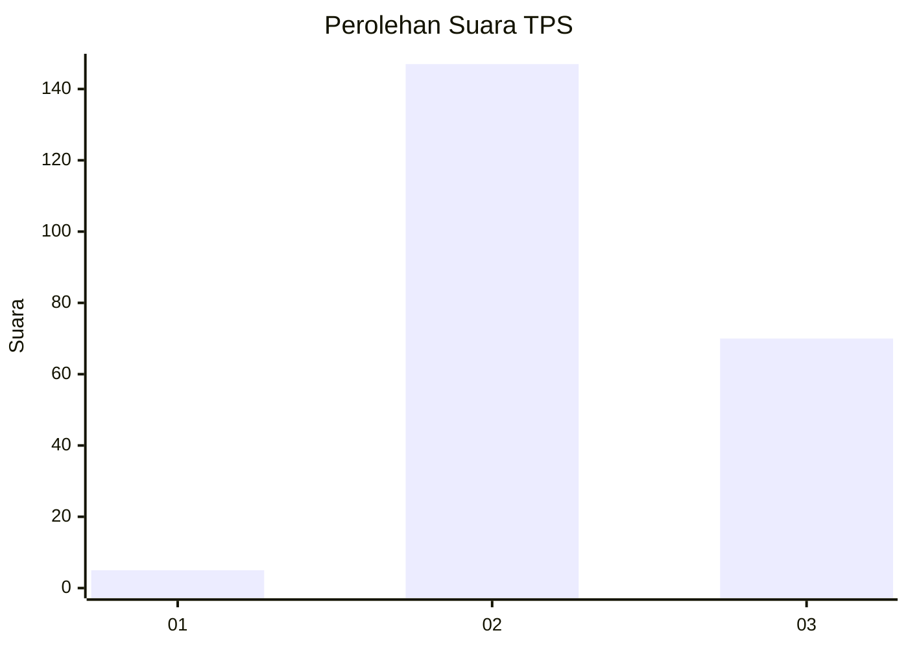
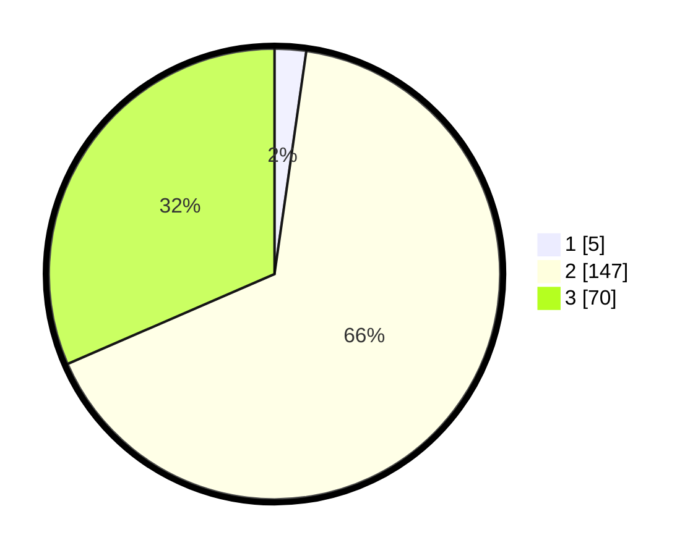

# Hasil

## Grafik

## Tabel

| No. | Nama Paslon    | Suara | Suara (raw) | Persentase |
|:--- |:-------------- | -----:| -----------:| ----------:|
| 1   | ANIES MUHAIMIN | 5     | [5][p-1]    | 2,25       |
| 2   | PRABOWO GIBRAN | 147   | [147][p-2]  | 66,22      |
| 3   | GANJAR MAHFUD  | 70    | [70][p-3]   | 31,53      |

[p-1]: https://github.com/gigit-pemilu/pemilu-2024/blob/main/pilpres/hitung-suara/sub/35-jawa-timur/sub/05-blitar/sub/09-nglegok/sub/2005-bangsri/sub/018-tps/sub/paslon-1.txt
[p-2]: https://github.com/gigit-pemilu/pemilu-2024/blob/main/pilpres/hitung-suara/sub/35-jawa-timur/sub/05-blitar/sub/09-nglegok/sub/2005-bangsri/sub/018-tps/sub/paslon-2.txt
[p-3]: https://github.com/gigit-pemilu/pemilu-2024/blob/main/pilpres/hitung-suara/sub/35-jawa-timur/sub/05-blitar/sub/09-nglegok/sub/2005-bangsri/sub/018-tps/sub/paslon-3.txt

## Foto C Plano

https://sirekap-obj-formc.kpu.go.id/8b17/pemilu/ppwp/35/05/09/20/05/3505092005018-20240214-215445--89f0594f-f3a9-4ba6-aac2-31a850036407.jpg

https://sirekap-obj-formc.kpu.go.id/8b17/pemilu/ppwp/35/05/09/20/05/3505092005018-20240214-215622--4eb9f670-1a05-47ea-9d3c-61d4e8a737d0.jpg

https://sirekap-obj-formc.kpu.go.id/8b17/pemilu/ppwp/35/05/09/20/05/3505092005018-20240214-215740--2d815a1e-1fa3-48ab-b44e-4f083cc8205a.jpg

## Metadata

| Key        | Value               |
| ---------- | ------------------- |
| Time Stamp | 2024-02-15 12:00:28 |

