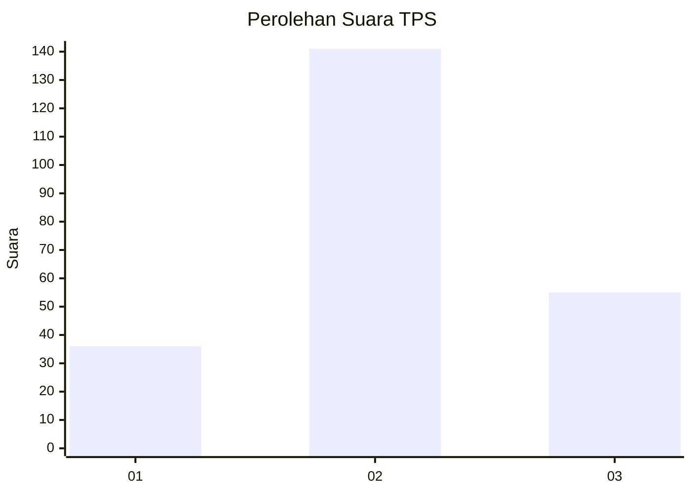
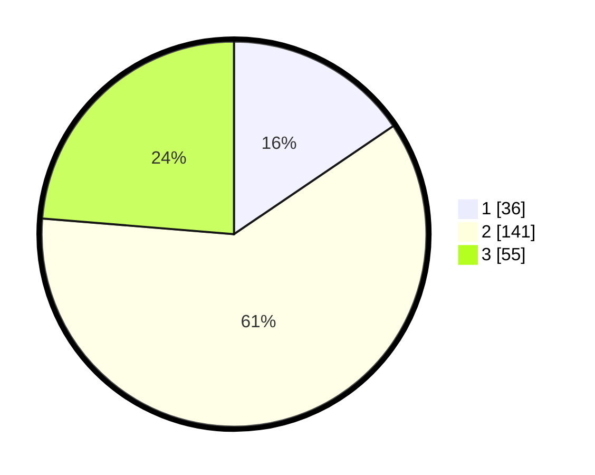

# Hasil

## Grafik

## Tabel

| No. | Nama Paslon    | Suara | Suara (raw) | Persentase |
|:--- |:-------------- | -----:| -----------:| ----------:|
| 1   | ANIES MUHAIMIN | 36    | [36][p-1]   | 15,52      |
| 2   | PRABOWO GIBRAN | 141   | [141][p-2]  | 60,78      |
| 3   | GANJAR MAHFUD  | 55    | [55][p-3]   | 23,71      |

[p-1]: https://github.com/gigit-pemilu/pemilu-2024-35-jawa-timur/blob/main/pilpres/hitung-suara/sub/35-jawa-timur/sub/05-blitar/sub/09-nglegok/sub/2006-kemloko/sub/007-tps/sub/paslon-1.txt
[p-2]: https://github.com/gigit-pemilu/pemilu-2024-35-jawa-timur/blob/main/pilpres/hitung-suara/sub/35-jawa-timur/sub/05-blitar/sub/09-nglegok/sub/2006-kemloko/sub/007-tps/sub/paslon-2.txt
[p-3]: https://github.com/gigit-pemilu/pemilu-2024-35-jawa-timur/blob/main/pilpres/hitung-suara/sub/35-jawa-timur/sub/05-blitar/sub/09-nglegok/sub/2006-kemloko/sub/007-tps/sub/paslon-3.txt

## Foto C Plano

https://sirekap-obj-formc.kpu.go.id/3b78/pemilu/ppwp/35/05/09/20/06/3505092006007-20240214-231600--f180c5ae-fb32-407b-bff7-b71bf3b6ff09.jpg

https://sirekap-obj-formc.kpu.go.id/3b78/pemilu/ppwp/35/05/09/20/06/3505092006007-20240214-231732--b9c37f07-99cd-4f92-b141-2753cc80683f.jpg

https://sirekap-obj-formc.kpu.go.id/3b78/pemilu/ppwp/35/05/09/20/06/3505092006007-20240214-231830--07fa15b7-fcba-4859-bd12-ac9c0b8a9016.jpg

## Metadata

| Key        | Value               |
| ---------- | ------------------- |
| Time Stamp | 2024-02-22 18:00:00 |

