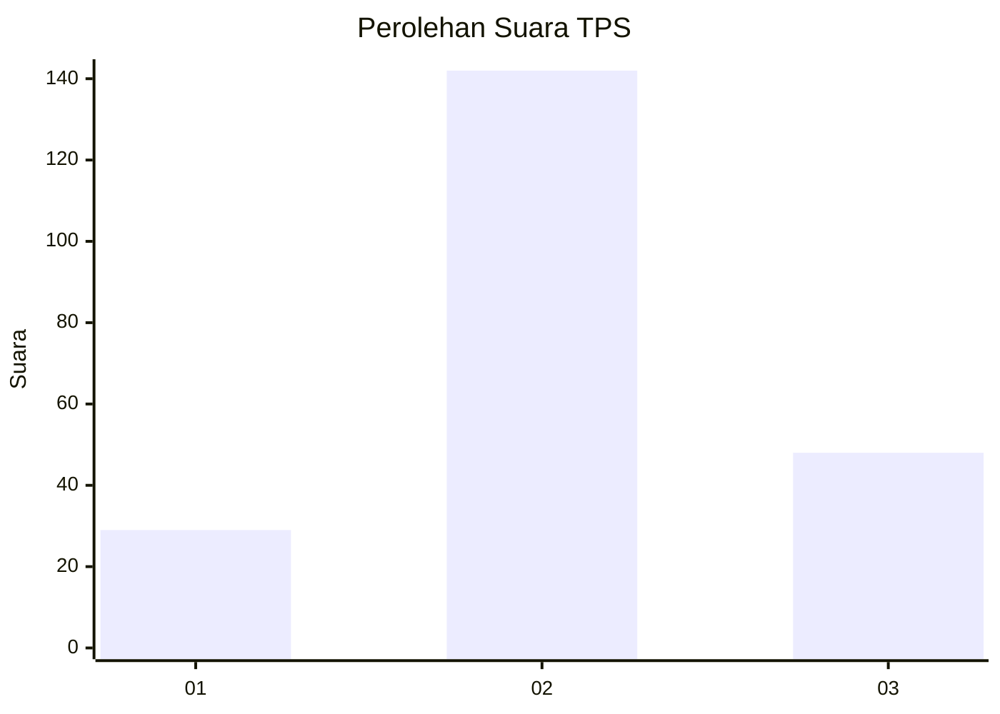
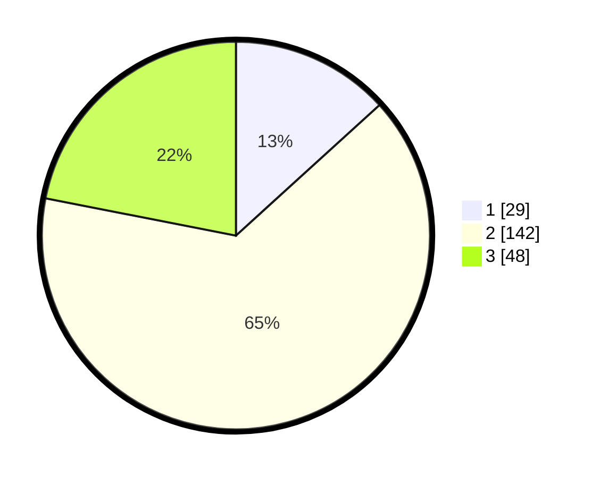

# Hasil

## Grafik

## Tabel

| No. | Nama Paslon    | Suara | Suara (raw) | Persentase |
|:--- |:-------------- | -----:| -----------:| ----------:|
| 1   | ANIES MUHAIMIN | 29    | [29][p-1]   | 13,24      |
| 2   | PRABOWO GIBRAN | 142   | [142][p-2]  | 64,84      |
| 3   | GANJAR MAHFUD  | 48    | [48][p-3]   | 21,92      |

[p-1]: https://github.com/gigit-pemilu/pemilu-2024-35-jawa-timur/blob/main/pilpres/hitung-suara/sub/35-jawa-timur/sub/05-blitar/sub/09-nglegok/sub/2008-krenceng/sub/001-tps/sub/paslon-1.txt
[p-2]: https://github.com/gigit-pemilu/pemilu-2024-35-jawa-timur/blob/main/pilpres/hitung-suara/sub/35-jawa-timur/sub/05-blitar/sub/09-nglegok/sub/2008-krenceng/sub/001-tps/sub/paslon-2.txt
[p-3]: https://github.com/gigit-pemilu/pemilu-2024-35-jawa-timur/blob/main/pilpres/hitung-suara/sub/35-jawa-timur/sub/05-blitar/sub/09-nglegok/sub/2008-krenceng/sub/001-tps/sub/paslon-3.txt

## Foto C Plano

https://sirekap-obj-formc.kpu.go.id/fe53/pemilu/ppwp/35/05/09/20/08/3505092008001-20240215-010540--a193f1f4-f894-439d-b4c1-dbe34b5c3498.jpg

https://sirekap-obj-formc.kpu.go.id/fe53/pemilu/ppwp/35/05/09/20/08/3505092008001-20240215-010657--6562362d-4647-466b-92e9-68e0a355a599.jpg

https://sirekap-obj-formc.kpu.go.id/fe53/pemilu/ppwp/35/05/09/20/08/3505092008001-20240215-010832--f1def05f-d258-4ac7-b24e-a2c5d35aea5f.jpg

## Metadata

| Key        | Value               |
| ---------- | ------------------- |
| Time Stamp | 2024-02-15 15:00:29 |

