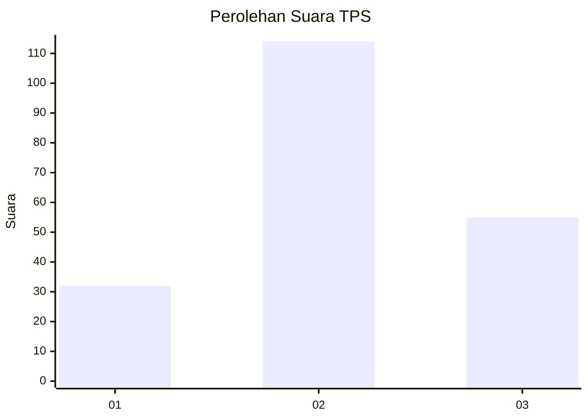
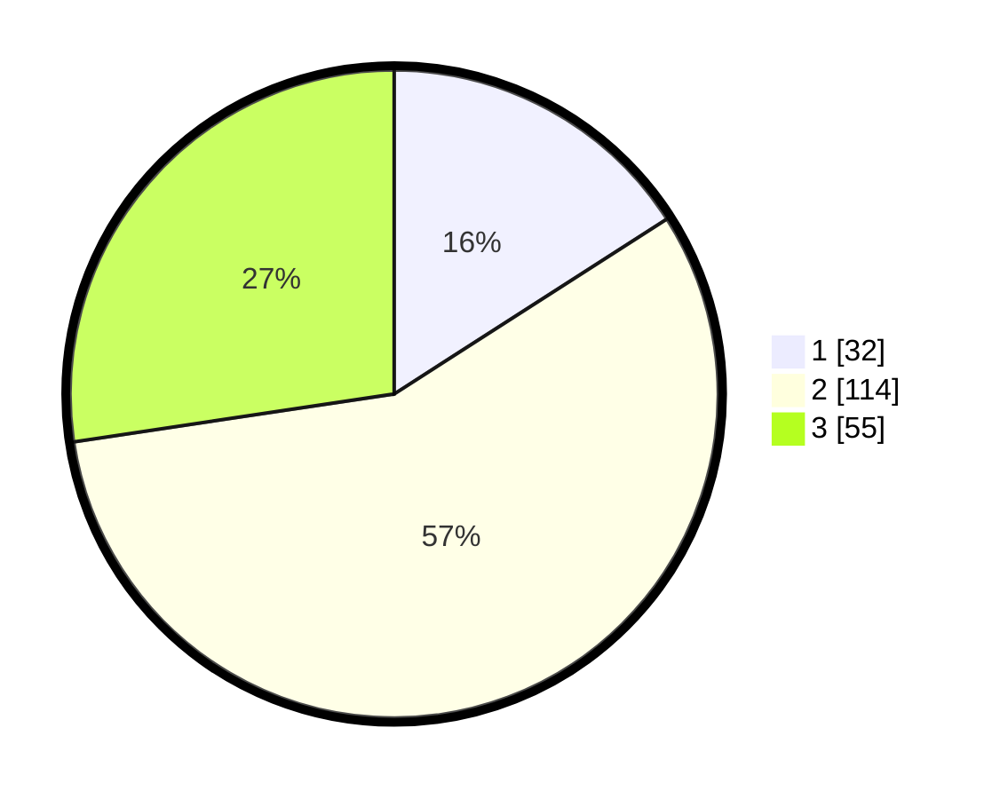

# Hasil

## Grafik

## Tabel

| No. | Nama Paslon    | Suara | Suara (raw) | Persentase |
|:--- |:-------------- | -----:| -----------:| ----------:|
| 1   | ANIES MUHAIMIN | 32    | [32][p-1]   | 15,92      |
| 2   | PRABOWO GIBRAN | 114   | [114][p-2]  | 56,72      |
| 3   | GANJAR MAHFUD  | 55    | [55][p-3]   | 27,36      |

[p-1]: https://github.com/gigit-pemilu/pemilu-2024/blob/main/pilpres/hitung-suara/sub/35-jawa-timur/sub/05-blitar/sub/09-nglegok/sub/2008-krenceng/sub/004-tps/sub/paslon-1.txt
[p-2]: https://github.com/gigit-pemilu/pemilu-2024/blob/main/pilpres/hitung-suara/sub/35-jawa-timur/sub/05-blitar/sub/09-nglegok/sub/2008-krenceng/sub/004-tps/sub/paslon-2.txt
[p-3]: https://github.com/gigit-pemilu/pemilu-2024/blob/main/pilpres/hitung-suara/sub/35-jawa-timur/sub/05-blitar/sub/09-nglegok/sub/2008-krenceng/sub/004-tps/sub/paslon-3.txt

## Foto C Plano

https://sirekap-obj-formc.kpu.go.id/8dfc/pemilu/ppwp/35/05/09/20/08/3505092008004-20240216-215955--1f617f42-e9bc-4e6e-8670-37a428ef49bc.jpg

https://sirekap-obj-formc.kpu.go.id/8dfc/pemilu/ppwp/35/05/09/20/08/3505092008004-20240216-213911--74ab95fa-3631-41ef-b855-13f5247b26e1.jpg

https://sirekap-obj-formc.kpu.go.id/8dfc/pemilu/ppwp/35/05/09/20/08/3505092008004-20240216-215850--be474fb2-855e-4e89-897d-fd3ee1e78eba.jpg

## Metadata

| Key        | Value               |
| ---------- | ------------------- |
| Time Stamp | 2024-02-17 07:00:02 |

