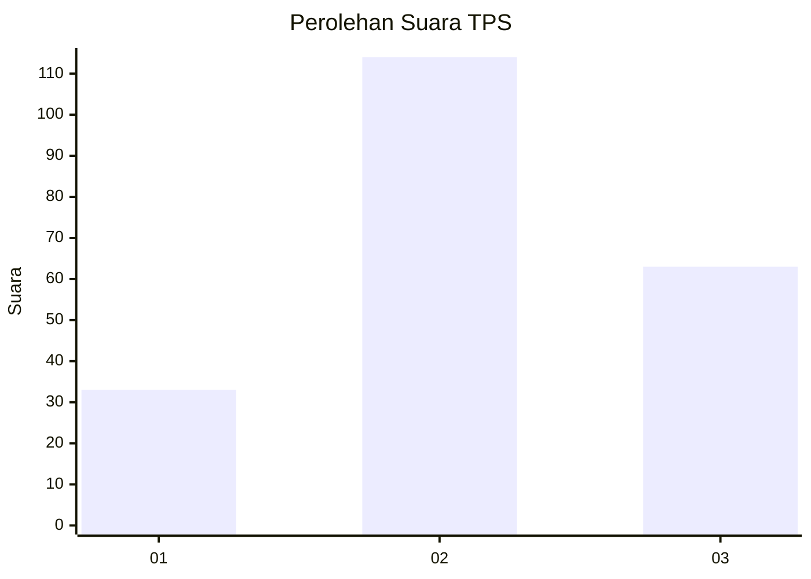
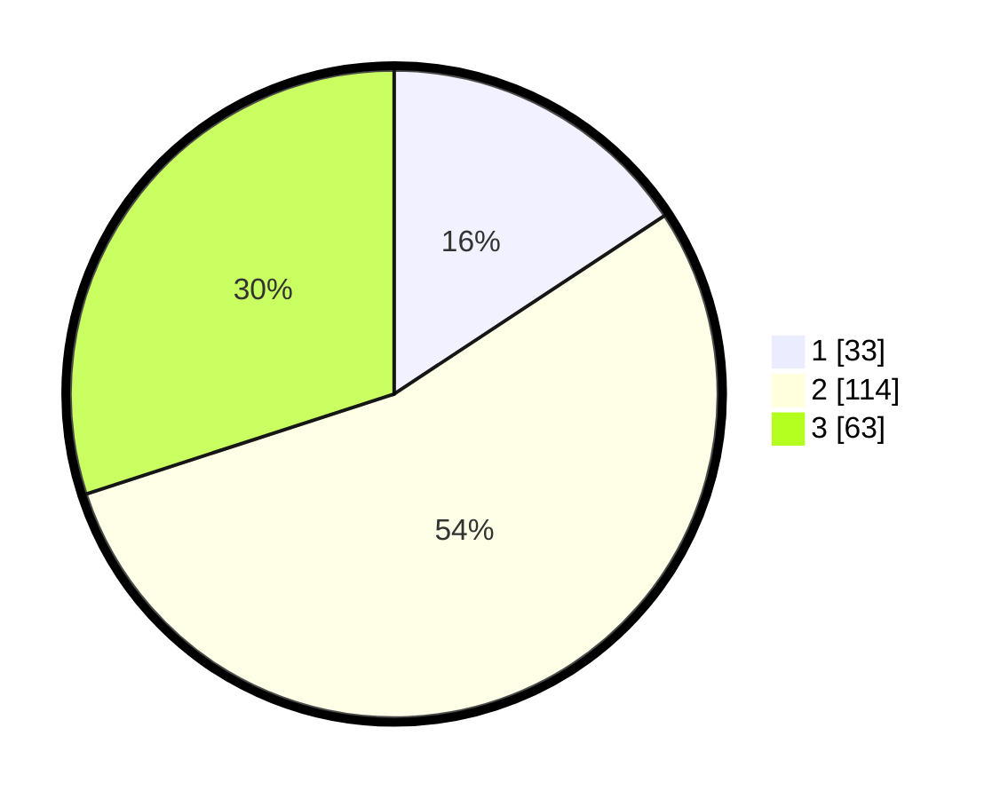

# Hasil

## Grafik

## Tabel

| No. | Nama Paslon    | Suara | Suara (raw) | Persentase |
|:--- |:-------------- | -----:| -----------:| ----------:|
| 1   | ANIES MUHAIMIN | 33    | [33][p-1]   | 15,71      |
| 2   | PRABOWO GIBRAN | 114   | [114][p-2]  | 54,29      |
| 3   | GANJAR MAHFUD  | 63    | [63][p-3]   | 30,00      |

[p-1]: https://github.com/gigit-pemilu/pemilu-2024/blob/main/pilpres/hitung-suara/sub/35-jawa-timur/sub/05-blitar/sub/09-nglegok/sub/2011-modangan/sub/018-tps/sub/paslon-1.txt
[p-2]: https://github.com/gigit-pemilu/pemilu-2024/blob/main/pilpres/hitung-suara/sub/35-jawa-timur/sub/05-blitar/sub/09-nglegok/sub/2011-modangan/sub/018-tps/sub/paslon-2.txt
[p-3]: https://github.com/gigit-pemilu/pemilu-2024/blob/main/pilpres/hitung-suara/sub/35-jawa-timur/sub/05-blitar/sub/09-nglegok/sub/2011-modangan/sub/018-tps/sub/paslon-3.txt

## Foto C Plano

https://sirekap-obj-formc.kpu.go.id/5f08/pemilu/ppwp/35/05/09/20/11/3505092011018-20240215-001341--9fec05a6-19e1-48da-be1c-335b3a7c3eac.jpg

https://sirekap-obj-formc.kpu.go.id/5f08/pemilu/ppwp/35/05/09/20/11/3505092011018-20240215-001507--f104a2b9-2c31-4c1d-8066-24a87c570e7a.jpg

https://sirekap-obj-formc.kpu.go.id/5f08/pemilu/ppwp/35/05/09/20/11/3505092011018-20240215-001601--f5507b96-07a4-4c91-bb37-8cefee3ab0c8.jpg

## Metadata

| Key        | Value               |
| ---------- | ------------------- |
| Time Stamp | 2024-02-15 15:00:29 |

