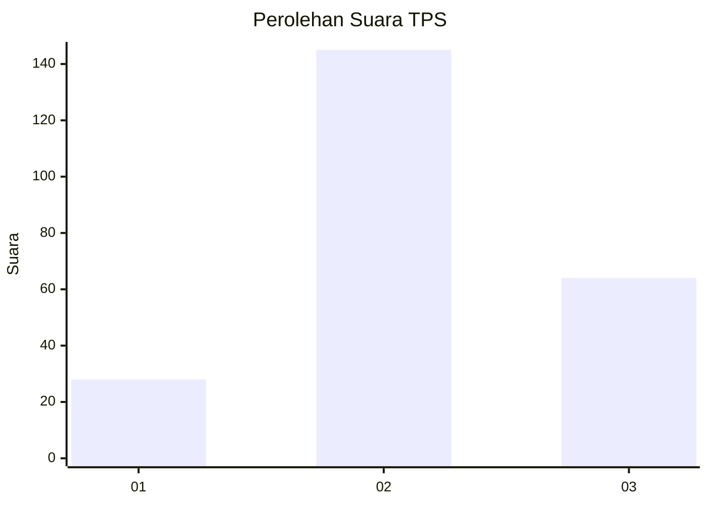
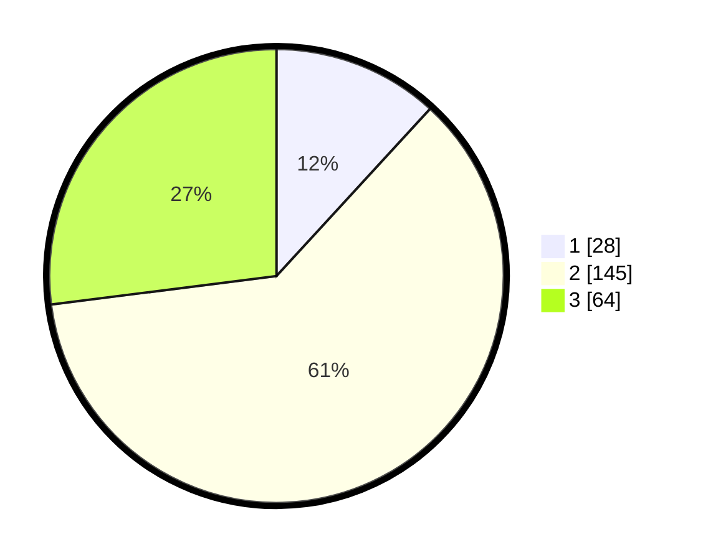

# Hasil

## Grafik

## Tabel

| No. | Nama Paslon    | Suara | Suara (raw) | Persentase |
|:--- |:-------------- | -----:| -----------:| ----------:|
| 1   | ANIES MUHAIMIN | 28    | [28][p-1]   | 11,81      |
| 2   | PRABOWO GIBRAN | 145   | [145][p-2]  | 61,18      |
| 3   | GANJAR MAHFUD  | 64    | [64][p-3]   | 27,00      |

[p-1]: https://github.com/gigit-pemilu/pemilu-2024/blob/main/pilpres/hitung-suara/sub/35-jawa-timur/sub/05-blitar/sub/10-kanigoro/sub/1008-kanigoro/sub/012-tps/sub/paslon-1.txt
[p-2]: https://github.com/gigit-pemilu/pemilu-2024/blob/main/pilpres/hitung-suara/sub/35-jawa-timur/sub/05-blitar/sub/10-kanigoro/sub/1008-kanigoro/sub/012-tps/sub/paslon-2.txt
[p-3]: https://github.com/gigit-pemilu/pemilu-2024/blob/main/pilpres/hitung-suara/sub/35-jawa-timur/sub/05-blitar/sub/10-kanigoro/sub/1008-kanigoro/sub/012-tps/sub/paslon-3.txt

## Foto C Plano

https://sirekap-obj-formc.kpu.go.id/8751/pemilu/ppwp/35/05/10/10/08/3505101008012-20240219-134505--04e4aeb0-d84d-42f3-97e0-4362c7083ee7.jpg

https://sirekap-obj-formc.kpu.go.id/8751/pemilu/ppwp/35/05/10/10/08/3505101008012-20240219-134801--16f8ae60-a33f-4bb5-ba2e-c67c9a470900.jpg

https://sirekap-obj-formc.kpu.go.id/8751/pemilu/ppwp/35/05/10/10/08/3505101008012-20240219-134953--cbe54753-b4f7-4232-ae21-f02e6e78569b.jpg

## Metadata

| Key        | Value               |
| ---------- | ------------------- |
| Time Stamp | 2024-02-25 13:00:00 |

