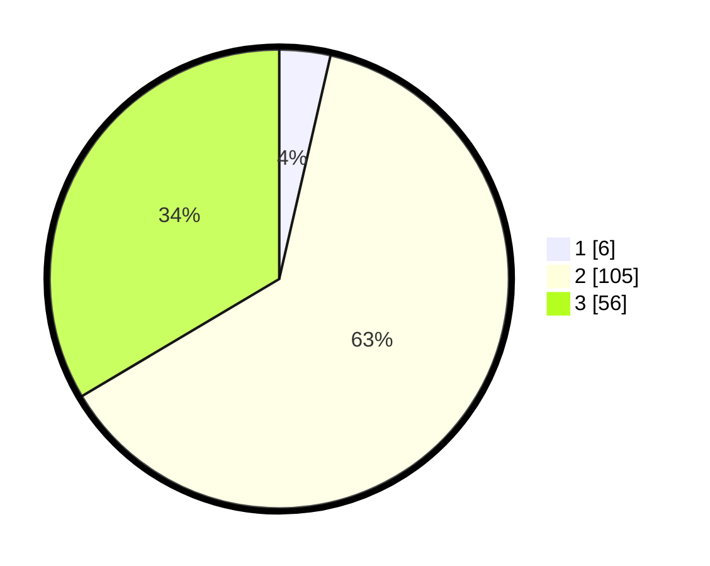

# Hasil

## Grafik

## Tabel

| No. | Nama Paslon    | Suara | Suara (raw) | Persentase |
|:--- |:-------------- | -----:| -----------:| ----------:|
| 1   | ANIES MUHAIMIN | 6     | [6][p-1]    | 3,59       |
| 2   | PRABOWO GIBRAN | 105   | [105][p-2]  | 62,87      |
| 3   | GANJAR MAHFUD  | 56    | [56][p-3]   | 33,53      |

[p-1]: https://github.com/gigit-pemilu/pemilu-2024-35-jawa-timur/blob/main/pilpres/hitung-suara/sub/35-jawa-timur/sub/05-blitar/sub/10-kanigoro/sub/1010-satreyan/sub/001-tps/sub/paslon-1.txt
[p-2]: https://github.com/gigit-pemilu/pemilu-2024-35-jawa-timur/blob/main/pilpres/hitung-suara/sub/35-jawa-timur/sub/05-blitar/sub/10-kanigoro/sub/1010-satreyan/sub/001-tps/sub/paslon-2.txt
[p-3]: https://github.com/gigit-pemilu/pemilu-2024-35-jawa-timur/blob/main/pilpres/hitung-suara/sub/35-jawa-timur/sub/05-blitar/sub/10-kanigoro/sub/1010-satreyan/sub/001-tps/sub/paslon-3.txt

## Foto C Plano

https://sirekap-obj-formc.kpu.go.id/e3de/pemilu/ppwp/35/05/10/10/10/3505101010001-20240215-022134--638da846-9602-4a86-8456-f1857d8ed377.jpg

https://sirekap-obj-formc.kpu.go.id/e3de/pemilu/ppwp/35/05/10/10/10/3505101010001-20240215-022034--436f49bc-f178-41ca-a0a5-b869ed39ef5d.jpg

https://sirekap-obj-formc.kpu.go.id/e3de/pemilu/ppwp/35/05/10/10/10/3505101010001-20240215-022334--a389f29b-f6ba-46b6-85c2-932bd78b82cb.jpg

## Metadata

| Key        | Value               |
| ---------- | ------------------- |
| Time Stamp | 2024-02-15 15:00:29 |

