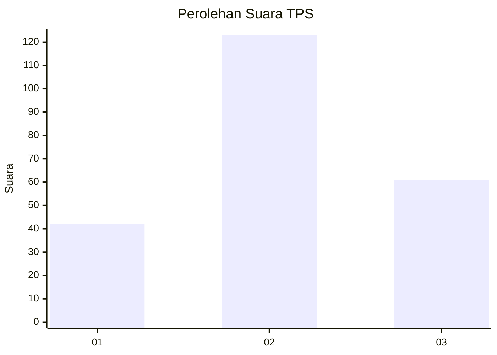
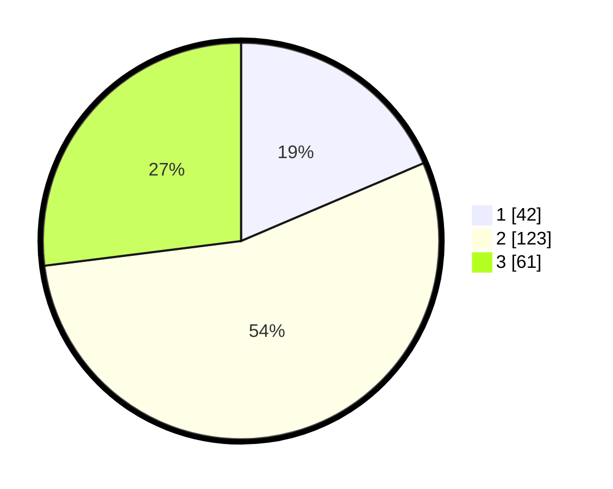

# Hasil

## Grafik

## Tabel

| No. | Nama Paslon    | Suara | Suara (raw) | Persentase |
|:--- |:-------------- | -----:| -----------:| ----------:|
| 1   | ANIES MUHAIMIN | 42    | [42][p-1]   | 18,58      |
| 2   | PRABOWO GIBRAN | 123   | [123][p-2]  | 54,42      |
| 3   | GANJAR MAHFUD  | 61    | [61][p-3]   | 26,99      |

[p-1]: https://github.com/gigit-pemilu/pemilu-2024/blob/main/pilpres/hitung-suara/sub/35-jawa-timur/sub/05-blitar/sub/10-kanigoro/sub/2003-gogodeso/sub/005-tps/sub/paslon-1.txt
[p-2]: https://github.com/gigit-pemilu/pemilu-2024/blob/main/pilpres/hitung-suara/sub/35-jawa-timur/sub/05-blitar/sub/10-kanigoro/sub/2003-gogodeso/sub/005-tps/sub/paslon-2.txt
[p-3]: https://github.com/gigit-pemilu/pemilu-2024/blob/main/pilpres/hitung-suara/sub/35-jawa-timur/sub/05-blitar/sub/10-kanigoro/sub/2003-gogodeso/sub/005-tps/sub/paslon-3.txt

## Foto C Plano

https://sirekap-obj-formc.kpu.go.id/d79a/pemilu/ppwp/35/05/10/20/03/3505102003005-20240217-100213--5d1a48dd-9c7d-4ecd-b4dc-910718045cc4.jpg

https://sirekap-obj-formc.kpu.go.id/d79a/pemilu/ppwp/35/05/10/20/03/3505102003005-20240217-100321--4d12ffce-4a1c-4302-b884-083f677a2f42.jpg

https://sirekap-obj-formc.kpu.go.id/d79a/pemilu/ppwp/35/05/10/20/03/3505102003005-20240217-100517--4f14a1b1-cbd7-402b-a2bf-4201525d8ce8.jpg

## Metadata

| Key        | Value               |
| ---------- | ------------------- |
| Time Stamp | 2024-02-17 14:45:18 |

