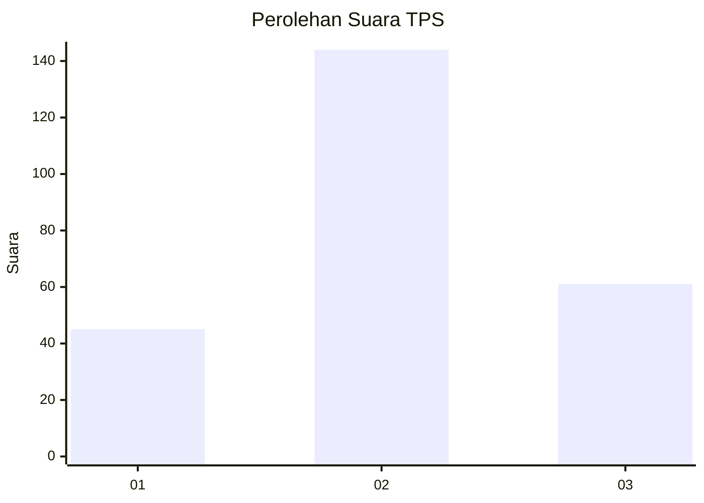
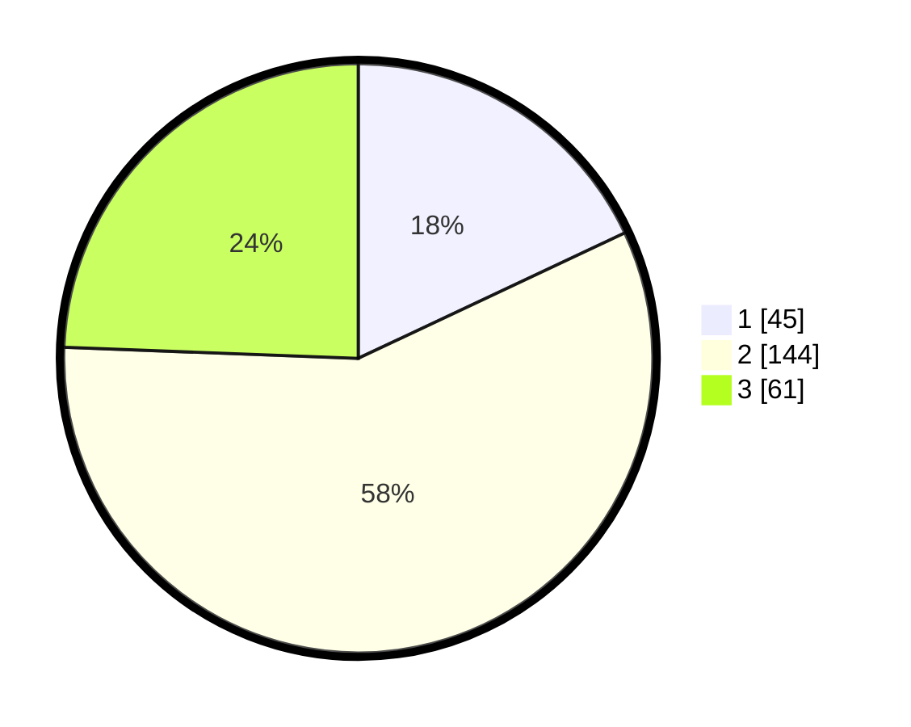

# Hasil

## Grafik

## Tabel

| No. | Nama Paslon    | Suara | Suara (raw) | Persentase |
|:--- |:-------------- | -----:| -----------:| ----------:|
| 1   | ANIES MUHAIMIN | 45    | [45][p-1]   | 18,00      |
| 2   | PRABOWO GIBRAN | 144   | [144][p-2]  | 57,60      |
| 3   | GANJAR MAHFUD  | 61    | [61][p-3]   | 24,40      |

[p-1]: https://github.com/gigit-pemilu/pemilu-2024-35-jawa-timur/blob/main/pilpres/hitung-suara/sub/35-jawa-timur/sub/05-blitar/sub/10-kanigoro/sub/2009-banggle/sub/011-tps/sub/paslon-1.txt
[p-2]: https://github.com/gigit-pemilu/pemilu-2024-35-jawa-timur/blob/main/pilpres/hitung-suara/sub/35-jawa-timur/sub/05-blitar/sub/10-kanigoro/sub/2009-banggle/sub/011-tps/sub/paslon-2.txt
[p-3]: https://github.com/gigit-pemilu/pemilu-2024-35-jawa-timur/blob/main/pilpres/hitung-suara/sub/35-jawa-timur/sub/05-blitar/sub/10-kanigoro/sub/2009-banggle/sub/011-tps/sub/paslon-3.txt

## Foto C Plano

https://sirekap-obj-formc.kpu.go.id/8bdc/pemilu/ppwp/35/05/10/20/09/3505102009011-20240215-011951--d506e95e-99aa-4d3d-a4d1-41d9f1eaed85.jpg

https://sirekap-obj-formc.kpu.go.id/8bdc/pemilu/ppwp/35/05/10/20/09/3505102009011-20240216-212654--7760324a-a107-41ee-acb9-042a5ff6e098.jpg

https://sirekap-obj-formc.kpu.go.id/8bdc/pemilu/ppwp/35/05/10/20/09/3505102009011-20240216-212855--f1bda97c-0201-41a5-98d6-94e451a1fc04.jpg

## Metadata

| Key        | Value               |
| ---------- | ------------------- |
| Time Stamp | 2024-02-17 19:30:00 |

