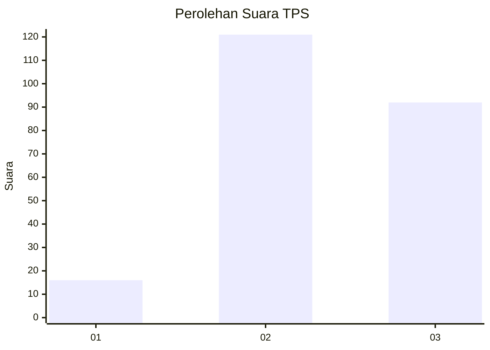
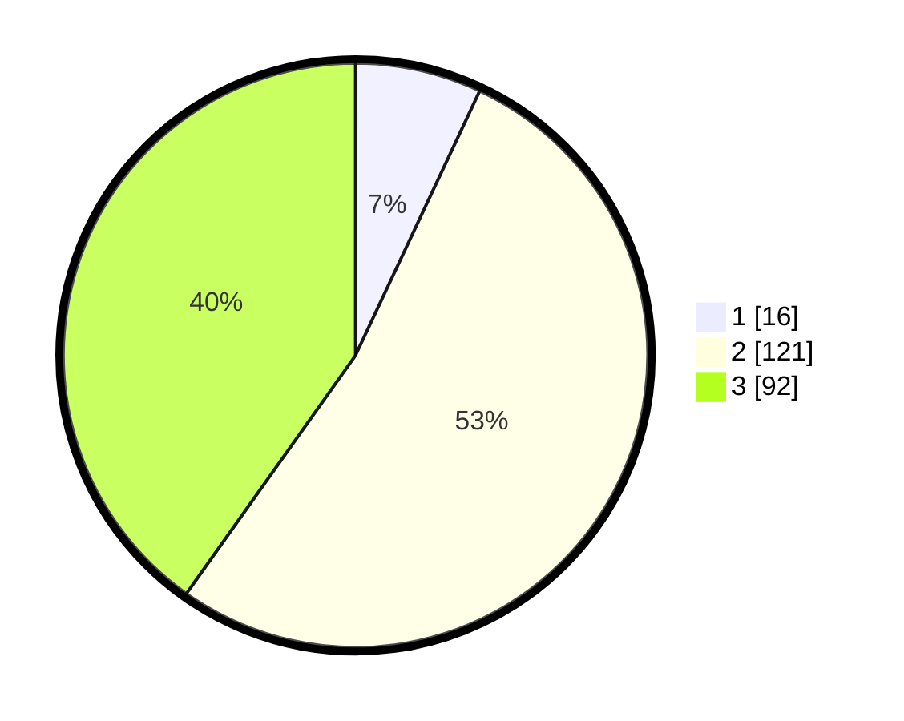

# Hasil

## Grafik

## Tabel

| No. | Nama Paslon    | Suara | Suara (raw) | Persentase |
|:--- |:-------------- | -----:| -----------:| ----------:|
| 1   | ANIES MUHAIMIN | 16    | [16][p-1]   | 6,99       |
| 2   | PRABOWO GIBRAN | 121   | [121][p-2]  | 52,84      |
| 3   | GANJAR MAHFUD  | 92    | [92][p-3]   | 40,17      |

[p-1]: https://github.com/gigit-pemilu/pemilu-2024-35-jawa-timur/blob/main/pilpres/hitung-suara/sub/35-jawa-timur/sub/05-blitar/sub/10-kanigoro/sub/2011-sawentar/sub/006-tps/sub/paslon-1.txt
[p-2]: https://github.com/gigit-pemilu/pemilu-2024-35-jawa-timur/blob/main/pilpres/hitung-suara/sub/35-jawa-timur/sub/05-blitar/sub/10-kanigoro/sub/2011-sawentar/sub/006-tps/sub/paslon-2.txt
[p-3]: https://github.com/gigit-pemilu/pemilu-2024-35-jawa-timur/blob/main/pilpres/hitung-suara/sub/35-jawa-timur/sub/05-blitar/sub/10-kanigoro/sub/2011-sawentar/sub/006-tps/sub/paslon-3.txt

## Foto C Plano

https://sirekap-obj-formc.kpu.go.id/c187/pemilu/ppwp/35/05/10/20/11/3505102011006-20240214-235441--c63be811-9eab-42a4-8e06-d9fdcaefe83b.jpg

https://sirekap-obj-formc.kpu.go.id/c187/pemilu/ppwp/35/05/10/20/11/3505102011006-20240215-001031--1ab20c1d-a8fa-45ff-b429-1e9955394f22.jpg

https://sirekap-obj-formc.kpu.go.id/c187/pemilu/ppwp/35/05/10/20/11/3505102011006-20240214-235944--a1eebd37-9493-46d2-bdef-5d520715ba3c.jpg

## Metadata

| Key        | Value               |
| ---------- | ------------------- |
| Time Stamp | 2024-02-16 16:25:10 |

