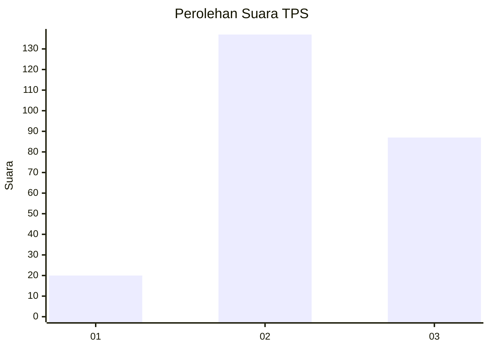
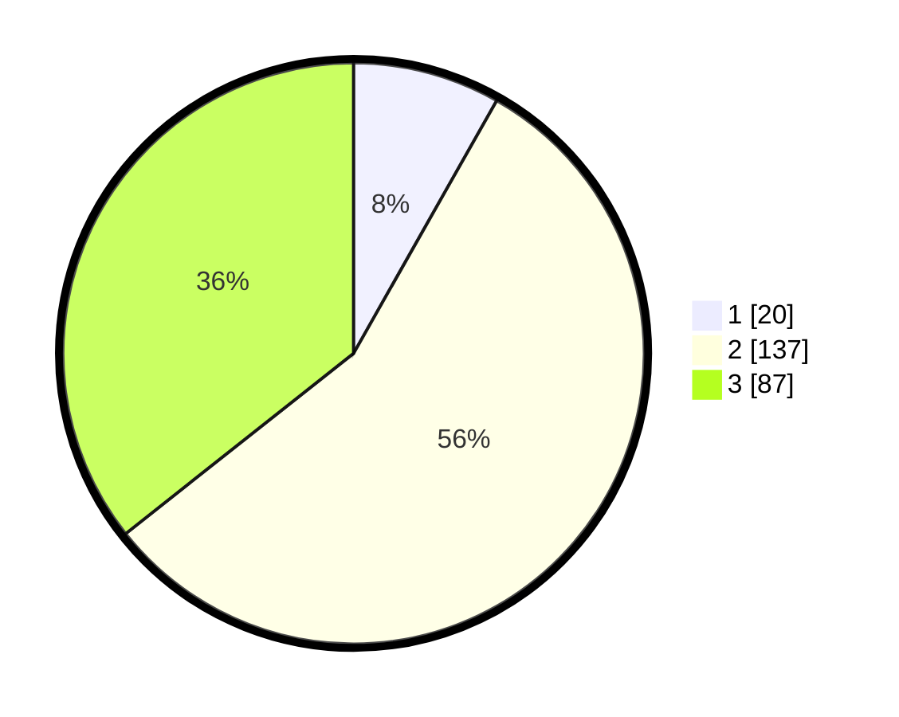

# Hasil

## Grafik

## Tabel

| No. | Nama Paslon    | Suara | Suara (raw) | Persentase |
|:--- |:-------------- | -----:| -----------:| ----------:|
| 1   | ANIES MUHAIMIN | 20    | [20][p-1]   | 8,20       |
| 2   | PRABOWO GIBRAN | 137   | [137][p-2]  | 56,15      |
| 3   | GANJAR MAHFUD  | 87    | [87][p-3]   | 35,66      |

[p-1]: https://github.com/gigit-pemilu/pemilu-2024-35-jawa-timur/blob/main/pilpres/hitung-suara/sub/35-jawa-timur/sub/05-blitar/sub/10-kanigoro/sub/2011-sawentar/sub/019-tps/sub/paslon-1.txt
[p-2]: https://github.com/gigit-pemilu/pemilu-2024-35-jawa-timur/blob/main/pilpres/hitung-suara/sub/35-jawa-timur/sub/05-blitar/sub/10-kanigoro/sub/2011-sawentar/sub/019-tps/sub/paslon-2.txt
[p-3]: https://github.com/gigit-pemilu/pemilu-2024-35-jawa-timur/blob/main/pilpres/hitung-suara/sub/35-jawa-timur/sub/05-blitar/sub/10-kanigoro/sub/2011-sawentar/sub/019-tps/sub/paslon-3.txt

## Foto C Plano

https://sirekap-obj-formc.kpu.go.id/0396/pemilu/ppwp/35/05/10/20/11/3505102011019-20240215-025527--31bc0d5c-6880-4f9f-892c-b8e7babe3fe4.jpg

https://sirekap-obj-formc.kpu.go.id/0396/pemilu/ppwp/35/05/10/20/11/3505102011019-20240214-225239--7245140f-8a43-45b9-bfc7-486cbd084386.jpg

https://sirekap-obj-formc.kpu.go.id/0396/pemilu/ppwp/35/05/10/20/11/3505102011019-20240214-225436--0d40934f-ee18-4a03-b258-0ca19edc67bd.jpg

## Metadata

| Key        | Value               |
| ---------- | ------------------- |
| Time Stamp | 2024-02-15 12:00:28 |

