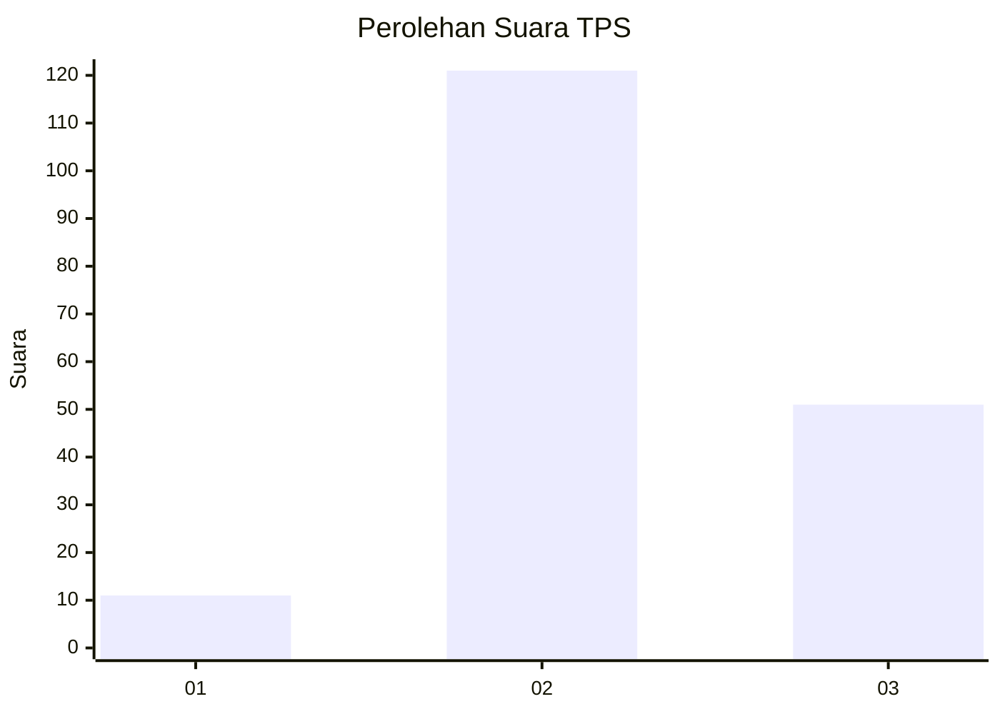

# Hasil

## Grafik

## Tabel

| No. | Nama Paslon    | Suara | Suara (raw) | Persentase |
|:--- |:-------------- | -----:| -----------:| ----------:|
| 1   | ANIES MUHAIMIN | 11    | [11][p-1]   | 6,01       |
| 2   | PRABOWO GIBRAN | 121   | [121][p-2]  | 66,12      |
| 3   | GANJAR MAHFUD  | 51    | [51][p-3]   | 27,87      |

[p-1]: https://github.com/gigit-pemilu/pemilu-2024/blob/main/pilpres/hitung-suara/sub/35-jawa-timur/sub/05-blitar/sub/11-garum/sub/1002-sumberdiren/sub/002-tps/sub/paslon-1.txt
[p-2]: https://github.com/gigit-pemilu/pemilu-2024/blob/main/pilpres/hitung-suara/sub/35-jawa-timur/sub/05-blitar/sub/11-garum/sub/1002-sumberdiren/sub/002-tps/sub/paslon-2.txt
[p-3]: https://github.com/gigit-pemilu/pemilu-2024/blob/main/pilpres/hitung-suara/sub/35-jawa-timur/sub/05-blitar/sub/11-garum/sub/1002-sumberdiren/sub/002-tps/sub/paslon-3.txt

## Foto C Plano

https://sirekap-obj-formc.kpu.go.id/bd27/pemilu/ppwp/35/05/11/10/02/3505111002002-20240219-104307--a9521fb6-fce3-42c7-aabb-7bd82aa88a18.jpg

https://sirekap-obj-formc.kpu.go.id/bd27/pemilu/ppwp/35/05/11/10/02/3505111002002-20240219-104130--e919983e-ede4-4d96-be73-fdff6d788688.jpg

https://sirekap-obj-formc.kpu.go.id/bd27/pemilu/ppwp/35/05/11/10/02/3505111002002-20240219-104219--ab08549c-d717-4b96-8585-bca8ab450a4e.jpg

## Metadata

| Key        | Value               |
| ---------- | ------------------- |
| Time Stamp | 2024-02-24 22:31:28 |

