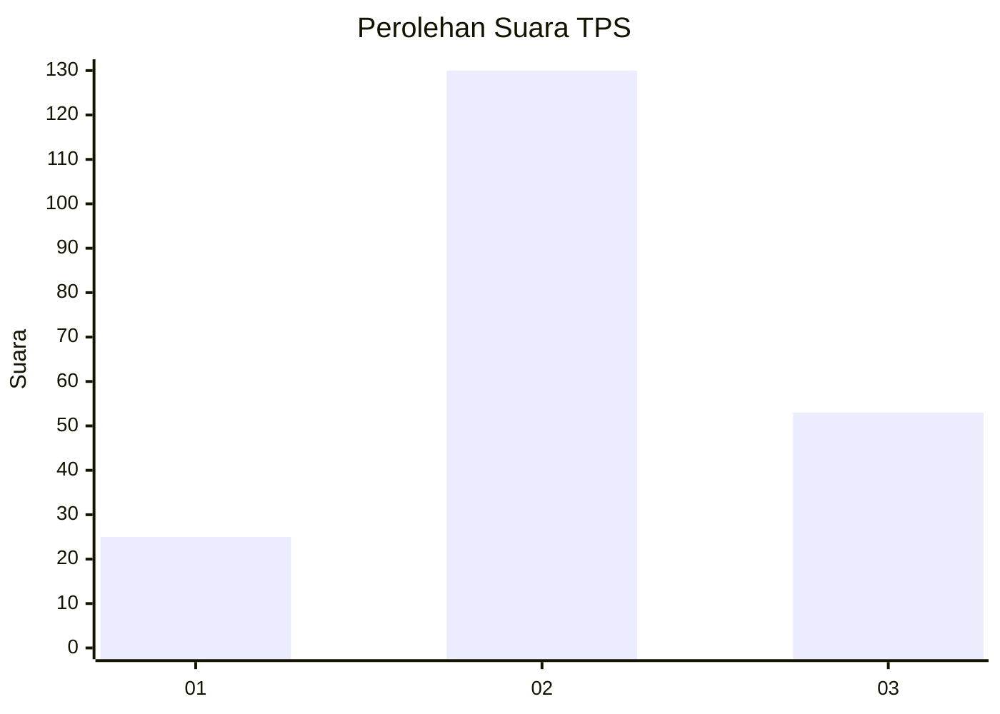
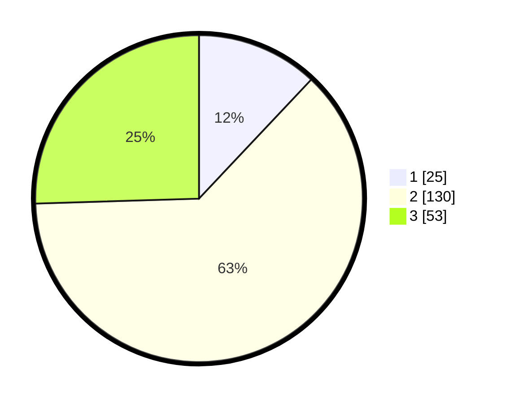

# Hasil

## Grafik

## Tabel

| No. | Nama Paslon    | Suara | Suara (raw) | Persentase |
|:--- |:-------------- | -----:| -----------:| ----------:|
| 1   | ANIES MUHAIMIN | 25    | [25][p-1]   | 12,02      |
| 2   | PRABOWO GIBRAN | 130   | [130][p-2]  | 62,50      |
| 3   | GANJAR MAHFUD  | 53    | [53][p-3]   | 25,48      |

[p-1]: https://github.com/gigit-pemilu/pemilu-2024/blob/main/pilpres/hitung-suara/sub/35-jawa-timur/sub/05-blitar/sub/11-garum/sub/1002-sumberdiren/sub/004-tps/sub/paslon-1.txt
[p-2]: https://github.com/gigit-pemilu/pemilu-2024/blob/main/pilpres/hitung-suara/sub/35-jawa-timur/sub/05-blitar/sub/11-garum/sub/1002-sumberdiren/sub/004-tps/sub/paslon-2.txt
[p-3]: https://github.com/gigit-pemilu/pemilu-2024/blob/main/pilpres/hitung-suara/sub/35-jawa-timur/sub/05-blitar/sub/11-garum/sub/1002-sumberdiren/sub/004-tps/sub/paslon-3.txt

## Foto C Plano

https://sirekap-obj-formc.kpu.go.id/4ff1/pemilu/ppwp/35/05/11/10/02/3505111002004-20240214-195657--d2d364dc-5c1d-4993-a444-07d9215c57dd.jpg

https://sirekap-obj-formc.kpu.go.id/4ff1/pemilu/ppwp/35/05/11/10/02/3505111002004-20240214-195703--3dd5b1a0-9cc3-47b1-9b9e-5d0fb3c7ca6d.jpg

https://sirekap-obj-formc.kpu.go.id/4ff1/pemilu/ppwp/35/05/11/10/02/3505111002004-20240214-195708--1d3516f7-44c3-420c-bbf6-f13182d05800.jpg

## Metadata

| Key        | Value               |
| ---------- | ------------------- |
| Time Stamp | 2024-02-15 12:00:28 |

