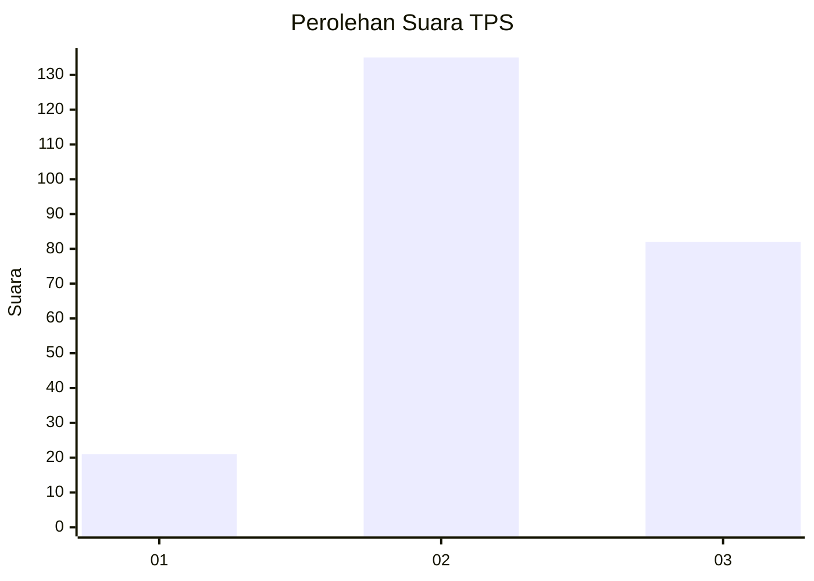
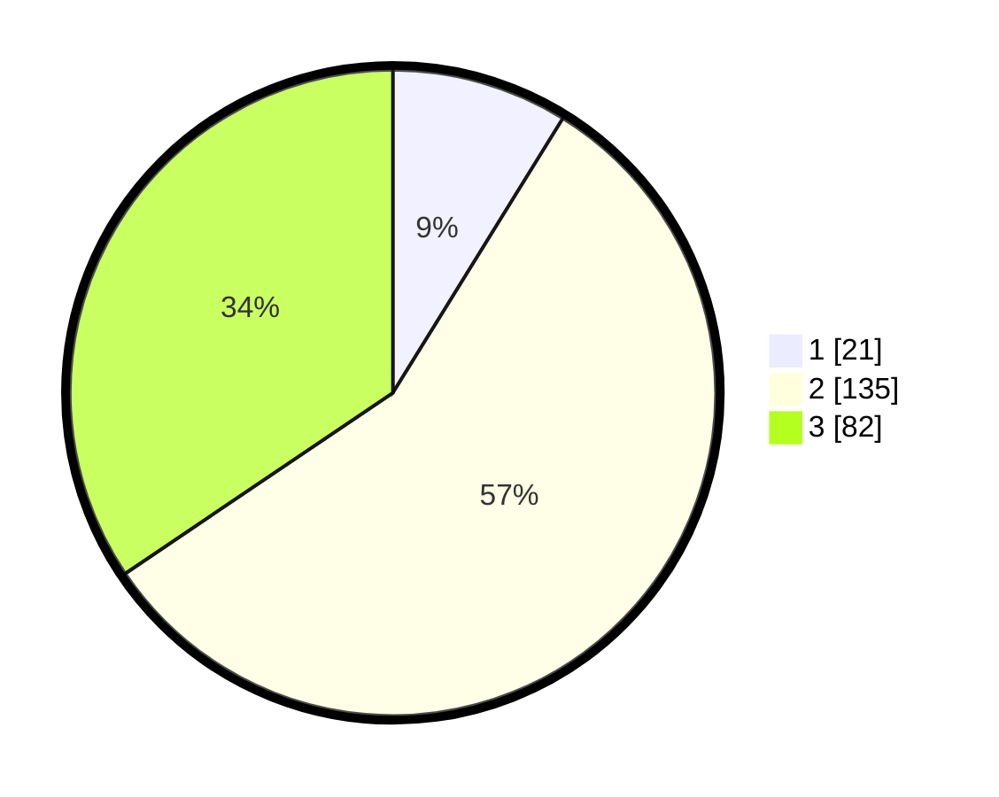

# Hasil

## Grafik

## Tabel

| No. | Nama Paslon    | Suara | Suara (raw) | Persentase |
|:--- |:-------------- | -----:| -----------:| ----------:|
| 1   | ANIES MUHAIMIN | 21    | [21][p-1]   | 8,82       |
| 2   | PRABOWO GIBRAN | 135   | [135][p-2]  | 56,72      |
| 3   | GANJAR MAHFUD  | 82    | [82][p-3]   | 34,45      |

[p-1]: https://github.com/gigit-pemilu/pemilu-2024-35-jawa-timur/blob/main/pilpres/hitung-suara/sub/35-jawa-timur/sub/05-blitar/sub/11-garum/sub/1004-garum/sub/006-tps/sub/paslon-1.txt
[p-2]: https://github.com/gigit-pemilu/pemilu-2024-35-jawa-timur/blob/main/pilpres/hitung-suara/sub/35-jawa-timur/sub/05-blitar/sub/11-garum/sub/1004-garum/sub/006-tps/sub/paslon-2.txt
[p-3]: https://github.com/gigit-pemilu/pemilu-2024-35-jawa-timur/blob/main/pilpres/hitung-suara/sub/35-jawa-timur/sub/05-blitar/sub/11-garum/sub/1004-garum/sub/006-tps/sub/paslon-3.txt

## Foto C Plano

https://sirekap-obj-formc.kpu.go.id/13b4/pemilu/ppwp/35/05/11/10/04/3505111004006-20240214-234053--7179af32-065c-4d22-8d1b-4ea84aacbb06.jpg

https://sirekap-obj-formc.kpu.go.id/13b4/pemilu/ppwp/35/05/11/10/04/3505111004006-20240214-234409--3141f6d8-e537-490e-adf3-02f636212e69.jpg

https://sirekap-obj-formc.kpu.go.id/13b4/pemilu/ppwp/35/05/11/10/04/3505111004006-20240214-234515--864f4da3-4ffc-4533-bd2b-992caeb61fb0.jpg

## Metadata

| Key        | Value               |
| ---------- | ------------------- |
| Time Stamp | 2024-02-15 12:00:28 |

