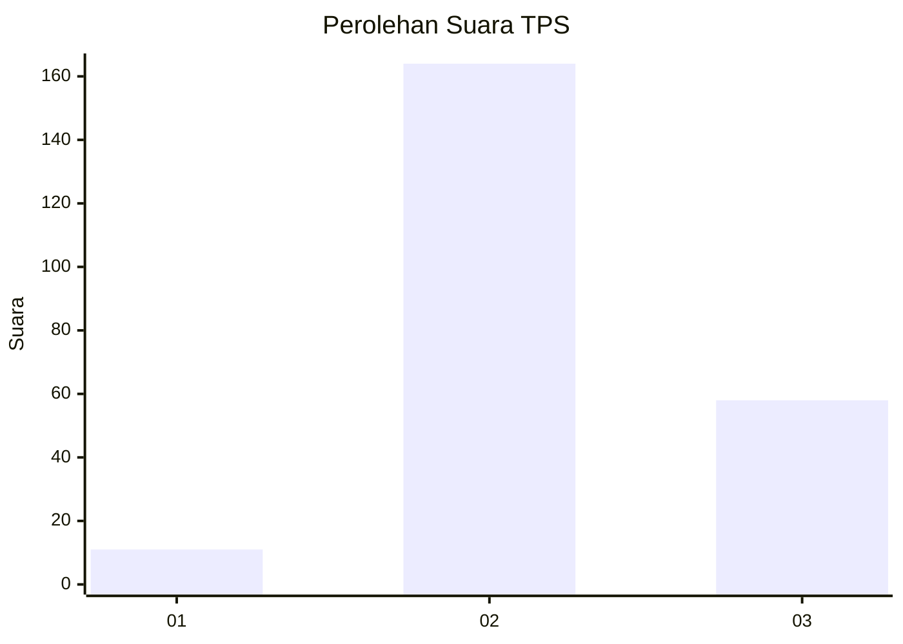
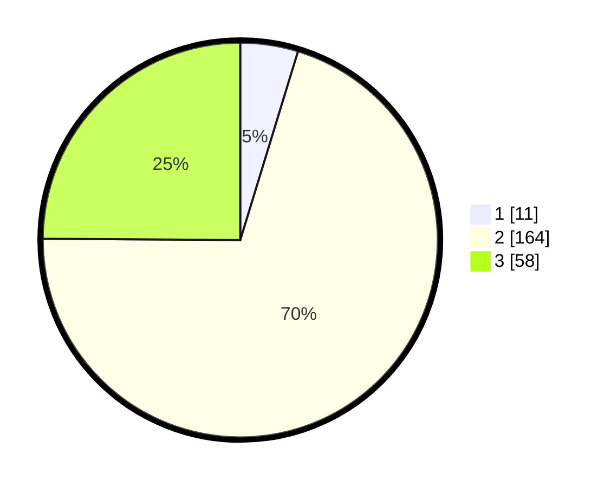

# Hasil

## Grafik

## Tabel

| No. | Nama Paslon    | Suara | Suara (raw) | Persentase |
|:--- |:-------------- | -----:| -----------:| ----------:|
| 1   | ANIES MUHAIMIN | 11    | [11][p-1]   | 4,72       |
| 2   | PRABOWO GIBRAN | 164   | [164][p-2]  | 70,39      |
| 3   | GANJAR MAHFUD  | 58    | [58][p-3]   | 24,89      |

[p-1]: https://github.com/gigit-pemilu/pemilu-2024/blob/main/pilpres/hitung-suara/sub/35-jawa-timur/sub/05-blitar/sub/11-garum/sub/1004-garum/sub/007-tps/sub/paslon-1.txt
[p-2]: https://github.com/gigit-pemilu/pemilu-2024/blob/main/pilpres/hitung-suara/sub/35-jawa-timur/sub/05-blitar/sub/11-garum/sub/1004-garum/sub/007-tps/sub/paslon-2.txt
[p-3]: https://github.com/gigit-pemilu/pemilu-2024/blob/main/pilpres/hitung-suara/sub/35-jawa-timur/sub/05-blitar/sub/11-garum/sub/1004-garum/sub/007-tps/sub/paslon-3.txt

## Foto C Plano

https://sirekap-obj-formc.kpu.go.id/35ef/pemilu/ppwp/35/05/11/10/04/3505111004007-20240214-223410--3b652ada-a730-4dfb-8c8c-18af77b640de.jpg

https://sirekap-obj-formc.kpu.go.id/35ef/pemilu/ppwp/35/05/11/10/04/3505111004007-20240214-225314--3ac96562-c622-459b-bbd6-3537da50d802.jpg

https://sirekap-obj-formc.kpu.go.id/35ef/pemilu/ppwp/35/05/11/10/04/3505111004007-20240214-225611--45a53202-e160-460f-a810-1b33d42a54f5.jpg

## Metadata

| Key        | Value               |
| ---------- | ------------------- |
| Time Stamp | 2024-02-15 12:00:28 |

